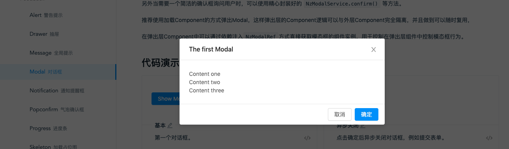
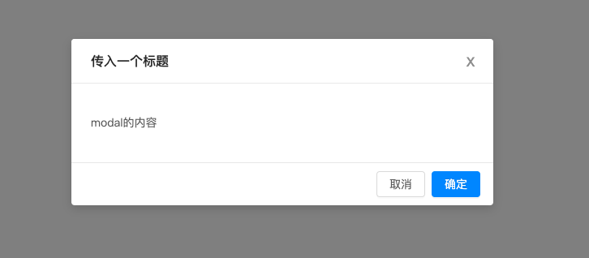
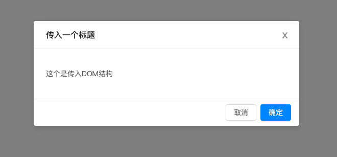
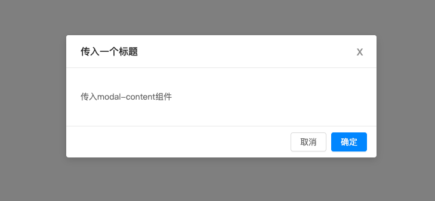
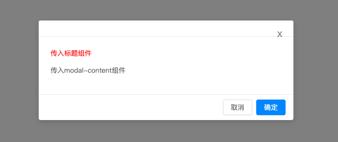
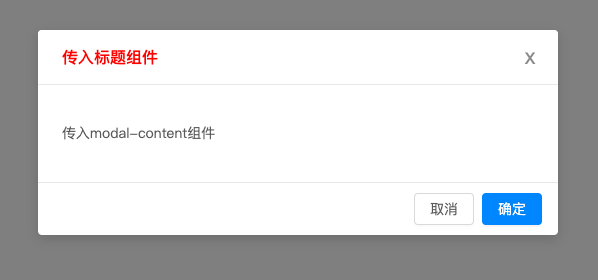
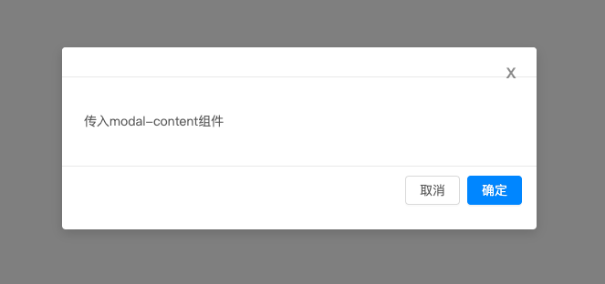

## 前言
最近在编写一个先对比较大点的项目，其中可以抽取的公用组件非常多，然后就一直在思考，该如何让通用组件做到更加灵活。于是不断翻阅各类相关文章，终于`ng-content`走入了我的视线。今天这篇文章将主要讲解如何使用`ng-content`。

[完整代码地址](https://github.com/shiyou00/angular-ng-content)

## 什么是ng-content
将Angular的组件或者内容投影进另外一个组件。你可以认为它等价于 `node.appendChild(el)`或 jQuery 中的 `$(node).append(el)` 方法：使用这些方法，节点不被克隆，它被简单地移动到它的新位置。因此，投影内容的生命周期将被绑定到它被声明的地方，而不是显示在地方。

因为 `ng-content` 只是移动元素，所以可以在编译时完成，而不是在运行时，这大大减少了实际应用程序的工作量。

## 没有它我们是怎么工作的

先实现一个简单的弹窗组件：  
  

创建组件：
```
ng g c modal-container // 弹窗mask层
ng g c modal-container/modal-inner // 弹窗内容层
```

modal-container
```
<div class="cdk-overlay-container">
    <app-modal-inner [title]="'传入一个标题'" [content]="'modal的内容'"></app-modal-inner>
</div>
```

modal-inner
```
<div class="modal-inner">
    <div class="modal-content">
        <div class="modal-close">
            <div class="modal-close-x">X</div>
        </div>
        <div class="modal-header">
            <div class="modal-title">
                {{title}}
            </div>
        </div>
        <div class="modal-body">
            <p>{{content}}</p>
        </div>
        <div class="modal-footer">
            <button class="btn btn-default">取消</button>
            <button class="btn btn-primary">确定</button>
        </div>
    </div>
</div>
```

具体样式可以到github上查看。来看看现在的布局

  

我们可以看到，标题和内容是通过`@Input` 传递进组件的。

这也是我们在编写一个组件最开始能想到的方法。

现在可以看到`content`是写死在一个p标签内部。如果我们想做到更加通用该怎么办？其实很简单，就是在组件外直接传递DOM结构进来。这应该就是最直观的方式。所以就有本文的主题`ng-content`。

## 有了它之后该如何改进
`modal-inner`
```
<div class="modal-body">
    <ng-content></ng-content> // 原本的传值替换成ng-content
</div>
```

`modal-container`
```
<div class="cdk-overlay-container">
    <app-modal-inner [title]="'传入一个标题'">
        <p>这个是传入DOM结构</p> // 在这里传入DOM
    </app-modal-inner>
</div>
```
  

可以看到也成功展示出来了，那么我们现在就可以传入一个完整的DOM进去了，大大的提高了组件的灵活性了。

## ng-content

### 基础使用
正常来说，我们会直接传入一个组件进`app-modal-inner`的`content`，这样灵活性更大。

```
ng g c modal-container/modal-content
```

`modal-container`
```
<div class="cdk-overlay-container">
    <app-modal-inner [title]="'传入一个标题'">
        <app-modal-content></app-modal-content>
    </app-modal-inner>
</div>
```

  

### select 属性
此时又来一个需求要把标题改成红色的？那么怎么办，把标题也改成`ng-content`的形式传入把。

创建标题组件
```
ng g c modal-container/modal-title
```

`modal-container`
```
<div class="cdk-overlay-container">
    <app-modal-inner>
        <app-modal-title></app-modal-title> // 传入标题组件
        <app-modal-content></app-modal-content> // 传入内容组件
    </app-modal-inner>
</div>
```

modal-inner
```
<div class="modal-inner">
    <div class="modal-content">
        ...
        <div class="modal-header">
            <div class="modal-title">
                <ng-content></ng-content>
            </div>
        </div>
        <div class="modal-body">
            <ng-content></ng-content>
        </div>
        ...
    </div>
</div>
```

看看效果：
  

你会发现传入的两个组件都只进入`modal-body`的`ng-content`中。

是的，当传入多个ng-content时，是没有办法区分的。这个时候需要添加`select`指令。

```
<div class="modal-header">
    <div class="modal-title">
        <ng-content select="app-modal-title"></ng-content>
    </div>
</div>
<div class="modal-body">
    <ng-content select="app-modal-content"></ng-content>
</div>
```
select = 传入的组件名

  

此时你会发现各种都对应上了。

### ContentChild && ContentChildren
在有些实现时，我们可能需要在宿主组件中获取投影组件的实例，`ContentChild && ContentChildren` 支持我们这样做。

【ContentChild】   
modal-inner   
```
import { Component, OnInit, AfterContentInit, ContentChild } from '@angular/core';
import { ModalContentComponent } from '../modal-content/modal-content.component';

@Component({
  selector: 'app-modal-inner',
  templateUrl: './modal-inner.component.html',
  styleUrls: ['./modal-inner.component.css']
})
export class ModalInnerComponent implements OnInit, AfterContentInit {
  @ContentChild(ModalContentComponent) contentCom: ModalContentComponent;
  constructor() { }

  ngOnInit() {
  }

  ngAfterContentInit() {
    console.log(this.contentCom); // 可以正确的打印出`ModalContentComponent`实例
  }
}
```

`@ContentChild` 的作用同 `@ViewChild` 的作用相同

我们现在就可以获取到`ModalContentComponent`中的数据已经方法。


【ContentChildren】   
除了 ContentChild 装饰器之外，Angular 还为我们提供了一个 ContentChildren 装饰器，用来从通过 Content Projection 方式设置的视图中获取匹配的多个元素，返回的结果是一个 QueryList 集合。

用法同上这里就不赘述了。

### ngProjectAs
有时候我们的定义的组件可能会包含在其它容器中，比如 `<ng-container>` ，这时我们的目标投影会发生什么：

`modal-container`
```
<div class="cdk-overlay-container">
    <app-modal-inner>
        <ng-container> // 添加了ng-container的包裹
            <app-modal-title></app-modal-title>
        </ng-container>
        <app-modal-content></app-modal-content>
    </app-modal-inner>
</div>
```

看下效果：  
  

你会发现标题不见了。这个时候就需要ngProjectAs的帮助了

```
<app-modal-inner>
    <ng-container ngProjectAs="app-modal-title">
        <app-modal-title></app-modal-title>
    </ng-container>
    <app-modal-content></app-modal-content>
</app-modal-inner>
```

现在再去看又恢复了。这个就是`ngProjectAs`的作用。

## 小结
通过这边文章，我们学习了`ng-content`该如何使用，以及它的使用场景。以后就可以使用它编写更加通用的组件了。
