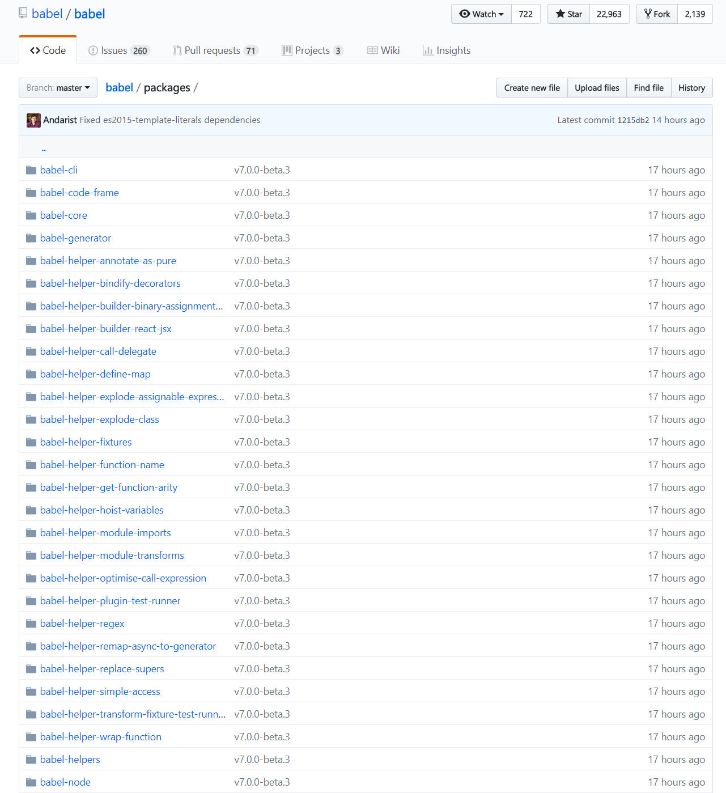

## Babel 是什么？
大家都知道js作为宿主语言，很依赖执行的环境（浏览器、node等），不同环境对js语法的支持不尽相同，特别是ES6之后，ECMAScrip对版本的更新已经到了一年一次的节奏，虽然每年更新的幅度不大，但是每年的提案可不少。babel的出现就是为了解决这个问题，把那些使用新标准编写的代码转译为当前环境可运行的代码，简单点说就是把ES6代码转译（转码+编译）到ES5。


## ES6

正文之前先谈谈ES6，ES即ECMAScript，6表示第六个版本(也被称为是ES2015，因为是2015年发布的)，它是javascript的实现标准。

被纳入到ES标准的语法必须要经过如下五个阶段:

- Stage 0: strawman
- Stage 1: proposal
- Stage 2: draft   -   必须包含2个实验性的具体实现，其中一个可以是用转译器实现的，例如Babel。
- Stage 3: candidate  -  至少要有2个符合规范的具体实现。
- Stage 4: finished

可以看到提案在进入stage3阶段时就已经在一些环境被实现，在stage2阶段有babel的实现。所以被纳入到ES标准的语法其实在大部分环境都已经是有了实现的，那么为什么还要用babel来进行转译，因为不能确保每个运行代码的环境都是最新版本并已经实现了规范。

## babel6
移除babel全家桶安装，拆分为单独模块，例如：babel-core、babel-cli、babel-node、babel-polyfill等； 可以在babel的github仓库看到babel现在有哪些模块。

  

- 新增 `.babelrc` 配置文件，基本上所有的babel转译都会来读取这个配置；
- 新增 plugin 配置，所有的东西都插件化，什么代码要转译都能在插件中自由配置；
- 新增 preset 配置，babel5会默认转译ES6和jsx语法，babel6转译的语法都要在preset中配置，preset简单说就是一系列plugin包的使用。

## 具体模块介绍

babel6将babel全家桶拆分成了许多不同的模块，只有知道这些模块怎么用才能更好的理解babel。

安装
```
#通过npm安装
npm install babel-core babel-cli babel-node
```

### babel-core
babel-core是作为babel的核心存在，babel的核心api都在这个模块里面，比如：transform。

介绍几个babel-core中的api

babel.transform：用于字符串转码得到AST
```
/*
 * @param {string} code 要转译的代码字符串
 * @param {object} options 可选，配置项
 * @return {object} 
*/
babel.transform(code: string, options?: Object)
    
//返回一个对象(主要包括三个部分)：
{
    generated code, //生成码
    sources map, //源映射
    AST  //即abstract syntax tree，抽象语法树
}
```

一些使用babel插件的打包或构建工具都有使用到这个方法，下面是一些引入babel插件中的源码：
```
//gulp-babel
const babel = require('babel-core');
/*
some codes...
*/
module.exports = function (opts) {
    opts = opts || {};
	return through.obj(function (file, enc, cb) {
        try {
            const fileOpts = Object.assign({}, opts, {
            	filename: file.path,
            	filenameRelative: file.relative,
            	sourceMap: Boolean(file.sourceMap),
            	sourceFileName: file.relative,
            	sourceMapTarget: file.relative
            });
            const res = babel.transform(file.contents.toString(), fileOpts);
            if (res !== null) {
            	//some codes
            }
        } catch (err) {
            //some codes
        }
    }
}
```

上面是一些打包工具引入babel插件时的一些源码，可以看到基本都是先通过调用transform方法进行代码转码。

### babel-cli
babel-cli是一个通过命令行对js文件进行换码的工具。

使用方法：
```
babel script.js
babel script.js --out-file build.js // 指定输出文件
babel src --out-dir dist // 指定输入文件夹和输出文件夹
```


### babel-polyfill

polyfill这个单词翻译成中文是垫片的意思，详细点解释就是桌子的桌脚有一边矮一点，拿一个东西把桌子垫平。polyfill在代码中的作用主要是用已经存在的语法和api实现一些浏览器还没有实现的api，对浏览器的一些缺陷做一些修补。例如Array新增了includes方法，我想使用，但是低版本的浏览器上没有，就得做兼容处理：

```
if (!Array.prototype.includes) {
  Object.defineProperty(Array.prototype, 'includes', {
    value: function(searchElement, fromIndex) {
      if (this == null) {
        throw new TypeError('"this" is null or not defined');
      }
      var o = Object(this);
      var len = o.length >>> 0;
      if (len === 0) {
        return false;
      }
      var n = fromIndex | 0;
      var k = Math.max(n >= 0 ? n : len - Math.abs(n), 0);
      while (k < len) {
        if (o[k] === searchElement) {
          return true;
        }
        k++;
      }
      return false;
    }
  });
} 
```
理解polyfill的意思之后，再来说说babel为什么存在polyfill。因为babel的转译只是语法层次的转译，例如箭头函数、解构赋值、class，对一些新增api以及全局函数（例如：Promise）无法进行转译，这个时候就需要在代码中引入babel-polyfill


### `.babelrc` 配置文件
前面已经介绍了babel常用的一些模块，接下来看看babel的配置文件 .babelrc。

后面的后缀rc来自linux中，使用过linux就知道linux中很多rc结尾的文件，比如.bashrc，rc是run command的缩写，翻译成中文就是运行时的命令，表示程序执行时就会来调用这个文件。

babel所有的操作基本都会来读取这个配置文件，除了一些在回调函数中设置options参数的，如果没有这个配置文件，会从package.json文件的babel属性中读取配置。

配置文件内容：
```
{
  "presets": [
    ["env", { "modules": false }],
    "stage-0"
  ],
  "plugins": [
    "transform-runtime", // transform-runtime只会对es6的语法进行转换，而不会对新api进行转换，如果需要转换新api，就要引入babel-polyfill
    ["transform-react-jsx", { // 解析jsx
        "pragma": "vd"
      }
    ]
  ]
}
```

### plugins
babel中的插件，通过配置不同的插件才能告诉babel，我们的代码中有哪些是需要转译的。

```
{
    "plugins": [
        "transform-es2015-arrow-functions", //转译箭头函数
        "transform-es2015-classes", //转译class语法
        "transform-es2015-spread", //转译数组解构
        "transform-es2015-for-of" //转译for-of
    ]
}
//如果要为某个插件添加配置项，按如下写法：
{
    "plugins":[
        //改为数组，第二个元素为配置项
        ["transform-es2015-arrow-functions", { "spec": true }]
    ]
}
```

### presets
显然这样一个一个配置插件会非常的麻烦，为了方便，babel为我们提供了一个配置项叫做presets（预设）。

预设就是一系列插件的集合，就好像修图一样，把上次修图的一些参数保存为一个预设，下次就能直接使用。

如果要转译ES6语法，只要按如下方式配置即可：

```
//先安装ES6相关preset： cnpm install -D babel-preset-es2015
{
    "presets": ["es2015"]
}

//如果要转译的语法不止ES6，还有各个提案阶段的语法也想体验，可以按如下方式。
//安装需要的preset： cnpm install -D babel-preset-stage-0 babel-preset-stage-1 babel-preset-stage-2 babel-preset-stage-3
{
    "presets": [
        "es2015",
        "stage-0",
        "stage-1",
        "stage-2",
        "stage-3",
    ]
}

//同样babel也能直接转译jsx语法，通过引入react的预设
//cnpm install -D babel-preset-react
{
    "presets": [
        "es2015",
        "react"
    ]
}
```
不过上面这些preset官方现在都已经不推荐了，官方唯一推荐preset：babel-preset-env。

这款preset能灵活决定加载哪些插件和polyfill，不过还是得开发者手动进行一些配置。
```
// cnpm install -D babel-preset -env
{
    "presets": [
        ["env", {
            "targets": { //指定要转译到哪个环境
                //浏览器环境
                "browsers": ["last 2 versions", "safari >= 7"],
                //node环境
                "node": "6.10", //"current"  使用当前版本的node
                
            },
             //是否将ES6的模块化语法转译成其他类型
             //参数："amd" | "umd" | "systemjs" | "commonjs" | false，默认为'commonjs'
            "modules": 'commonjs',
            //是否进行debug操作，会在控制台打印出所有插件中的log，已经插件的版本
            "debug": false,
            //强制开启某些模块，默认为[]
            "include": ["transform-es2015-arrow-functions"],
            //禁用某些模块，默认为[]
            "exclude": ["transform-es2015-for-of"],
            //是否自动引入polyfill，开启此选项必须保证已经安装了babel-polyfill
            //参数：Boolean，默认为false.
            "useBuiltIns": false
        }]
    ]
}
```

## 简单的搭建ES6转换环境(非webpack)

```
mkdir es6-env
cd es6-env
npm init -y
npm install -D babel-cli babel-plugin-transform-runtime babel-polyfill babel-preset-env babel-preset-stage-0
```

`.babelrc`配置

```
{
  "presets": [
    ["env", { "modules": false }],
    "stage-0"
  ],
  "plugins": ["transform-runtime"]
}
```

packages.json文件添加script
```
"scripts": {
  "compile": "babel src --out-dir dist"
}
```

现在执行 npm run compile 命令就会把src文件夹中的ES6文件转换为ES5文件并且输出到dist目录

## 小结
本文对babel进行入门学习，并且搭建了一个简单的babel编译环境。
