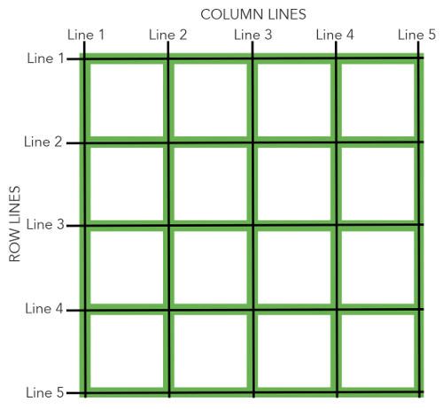

## 前言
Grid布局方式借鉴了平面装帧设计中的格线系统，将格线运用在屏幕上，而不再是单一的静态页面，可以称之为真正的栅格。本文将详细介绍grid布局

## 布局历史
对于Web开发者来说，网页布局一直是个比较重要的问题。但实际上，在网页开发很长的一段时间当中，我们甚至没有一个比较完整的布局模块。总的来说 Web 布局经历了以下四个阶段：  
1、table表格布局，通过 `Dreamweaver`拖拽表格或者手写 table 标签布局  
2、float浮动及position定位布局，借助元素元素盒模型本身的特性以及 float position 等属性等进行布局  
3、flex弹性盒模型布局，革命性的突破，解决传统布局方案上的三大痛点 排列方向、对齐方式，自适应尺寸。是目前最为成熟和强大的布局方案  
4、grid栅格布局，二维布局模块，具有强大的内容尺寸和定位能力，适合需要在两个维度上对齐内容的布局

Grid Layout 是一种基于二维网格的布局系统，旨在完全改变我们设计基于网格的用户界面的方式，弥补网页开发在二维布局能力上的缺陷  
与flex分为伸缩容器和伸缩项目类似，grid也分为网格容器和网格项目

## gird
网格布局（Grid）是最强大的 CSS 布局方案。

它将网页划分成一个个网格，可以任意组合不同的网格，做出各种各样的布局。以前，只能通过复杂的 CSS 框架达到的效果，现在浏览器内置了。

## 基本概念

### 容器和项目
> 采用网格布局的区域，称为"容器"（container）。容器内部采用网格定位的子元素，称为"项目"（item）。

```
<div class="grid-box">
    <div class="grid-main">
        <div class="grid-item">item1</div>
        <div class="grid-item">item2</div>
        <div class="grid-item">item3</div>
    </div>
</div>
```
grid-main : grid 容器  
grid-item : 项目

目前已经越来越多浏览器开始兼容grid布局了。

[点击查看兼容](https://caniuse.com/css-grid/embed)

### 行和列
> 容器里面的水平区域称为"行"（row），垂直区域称为"列"（column）。

### 单元格
行和列的交叉区域，称为"单元格"（cell）。

正常情况下，n行和m列会产生n x m个单元格。比如，3行3列会产生9个单元格。

### 网格线
划分网格的线，称为"网格线"（grid line）。水平网格线划分出行，垂直网格线划分出列。

正常情况下，n行有n + 1根水平网格线，m列有m + 1根垂直网格线，比如三行就有四根水平网格线。




## 网格容器
Grid 布局的属性分成两类。一类定义在容器上面，称为容器属性；另一类定义在项目上面，称为项目属性。这部分先介绍容器属性。

### display 属性
通过display属性设置属性值为grid或inline-grid可以创建一个网格容器。网格容器中的所有子元素就会自动变成网格项目（grid item）

```
display: grid
display: inline-grid
```
效果展示：
<iframe style="width: 100%; height: 320px;" src="https://shiyou00.github.io/lion/dist/html/css-grid/css-grid-1.html" frameborder="0"></iframe>


## grid-template-columns && grid-template-rows 属性
> grid-template-columns 属性定义每一列的列宽；grid-template-rows 属性定义每一行的行高

```
// item1和item2具有固定的高，分别为60px和40px。因为只定义了两个行的高度值，所以item3和item4的高度是根据其自身的内容来定义。
grid-template-rows: 60px 40px 

// 因为grid-template-columns只定义了三列的大小，它们也分别放置在列1、列2和列3；其中列1、列2和列3的尺寸大小等于item1、item2和item3宽度。
grid-template-columns: 40px 50px 60px 
```

效果展示
<iframe style="width: 100%; height: 320px;" src="https://shiyou00.github.io/lion/dist/html/css-grid/css-grid-2.html" frameborder="0"></iframe>


### fr
> fr单位可以帮助我们创建一个弹列的网格轨道。它代表了网格容器中可用的空间（就像Flexbox中无单位的值）

```
// 网格容器分成了4等份（1 + 1 + 2 = 4），每一份（1fr）是网格容器宽度的四分之一。所以item1和item2的宽度是网格容器的四分之一宽，item3是网格容器宽度的四分之二（2fr）
grid-template-columns: 1fr 1fr 2fr

// 当fr和其它长度单位的值结合在一起的时候，fr是基于网格容器可用空间来计算。
// 网格容器可用空间是网格宽度减去3rem和25%剩下的宽度，而fr就是基于这个尺寸计算：
grid-template-columns: 3rem 25% 1fr 2fr // 1fr = (网格宽度 - 3rem - 网格宽度 * 25%) / 3
```

效果展示
<iframe style="width: 100%; height: 320px;" src="https://shiyou00.github.io/lion/dist/html/css-grid/css-grid-3.html" frameborder="0"></iframe>


### minmax()
> 可以通过minmax()函数来创建网格轨道的最小或最大尺寸。minmax()函数接受两个参数：第一个参数定义网格轨道的最小值，第二个参数定义网格轨道的最大值。可以接受任何长度值，也接受auto值。auto值允许网格轨道基于内容的尺寸拉伸或挤压

```
grid-template-rows: minmax(100px, auto); // 第一行的高度最小值是100px，但其最大值为auto，允许行的高度可以变大超过100px。
grid-template-columns: minmax(auto, 50%) 1fr 3em; // 第一列设置了最小值为auto，但它的最大值是50%，也就是列的最大宽度不会超过网格容器宽度的50%
```

效果演示
<iframe style="width: 100%; height: 320px;" src="https://shiyou00.github.io/lion/dist/html/css-grid/css-grid-4.html" frameborder="0"></iframe>


### repeat()
> 使用repeat()可以创建重复的网格轨道。这个适用于创建相等尺寸的网格项目和多个网格项目。repeat()接受两个参数：第一个参数定义网格轨道应该重复的次数，第二个参数定义每个轨道的尺寸。

```
grid-template-rows: repeat(3, 1fr);    

// 第一列和最后一列的宽度都是30px，并且它们之间有另列三列，这三列是通过repeat()来创建的，而且每列的列宽是1fr（1fr = (网格宽度 - 30px - 30px) / 3）
grid-template-columns: 30px repeat(3, 1fr) 30px;
```

效果演示
<iframe style="width: 100%; height: 320px;" src="https://shiyou00.github.io/lion/dist/html/css-grid/css-grid-5.html" frameborder="0"></iframe>


## 间距

【grid-column-gap】创建列与列之间的间距

【grid-row-gap】创建行与行之间的间距

【grid-gap】默认值为0
> grid-gap是grid-row-gap和grid-column-gap两个属性的缩写，如果它指定了两个值，那么第一个值是设置grid-row-gap的值，第二个值设置grid-column-gap的值。如果只设置了一个值，表示行和列的间距相等，也就是说grid-row-gap和grid-column-gap的值相同

[注意]grid-gap只能创建列与列或行与行之间的间距，但不能创建列和行与网格容器边缘的间距  
间距(Gap)可以设置任何非负值，长度值可以是px、%、em等单位值

效果演示
<iframe style="width: 100%; height: 320px;" src="https://shiyou00.github.io/lion/dist/html/css-grid/css-grid-6.html" frameborder="0"></iframe>


以上是设置在容器上的属性和值，下面介绍设置在项目上的属性和值

-------------------------------------------------

## 网格项目 item

### 网格线
> 项目的位置是可以指定的，具体方法就是指定项目的四个边框，分别定位在哪根网格线。

【grid-row-start】上边框所在的水平网格线

【grid-row-end】下边框所在的水平网格线

【grid-column-start】左边框所在的垂直网格线

【grid-column-end】右边框所在的垂直网格线

默认值为 auto

通俗来讲就是“一个网格”其实位置和结束位置
```
.item1 {
  grid-column-start: 2;
  grid-column-end: 4;
}
上面代码指定，item1项目的左边框是第二根垂直网格线，右边框是第四根垂直网格线。
```

效果演示：
<iframe style="width: 100%; height: 320px;" src="https://shiyou00.github.io/lion/dist/html/css-grid/css-grid.html" frameborder="0"></iframe>


【grid-column】   
grid-column是grid-column-start和grid-column-end的简写。

【grid-row】   
grid-row是grid-row-start和grid-row-end的简写。

默认值为auto

如果只提供一个值，则指定了grid-row-start(grid-column-start)值；如果提供两个值，第一个值是grid-row-start(grid-column-start)的值，第二个值是grid-row-end(grid-column-end)的值，两者之间必须要用/隔开

【span】  
关键词span后面紧随数字，表示合并多少个列或行

效果展示
<iframe style="width: 100%; height: 320px;" src="https://shiyou00.github.io/lion/dist/html/css-grid/css-grid-7.html" frameborder="0"></iframe>


【grid-area】  
如果指定四个值，第一个值对应grid-row-start，第二个值对应grid-column-start，第三个值对应grid-row-end，第四个值对应grid-column-end

<iframe style="width: 100%; height: 320px;" src="https://shiyou00.github.io/lion/dist/html/css-grid/css-grid-8.html" frameborder="0"></iframe>


## 网格线命名
grid-template-columns属性和grid-template-rows属性里面，还可以使用方括号，指定每一根网格线的名字，方便以后的引用。

```
.container {
  display: grid;
  grid-template-columns: [c1] 100px [c2] 100px [c3] auto [c4];
  grid-template-rows: [r1] 100px [r2] 100px [r3] auto [r4];
}
```
上面代码指定网格布局为3行 x 3列，因此有4根垂直网格线和4根水平网格线。方括号里面依次是这八根线的名字。

## 网格区域命名
【grid-template-areas】  
像网格线名称一样，网格区域的名称可以使用grid-template-areas属性来命名。引用网格区域名称也可以设置网格项目位置
```
grid-template-areas:   "header header"   "content sidebar"    "footer footer";
grid-template-rows:    150px 1fr 100px;
grid-template-columns: 1fr 200px;
```
设置网格区域的名称应该放置在单引号或双引号内，每个名称由一个空格符分开。网格区域的名称，每组（单引号或双引号内的网格区域名称）定义了网格的一行，每个网格区域名称定义网格的一列

[注意]grid-template-areas: "header header" "content sidebar" "footer footer";不可以简写为grid-template-areas: "header" "content sidebar" "footer";

效果展示
<iframe style="width: 100%; height: 320px;" src="https://shiyou00.github.io/lion/dist/html/css-grid/css-grid-9.html" frameborder="0"></iframe>


## 隐式网格
【grid-auto-flow】  
网格默认流方向是row，可以通过grid-auto-flow属性把网格流的方向改变成column

效果展示
<iframe style="width: 100%; height: 320px;" src="https://shiyou00.github.io/lion/dist/html/css-grid/css-grid-10.html" frameborder="0"></iframe>


【grid-auto-rows】  
【grid-auto-columns】  
> 有时候，一些项目的指定位置，在现有网格的外部。比如网格只有3列，但是某一个项目指定在第5行。这时，浏览器会自动生成多余的网格，以便放置项目。

grid-auto-columns属性和grid-auto-rows属性用来设置，浏览器自动创建的多余网格的列宽和行高。它们的写法与grid-template-columns和grid-template-rows完全相同。如果不指定这两个属性，浏览器完全根据单元格内容的大小，决定新增网格的列宽和行高。

下面的例子里面，划分好的网格是3行 x 3列，但是，8号项目指定在第4行。所以grid-auto-rows会作用于item8，请手动操作下  

<iframe style="width: 100%; height: 320px;" src="https://shiyou00.github.io/lion/dist/html/css-grid/css-grid-11.html" frameborder="0"></iframe>

## 网格项目层级
网格项目可以具有层级和堆栈，必要时可能通过z-index属性来指定

```
.item-1,.item-2 {
    grid-row-start:  1;
    grid-column-end: span 2;
}
.item-1 { 
    grid-column-start: 1; 
    z-index: 1; 
}
.item-2 { 
    grid-column-start: 2 
}
```
在这个例子中，item1和item2的开始行都是1，item1列的开始是1，item2列的开始是2，并且它们都跨越两列。两个网格项目都是由网格线数字定位，结果这两个网格项目重叠了。

默认情况下，item2在item1上面，但是，我们在item1中设置了z-index:1;，导致item1在item2之上

效果展示：通过控制z-index的值，可以看得出item1 和 item2的层级关系

<iframe style="width: 100%; height: 320px;" src="https://shiyou00.github.io/lion/dist/html/css-grid/css-grid-12.html" frameborder="0"></iframe>


## 对齐

【justify-items】  
【justify-self】  
【align-items】  
【align-self】  
> justify-items和justify-self指定网格项目沿着行轴对齐方式；align-items和align-self指定网格项目沿着列轴对齐方式。

justify-items和align-items应用在网格容器上

align-self和justify-self属性用于网格项目自身对齐方式

这四个属性主要接受以下属性值：auto | normal | start | end | center | stretch | baseline | first baseline | last baseline

效果展示
<iframe style="width: 100%; height: 320px;" src="https://shiyou00.github.io/lion/dist/html/css-grid/css-grid-13.html" frameborder="0"></iframe>

综合效果来看，都是在网格线内进行移动的对齐的。

【align-content】属性是整个内容区域的垂直位置（上中下）  
【justify-content】属性是整个内容区域在容器里面的水平位置（左中右）

支持的属性值
```
normal | start | end | center | stretch | space-around | space-between | space-evenly | baseline | first baseline | last baseline
```

效果演示
<iframe style="width: 100%; height: 320px;" src="https://shiyou00.github.io/lion/dist/html/css-grid/css-grid-14.html" frameborder="0"></iframe>

## 小结
grid的属性和值是非常的多，初看一遍感觉很难懂，但是仔细按照例子操作下会发现grid是非常强大的布局系统的。赶快用起来把！
