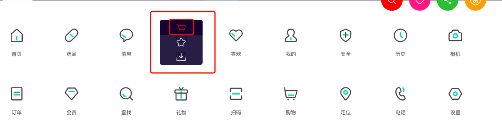
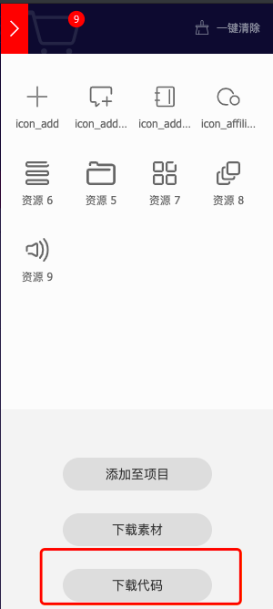
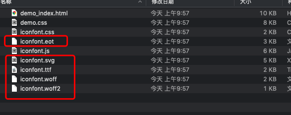
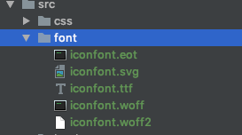
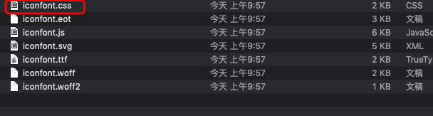
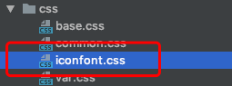
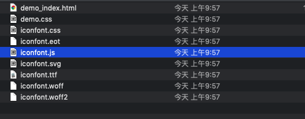

## 前言
项目开发中，是避免不了使用小图标的，那么国内比较好用的图标网站当属iconfont了，下面我们将详细介绍如何使用。

## iconfont选择所需图标

1、[iconfont官网](https://www.iconfont.cn/home/index)

2、把所需要的添加进入购物车  


3、添加所需图标完毕后，点击右上角的购物车图标  


4、下载代码  


5、下载的代码解压后  

图片上圈起来的都是字体文件

6、项目中新建一个font文件夹用来放置字体文件  


7、取出iconfont.css文件放入css文件夹  




8、打开iconfont.css文件，配置正确的字体文件路径
```
// 这里要根据自己的项目配置正确的字体路径：../font/iconfont.eot
@font-face {font-family: "iconfont";
  src: url('../font/iconfont.eot?t=1554343058030'); /* IE9 */
  src: url('../font/iconfont.eot?t=1554343058030#iefix') format('embedded-opentype'), /* IE6-IE8 */
  url('这里省略的base64字符...') format('woff2'),
  url('../font/iconfont.woff?t=1554343058030') format('woff'),
  url('../font/iconfont.ttf?t=1554343058030') format('truetype'), /* chrome, firefox, opera, Safari, Android, iOS 4.2+ */
  url('../font/iconfont.svg?t=1554343058030#iconfont') format('svg'); /* iOS 4.1- */
}
// 这个文件是下载字体时系统自带的
.iconfont {
  font-family: "iconfont" !important; // 这里的iconfont 和上面定义的font-family一定要是一样的
  font-size: 16px;
  font-style: normal;
  -webkit-font-smoothing: antialiased;
  -moz-osx-font-smoothing: grayscale;
}
// 下面是自动生成的图标类，可以直接引用
.icon-icon_add:before {
  content: "\eb8f";
}

.icon-icon_addmessage:before {
  content: "\eb90";
}

.icon-icon_addresslist:before {
  content: "\eb91";
}

.icon-icon_affiliations_li:before {
  content: "\eb92";
}
```

9、项目中使用
```
<!-- 这个文件一定要正确引入 -->
<link rel="stylesheet" href="../../css/iconfont.css"> 

/* 正确使用一个icon */
<i class="iconfont icon-icon_add"></i>
```

这样我们就可以愉快的使用icon了

效果展示：
<iframe style="width: 100%; height: 164px;" src="https://shiyou00.github.io/lion/dist/html/css-font/iconfont.html?case=f1" frameborder="0"></iframe>

【font-class】  
我们引用icon的方式是通过class的方式引入的。具有以下特点：
- 兼容性良好，支持 IE8+，及所有现代浏览器。
- 相比于 Unicode 语意明确，书写更直观。可以很容易分辨这个 icon 是什么。
- 因为使用 class 来定义图标，所以当要替换图标时，只需要修改 class 里面的 Unicode 引用。
- 不过因为本质上还是使用的字体，所以多色图标还是不支持的。

[注意] 之所以兼容IE8+是因为使用了before伪元素

【Symbol 引用】  
这是一种全新的使用方式，应该说这才是未来的主流，也是平台目前推荐的用法。  
这种用法其实是做了一个 SVG 的集合，与class引入相比具有如下特点：  
- 支持多色图标了，不再受单色限制。
- 通过一些技巧，支持像字体那样，通过 font-size, color 来调整样式。
- 兼容性较差，支持 IE9+，及现代浏览器。
- 浏览器渲染 SVG 的性能一般，还不如 png。

【使用方式】  
引入下载下来的iconfont.js到相应文件夹  


HTML文件中引入iconfont.js
```
<script src="../../js/iconfont.js"></script>
```

HTML中使用svg
```
<!DOCTYPE html>
<html lang="en">
<head>
    <meta charset="UTF-8">
   <title>font</title>
    <link rel="stylesheet" href="../../css/iconfont.css">
    <style>
        /* 添加svg样式 */ 
        .icon {
            width: 1em;
            height: 1em;
            vertical-align: -0.15em;
            fill: currentColor;
            overflow: hidden;
        }
    </style>
</head>
<body>

<!-- 引入svg -->
<svg class="icon" aria-hidden="true">
    <use xlink:href="#icon-icon_addresslist"></use>
</svg>


<script src="../../js/iconfont.js"></script>
</body>
</html>
```

现在页面上也可以正确渲染图标了。

## 小结
目前来说，常用的方法就是上面两种了，我们团队目前使用的是class方式引用。
