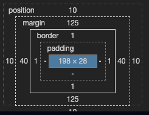

## 前言
CSS有三种基本的布局机制：普通流、浮动和绝对定位。利用定位，可以准确地定义元素框相对于其正常位置应该出现的位置，或者相对于父元素、另一个元素甚至浏览器窗口本身的位置。但元素究竟如何定位，定位到什么位置，主要依靠top/right/bottom/left这四个偏移属性。本文就定位中的偏移做详细介绍

## position定位
```
值: static | relative | absolute | fixed | inherit
初始值: static
应用于: 所有元素
继承性: 无
```

static:元素框正常生成。块级元素生成一个矩形框，作为文档流的一部分，行内元素则会创建一个或多个行框，置于其父元素中

relative:元素框偏移某个距离。元素仍保持其未定位前的形状，它原本所占的空间仍保留

absolute:元素框从文档流完全删除，并相对于其包含块定位，包含块可能是文档中的另一个元素或者是初始包含块。元素原先在正常文档流中所占的空间会关闭，就好像该元素原来不存在一样。元素定位后生成一个块级框，而不论原来它在正常流中生成何种类型的框

fixed:元素框的表现类似于将position设置为absolute，不过其包含块是视窗本身

[注意]相对定位实际上被看作普通流定位模型的一部分，因为元素的位置相对于它在普通流中的位置

效果展示：
<iframe style="width: 100%; height: 240px;" src="https://shiyou00.github.io/lion/dist/html/css-position/position.html?case=f1" frameborder="0"></iframe>

## 包含块
【1】根元素  
根元素HTML的包含块(也称为初始包含块)是一个视窗大小的矩形，即HTML的父级document

【2】非根元素  
如果position值是relative或static，包含块由最近的块级框、表单元格或行内祖先框的内容边界构成

如果position值是absolute，包含块设置为最近的position值不是static的祖先元素(可以是任何类型)，过程如下:

[1]如果这个祖先是块级元素，包含块则设置为该元素的内边距边界。换句话说，就是由边框界定的区域

[2]如果这个祖先是行内元素，包含块则设置为该祖先元素的内容边界

[3]如果没有祖先，元素的包含块定义为初始包含块，即document

[注意]由于元素可以定位到其包含块的外面。这与浮动元素使用负外边距浮动到其父元素内容区外面很类似。所以这里包含块实际上应该是定位上下文，或者定位父级

## 偏移属性
三种定位机制使用了4个属性来描述定位元素各边相对于其包含块的偏移。这4个属性被称为偏移属性。
```
top/right/bottom/left

值: <length> | <percentage> | auto | inherit

初始值: auto

应用于: 定位元素(也就是position值不是static的元素)

继承性: 无

百分数: 对于top和bottom，相对于包含块的clientHeight；对于right和left，相对于包含块的clientWidth
```

这些属性描述了距离包含块最近边的偏移。top描述了定位元素上外边界离其包含块的顶端有多远。如果top为正值，会把定位元素的上外边距边界下移，若为负值，则会把定位元素的上外边距移到其包含块的顶端之上。类似地，left描述了定位元素的左外边距边界在其包含块左边界右边(正值)或左边(负值)有多远。如果是正值，会把定位元素的外边距边界移到包含块左边界右边，而负值则将其移到包含块左边界左边。所以，正值会导致向内偏移，使边界朝着包含块的中心移动，而负值会导致向外偏移。

偏移定位元素的外边距边界时，带来的影响是元素的所有一切(包含外边距、边框、内边距和内容)都会在定位的过程中移动

[注意]定位元素的边界是指定位元素margin外侧的边界；包含块的包含区域是指包含块的border内侧的padding+content区域

效果展示：
<iframe style="width: 100%; height: 400px;" src="https://shiyou00.github.io/lion/dist/html/css-position/position.html?case=f2" frameborder="0"></iframe>

## 绝对定位
元素绝对定位时，会从文档流中完全删除。然后相对于其包含块定位，其边界根据偏移属性(top、left等)放置。定位元素不会流入其他元素的内容，反之亦然。元素绝对定位时，会为其后代元素建立一个包含块

[注意]如果文档可滚动，绝对定位元素会随着它滚动，因为元素最终会相对于正常流的某一部分定位

当元素绝对定位时，偏移属性表现如下:
```
left:0 元素的左边界(margin-left外侧)位于包含块的左边界内侧(border-left内侧)
top:0 元素的上边界(margin-rop外侧)位于包含块的上边界内侧(border-top内侧)
right:0 元素的右边界(margin-right外侧)位于包含块的右边界内侧(border-right内侧)
bottom:0 元素的下边界(margin-bottom外侧)位于包含块的下边界内侧(border-bottom内侧)
```

```
当top、right、bottom、left四个值都为auto时(即都处于默认状态时)，
left:auto 元素的左边界位于元素处于静态位置时的左边界
top:auto 元素的上边界位于元素处于静态位置时的上边界
right:auto 元素的右边界位于正好能包裹住元素的横向区域的右边界(margin-right外侧)
bottom:auto 元素的下边界位于正好能包裹住元素的纵向区域的下边界(margin-bottom外侧)
```

[注意]元素的静态位置是指元素在正常流中原本的位置，更确切的讲，顶端的静态位置是从包含块的上边界到假想框的上外边距边界之间的距离。假想框是假设元素position属性为static时元素的第一个框。如果这个假想框在包含块的上面，则这个值为负

效果展示：
<iframe style="width: 100%; height: 600px;" src="https://shiyou00.github.io/lion/dist/html/css-position/position.html?case=f3" frameborder="0"></iframe>

## 格式化
对于普通流的元素来说，水平格式化的7大属性是margin-left、border-left、padding-left、width、padding-right、border-right、margin-right7个属性的值加在一起必须是元素包含块的宽度，这往往是块元素的父元素的width值(因为块级元素的父级元素几乎都是块级元素)。垂直方向也类似。

但是对于绝对定位元素则不相同。它的水平格式化等式为:
```
left + margin-left + border-left-width + padding-left + width + padding-right + border-right-width + margin-right + right = 包含块的clientWidth
```

类似的，垂直格式化等式为:
```
top + margin-top + border-top-width + padding-top + height + padding-bottom + border-bottom-width + margin-bottom + bottom = 包含块的clientHeight
```



## auto
auto值是用来弥补实际值与所需总和的差距。

水平方向上，可以为auto的属性有left、margin-left、width、margin-right、right。类似地，垂直方向上，可以为auto的属性有top、margin-top、height、margin-bottom、bottom

1、margin-left:auto; margin-right:auto; left:0; right:0; 块元素可以横向居中显示  
2、margin-top:auto; margin-bottom:auto; top:0; right:0; 块元素可以纵向居中显示
结合上面两点可以实现水平垂直居中显示

[注意1]IE7-浏览器不支持绝对定位元素通过将上下外边距设置为auto来实现垂直居中的行为

[注意2]IE6-浏览器不支持绝对定位元素不设置宽度，而通过设置top/left/right/bottom来撑开宽高的行为

效果展示：
<iframe style="width: 100%; height: 800px;" src="https://shiyou00.github.io/lion/dist/html/css-position/position.html?case=f4" frameborder="0"></iframe>
