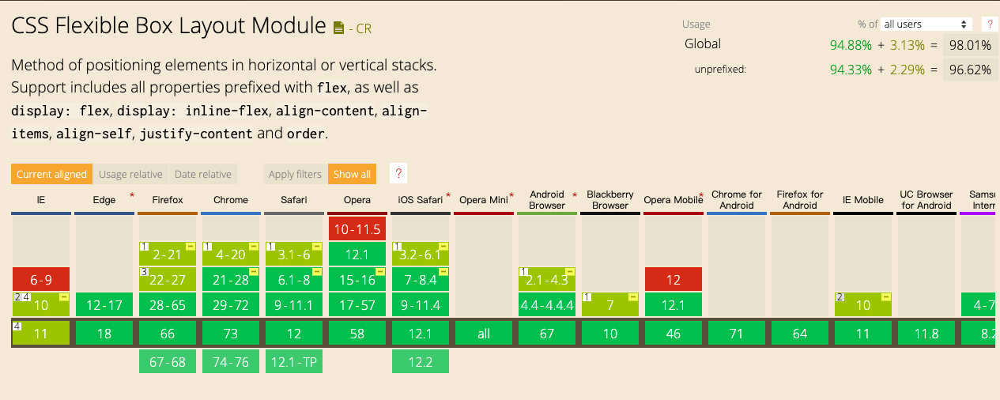

## 前言
> 2009年，W3C 提出了一种新的方案----Flex 布局，可以简便、完整、响应式地实现各种页面布局。目前，它已经得到了所有浏览器的支持，这意味着，现在就能很安全地使用这项功能。



[查询兼容](https://caniuse.com/#search=flex)

## Flex 布局是什么
> Flex 是 Flexible Box 的缩写，意为"弹性布局"，用来为盒状模型提供最大的灵活性。

任何一个容器都可以指定为 Flex 布局。

```
.flexBox{
  display: flex; 
  display: inline-flex;
  display: -webkit-flex;
}
```
[兼容]Webkit 内核的浏览器，必须加上-webkit前缀。  
[注意]设为 Flex 布局以后，子元素的float、clear和vertical-align属性将失效。

效果展示：
<iframe style="width: 100%; height: 132px;" src="https://shiyou00.github.io/lion/dist/html/css-flex/flex.html?case=f1" frameborder="0"></iframe>

## 基本概念
【容器】【项目】  
采用 Flex 布局的元素，称为 Flex 容器（flex container），简称"容器"。它的所有子元素自动成为容器成员，称为 Flex 项目（flex item），简称"项目"。

【水平的主轴】【垂直的交叉轴】  
主轴的开始位置（与边框的交叉点）叫做main start，结束位置叫做main end；  
交叉轴的开始位置叫做cross start，结束位置叫做cross end。  
项目默认沿主轴排列。单个项目占据的主轴空间叫做main size，占据的交叉轴空间叫做cross size。

## 容器的属性
以下6个属性设置在容器上
```
flex-direction 
flex-wrap
flex-flow
justify-content
align-items
align-content
```

【flex-direction】
> direction属性决定主轴的方向（即项目的排列方向）。

属性值
```
.flexBox {
  flex-direction: row | row-reverse | column | column-reverse;
}
row（默认值）：主轴为水平方向，起点在左端。
row-reverse：主轴为水平方向，起点在右端。
column：主轴为垂直方向，起点在上沿。
column-reverse：主轴为垂直方向，起点在下沿。
```

效果展示：
<iframe style="width: 100%; height: 132px;" src="https://shiyou00.github.io/lion/dist/html/css-flex/flex.html?case=f2" frameborder="0"></iframe>

【flex-wrap】  
默认情况下，项目都排在一条线（又称"轴线"）上。flex-wrap属性定义，如果一条轴线排不下，如何换行。

```
.box{
  flex-wrap: nowrap | wrap | wrap-reverse;
}
nowrap(默认)：不换行
wrap：换行，第一行在上方
wrap-reverse：换行，第一行在下方
```

效果展示：
<iframe style="width: 100%; height: 242px;" src="https://shiyou00.github.io/lion/dist/html/css-flex/flex.html?case=f3" frameborder="0"></iframe>

【flex-flow】  
flex-flow属性是flex-direction属性和flex-wrap属性的简写形式，默认值为row nowrap。

```
.box {
  flex-flow: <flex-direction> || <flex-wrap>;
}
```

效果展示：
<iframe style="width: 100%; height: 242px;" src="https://shiyou00.github.io/lion/dist/html/css-flex/flex.html?case=f4" frameborder="0"></iframe>

【justify-content】
> justify-content属性定义了项目在主轴上的对齐方式。

```
.box {
  justify-content: flex-start | flex-end | center | space-between | space-around;
}

flex-start（默认值）：左对齐
flex-end：右对齐
center： 居中
space-between：两端对齐，项目之间的间隔都相等。
space-around：每个项目两侧的间隔相等。所以，项目之间的间隔比项目与边框的间隔大一倍。
```

效果展示：
<iframe style="width: 100%; height: 128px;" src="https://shiyou00.github.io/lion/dist/html/css-flex/flex.html?case=f5" frameborder="0"></iframe>

【align-items】
> align-items属性定义项目在交叉轴上如何对齐

```
.box {
  align-items: flex-start | flex-end | center | baseline | stretch;
}
flex-start：交叉轴的起点对齐。
flex-end：交叉轴的终点对齐。
center：交叉轴的中点对齐。
baseline: 项目的第一行文字的基线对齐。
stretch（默认值）：如果项目未设置高度或设为auto，将占满整个容器的高度。
```

效果展示：
<iframe style="width: 100%; height: 230px;" src="https://shiyou00.github.io/lion/dist/html/css-flex/flex.html?case=f6" frameborder="0"></iframe>

【align-content】
> align-content属性定义了多根轴线的对齐方式。如果项目只有一根轴线，该属性不起作用。

```
.box {
  align-content: flex-start | flex-end | center | space-between | space-around | stretch;
}
flex-start：与交叉轴的起点对齐。
flex-end：与交叉轴的终点对齐。
center：与交叉轴的中点对齐。
space-between：与交叉轴两端对齐，轴线之间的间隔平均分布。
space-around：每根轴线两侧的间隔都相等。所以，轴线之间的间隔比轴线与边框的间隔大一倍。
stretch（默认值）：轴线占满整个交叉轴。
```

效果展示：
<iframe style="width: 100%; height: 300px;" src="https://shiyou00.github.io/lion/dist/html/css-flex/flex.html?case=f7" frameborder="0"></iframe>


---------------------------------------

## 项目的属性
以下6个属性设置在项目上
```
order
flex-grow
flex-shrink
flex-basis
flex
align-self
```
【order】  
order属性定义项目的排列顺序。数值越小，排列越靠前，默认为0。

```
.item {
  order: <integer>;
}
```

效果展示：
<iframe style="width: 100%; height: 242px;" src="https://shiyou00.github.io/lion/dist/html/css-flex/flex.html?case=f8" frameborder="0"></iframe>

设置item1的order为1时 其它item都是0 所以item1跑到最后面去了

【flex-grow】
> flex-grow属性定义项目的放大比例，默认为0，即如果存在剩余空间，也不放大。

如果所有项目的flex-grow属性都为1，则它们将等分剩余空间（如果有的话）。如果一个项目的flex-grow属性为2，其他项目都为1，则前者占据的剩余空间将比其他项多一倍。
```
.item {
  flex-grow: <number>; /* default 0 */
}
```

效果展示：
<iframe style="width: 100%; height: 260px;" src="https://shiyou00.github.io/lion/dist/html/css-flex/flex.html?case=f9" frameborder="0"></iframe>

【flex-shrink】
> flex-shrink属性定义了项目的缩小比例，默认为1，即如果空间不足，该项目将缩小。

```
.item {
  flex-shrink: 1;
}
```

如果所有项目的flex-shrink属性都为1，当空间不足时，都将等比例缩小。如果一个项目的flex-shrink属性为0，其他项目都为1，则空间不足时，前者不缩小。

负值对该属性无效。

【flex-basis】
> flex-basis属性定义了在分配多余空间之前，项目占据的主轴空间（main size）。浏览器根据这个属性，计算主轴是否有多余空间。它的默认值为auto，即项目的本来大小。

```
.item {
  flex-basis: <length> | auto; /* default auto */
}
```

它可以设为跟width或height属性一样的值（比如350px），则项目将占据固定空间。

效果展示：
<iframe style="width: 100%; height: 480px;" src="https://shiyou00.github.io/lion/dist/html/css-flex/flex.html?case=f10" frameborder="0"></iframe>

【flex属性】
> flex属性是flex-grow, flex-shrink 和 flex-basis的简写，默认值为0 1 auto。后两个属性可选。

```
.item {
  flex: none | [ <'flex-grow'> <'flex-shrink'>? || <'flex-basis'> ]
}
```

该属性有两个快捷值：auto (1 1 auto) 和 none (0 0 auto)。

建议优先使用这个属性，而不是单独写三个分离的属性，因为浏览器会推算相关值。

效果展示参考上一个。

【align-self】
> align-self属性允许单个项目有与其他项目不一样的对齐方式，可覆盖align-items属性。默认值为auto，表示继承父元素的align-items属性，如果没有父元素，则等同于stretch。

```
.item {
  align-self: auto | flex-start | flex-end | center | baseline | stretch;
}
```

效果展示：
<iframe style="width: 100%; height: 306px;" src="https://shiyou00.github.io/lion/dist/html/css-flex/flex.html?case=f11" frameborder="0"></iframe>

## 小结
本文大部分都是参考阮大神的文章，只不过自己制作了点小例子供学习参考
