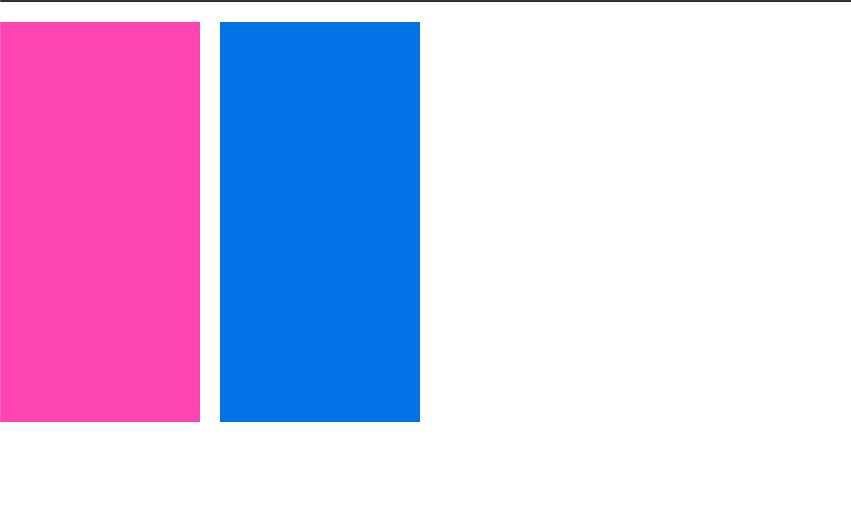

## 前言
相信在平时写CSS的时候大家都或多或少遇见过设置了height为百分比的时候发现不起作用。今天我们就来一探究竟

原因：父元素未设置具体高度，子元素设置height:100%是无效的。

## 现象以及方案

[1] 设置高度为100%时，无法实现全屏
```
<!DOCTYPE html>
<html lang="en">
<head>
    <meta charset="UTF-8">
    <style>
        .case-box{
            height: 100%;
            background:red;
        }
    </style>
</head>
<body>
<div class="case-box"></div>
</body>
</html>
```

这样写，你会发现一点效果都没有。

【解决方案】  
增加如下代码：  
```
html,body{
    height: 100%;
}
```


[2] 一个父元素中包含2个子元素，其中一个子元素非常高，撑开了父元素，另外1个子元素设置高度为100%失效。
```
<style>
    .case-box{
        overflow: hidden;
    }
    .height-max{
        width: 200px;
        height:400px;
        background: #167be0;
        float:left;
    }
    .height-percent{
        margin-right:20px;
        background: hotpink;
        width: 200px;
        height: 100%;
        padding:20px;
        float:left;
    }
</style>
<div class="case-box clearfix" data-case="f2">
    <div class="height-percent"></div>
    <div class="height-max"></div>
</div>
```


height-max 设置了高度是400px撑开了父级使得父级case-box高度也是400px，height-percent设置了高度为100%，本来我们期望会跟父级的高速一样都是400px，可是它还是没有高度(背景色是padding撑起来的)。

平时的布局经常可以碰到这样的情况，需要根据一个块的高度进行高度自适应布局，但是好像单纯的设置高度为100%是无法实现的。

【方案一】  
父元素case-box设置一个定高(视乎这样压根就满足不了我们的需求)

【方案二】  
使用position
```
<style>
    .case-box{
        overflow: hidden;
        position: relative;
    }
    .height-max{
        width: 200px;
        height:400px;
        background: #167be0;
        float:left;
        margin-left: 220px;
    }
    .height-percent{
        margin-right:20px;
        background: hotpink;
        width: 200px;
        height: 100%;
        padding:20px;
        float:left;
        position: absolute;
    }
</style>
```



[缺点]这样使用会破坏原本的布局顺序

【方案三】  
使用flex
```
<style>
    .case-box{
        position: relative;
        display: flex;
    }
    .height-max{
        width: 200px;
        height:400px;
        background: #167be0;
    }
    .height-percent{
        margin-right:20px;
        background: hotpink;
        width: 200px;
        padding:20px;
    }
</style>
```


不可否认flex布局还是非常方便的

[缺点]兼容性稍差

【方案四】  
display: table

```
<style>
    .case-box{
        position: relative;
        display: table;
    }
    .height-max{
        width: 200px;
        height:400px;
        background: #167be0;
    }
    .height-percent{
        background: hotpink;
        width: 200px;
        display: table-cell;
    }
</style>
```


[缺点]margin失效

【最佳方案】  
padding-bottom:3000px;margin-bottom:-3000px;

```
<style>
    .case-box{
        overflow: hidden;
        zoom:1;
    }
    .height-max{
        width: 200px;
        height:400px;
        background: #167be0;
        margin-left: 220px;
    }
    // 需要自使用的块设置好padding和margin
    .height-percent{
        background: hotpink;
        width: 200px;
        float:left;
        padding-bottom: 3000px;
        margin-bottom: -3000px;
    }
</style>
```
3000像素是个可变值，如果您的分栏高度不可能高度超过2000像素，您就可以设为2000像素，如果会超过3000像素，那么您要修改值为4000像素或是更高。  
父标签的overflow:hidden属性是必须的，否则会显示溢出的内容


## 小结
通过本文学习了:  
为什么height设置百分比无效(因为父元素没有设置固定高度的原因)  
以及如何实现高度自适用的布局方法
