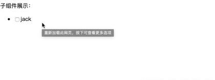
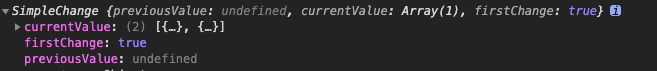

## 场景描述

父组件：
```
import { Component, OnInit } from '@angular/core';

@Component({
  selector: 'app-set-data',
  templateUrl: './set-data.component.html',
  styleUrls: ['./set-data.component.css']
})
export class SetDataComponent implements OnInit {
  heroList = [
    {
      name: "jack",
      age: 18
    }
  ];
  constructor() { }

  ngOnInit() {
  }
}


html:
<div>
  子组件展示：
  <child-data [heroList]="heroList"></child-data>
</div>
```


子组件：
```
import { Component, OnInit, Input } from '@angular/core';

@Component({
  selector: 'child-data',
  templateUrl: './child-data.component.html',
  styleUrls: ['./child-data.component.css']
})
export class ChildDataComponent implements OnInit {

  @Input() heroList;

  constructor() { }

  ngOnInit() {
    console.log(this.heroList);
  }

}
```

以上代码：   
父组件通过@Input()的方式把heroList传递给子组件，子组件要添加一些附加东西来适应子组件的渲染，譬如添加checked是否被选中。

我们把子组件代码改善一下：

```
ngOnInit() {
    this.heroList.forEach((item)=>{
      item['checked'] = false;
    })
  }
```

现在假设父组件中的heroList因为某种原因，在后期需要拉取后台的数据进行更新，那么我们在子组件就不能在ngOnInit对数据进行操作了，因为父组件后期还会更改heroList里面的数据例如往里面再添加一条。

此时我们在子组件中该如何处理呢？

angular提供了两种方法给我们
1. Input的set方法
2. ngOnChanges的声明周期中获取


## Input的set方法

我们把上面的代码再次修改下：   
父组件：   
```
ngOnInit() {
    setTimeout(()=>{
      this.heroList.push({
        name: "tom",
        age: 26
      })
    },3000)
  }
```
开一个定时器在3s后添加一条数据进来

子组件：
```
export class ChildDataComponent implements OnInit {
  _heroList;

  @Input() set heroList(value){
    this._heroList = value;
    this._heroList.forEach((item)=>{
      item['checked'] = false;
    });
  };

  constructor() { }

  ngOnInit() {
  }
}

html:
<ul>
  <li *ngFor="let hero of _heroList">
    <input type="checkbox" [value]="hero.checked">
    <span>{{hero.name}}</span>
  </li>
</ul>
```

我们来看下页面的变化：  


从图片中我们可以看到当3秒后，增加了一条数据，说明setter函数感知到数据变换了。


## ngOnChanges方法
> 一个生命周期钩子，当指令的任何一个可绑定属性发生变化时调用。 定义一个 ngOnChanges() 方法来处理这些变更

```
interface OnChanges {
  ngOnChanges(changes: SimpleChanges): void
}
```

触发条件：
- @input属性(输入属性)发生变化时，会调用。非此属性，不会调用。
- 当输入属性为对象时，当对象的属性值发生变化时，不会调用，当对象的引用变化时会触发。


我们改动下子组件的代码：
```
import { Component, OnInit, Input, OnChanges, SimpleChanges } from '@angular/core';

@Component({
  selector: 'child-data',
  templateUrl: './child-data.component.html',
  styleUrls: ['./child-data.component.css']
})
export class ChildDataComponent implements OnInit, OnChanges {
  _heroList;

  @Input() heroList;

  constructor() { }

  ngOnInit() {
  }
    
  ngOnChanges({heroList}: SimpleChanges){
    if(heroList.currentValue.length > 0){
        this._heroList = heroList.currentValue;
        this._heroList.forEach((item)=>{
          item['checked'] = false;
        });
    }
  }
}
```
我们同样实现了上面一样的功能

我们打印下heroList对象，看下是什么：   


currentValue: 最新的value  
previousValue: 上一次的value   

我们发现这个方法不仅提供了最新的值，还保留了上一次的值。

但是有一个问题，上面也提到了对象的属性值改变是不会触发的，只要更改了对象的引用才会触发的，针对这个问题，有没有好的解决方案呢。

最好的解决方案就是使用 service + rxjs的方式解决，题主在后期也会深入学习rxjs + service 进行数据管理的


## 小结
在通常情况下使用 setter方式 或者 ngOnChanges 的方式都可以，具体看业务需求。

stack overflow中有一个回答可以参考下：
```
One advantage of ngOnChanges() is that you get all changes at once if your component has several  @Input()s.
If your code only depends on a single @Input() a setter is probably the better approach.
```

意思是有多个@Input()的时候使用ngOnChanges来监听，只有单个@Input()的时候选用setter方式。

[本文代码地址](https://github.com/shiyou00/angular-service/tree/master/service-test/src/app/pages/set-data)