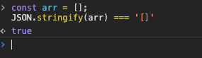
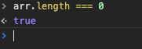

## 前言
平时开发中经常需要判断一个数组或者一个对象是否为空，但是我们发现直接判断`if([]){}`这样做是不行的。本文将总结几种有效的判断方式

## 起因
先看一小段简单的代码：
```
const arr = [];
// 当数组有值得时候进入逻辑分支，没有值得时候不进入逻辑分支
if(arr){
	//我们的业务逻辑;
	console.log(123);
}
```
通过运行代码我们发现实际上会打印出123,就说明此时，`[]` 通过判断为true。

原因:空数组其实就是一个对象，而任意对象通过Boolean()进行转换都为true；

[个人理解]：arr变量保存着一个指针地址，实际上是有值得，这也是为什么两个空数组进行判断会是false的原因，毕竟两个地址都不一样 `[]===[]` 为false

## 空数组的判断

1、JSON.stringify
```
const arr = [];
JSON.stringify(arr) === '[]'
```


2、数组长度判断
```
const arr = [];
arr.length === 0
```


3、数组隐式转换为数字
```
const arr = [];
+arr === 0
```
`+arr` 会隐式转换为数字0

## 空对象的判断
1、JSON.stringify
```
const obj = {};
JSON.stringify(obj) === '{}'
```

2、ES6 新增的方法 Object.keys()
> Object.keys() 方法会返回一个由一个给定对象的自身可枚举属性组成的数组，数组中属性名的排列顺序和使用 for...in 循环遍历该对象时返回的顺序一致 。
```
Object.keys(obj).length === 0;
```

## 小结
实际项目中经常碰到要判断空数组和空对象，特此总结下常用的几种方法。
