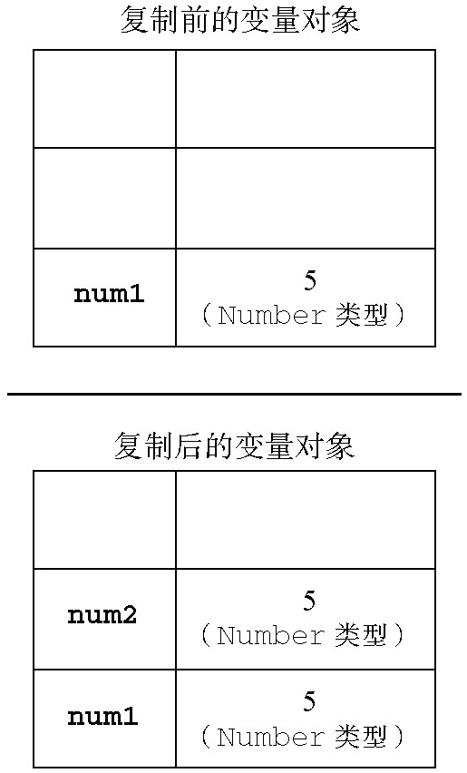
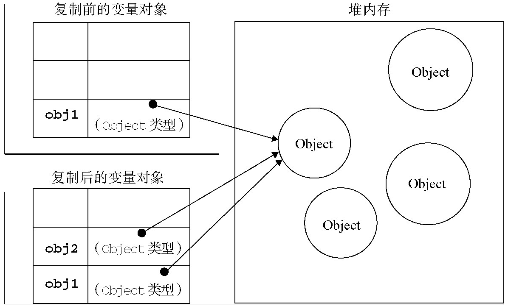

## 前言
ECMAScript变量可能包含两种不同数据类型的值：基本类型值和引用类型值。基本类型值指的是简单的数据段，而引用类型值指那些可能由多个值构成的对象。

## 基本类型
> Undefined、Null、Boolean、Number和String

## 引用类型
> 除了上诉基础类型以外的都是引用类型，例如Object，Array等

引用类型的值是保存在内存中的对象。与其他语言不同，JavaScript不允许直接访问内存中的位置，也就是说不能直接操作对象的内存空间。在操作对象时，实际上是在操作对象的引用而不是实际的对象。为此，引用类型的值是按引用访问的。

[注意]当复制保存着对象的某个变量时，操作的是对象的引用。但在为对象添加属性时，操作的是实际的对象。

【操作属性】  
引用类型可操作属性
```
var person = new Object();
person.name = "Nicholas";
alert(person.name);       //"Nicholas"
```

[注意] 基本类型是不能操作属性的

【复制变量值】  
基本类型
```
var num1 = 5;
var num2 = num1;
```
num1中保存的值是5。当使用num1的值来初始化num2时，num2中也保存了值5。但num2中的5与num1中的5是完全独立的。这两个变量可以参与任何操作而不会相互影响。




引用类型
> 当从一个变量向另一个变量复制引用类型的值时，同样也会将存储在变量对象中的值复制一份放到为新变量分配的空间中。不同的是，这个值的副本实际上是一个指针，而这个指针指向存储在堆中的一个对象。复制操作结束后，两个变量实际上将引用同一个对象。因此，改变其中一个变量，就会影响另一个变量，如下面的例子所示：

```
var obj1 = new Object();
var obj2 = obj1;
obj1.name = "Nicholas";
alert(obj2.name);  //"Nicholas"
```



【传递参数】  
ECMAScript中所有函数的参数都是按值传递的。也就是说，把函数外部的值复制给函数内部的参数，就和把值从一个变量复制到另一个变量一样。基本类型值的传递如同基本类型变量的复制一样，而引用类型值的传递，则如同引用类型变量的复制一样。

在向参数传递基本类型的值时，被传递的值会被复制给一个局部变量（即命名参数，或者用ECMAScript的概念来说，就是arguments对象中的一个元素）。在向参数传递引用类型的值时，会把这个值在内存中的地址复制给一个局部变量，因此这个局部变量的变化会反映在函数的外部

基本类型
```
function addTen(num) {
    num += 10;
    return num;
}

var count = 20;
var result = addTen(count);
alert(count);    //20，没有变化
alert(result);   //30
```

引用类型
```
function setName(obj) {
    obj.name = "Nicholas";
}

var person = new Object();
setName(person);
alert(person.name);    //"Nicholas"
```
以上代码中创建一个对象，并将其保存在了变量person中。然后，这个变量被传递到setName()函数中之后就被复制给了obj。在这个函数内部，obj和person引用的是同一个对象。

[关键词]可以把ECMAScript函数的参数想象成局部变量。

【检测类型】  
1、检测基本类型（除null）使用typeof
```
var s = "Nicholas";
var b = true;
var i = 22;
var u;
var n = null;
var o = new Object();

alert(typeof s);   //string
alert(typeof i);   //number
alert(typeof b);   //boolean
alert(typeof u);   //undefined
alert(typeof n);   //object
alert(typeof o);   //object
```

2、检测引用类型的值使用 instanceof
> instanceof运算符用于测试构造函数的prototype属性是否出现在对象的原型链中的任何位置

```
var str = "This is a simple string"; 
var num = 1111;
var boolean = true;
var und = undefined;
var nl = null;
var sb = Symbol('1111');
var obj = {}; // 非原始类型数据字面量定义

console.log(str instanceof String);         // false
console.log(num instanceof Number);         // false
console.log(boolean instanceof Boolean);    // false
console.log(nl instanceof Object);          // false
console.log(sb instanceof Symbol);          // false
console.log(obj instanceof Object);         // true

var strN = new String("This is a simple string");
var numN = new Number(1111);
var booleanN = new Boolean(true);
var objN = new Object();

console.log(strN instanceof String);            // true
console.log(numN instanceof Number);            // true
console.log(booleanN instanceof Boolean);       // true
console.log(objN instanceof Object);            // true
```

那么还没有其它检测数据类型的方式呢？可以看另外一篇文章
[JavaScript 有效检测数据类型](JavaScript类型判断详解（Object.prototype.toString.call方法）.md)

## 小结
本文主要介绍基本类型和引用类型的一些区别，如“属性操作”，“变量值复制”，“参数传递方式”，“类型检测” 等几个方面的不同表现。
