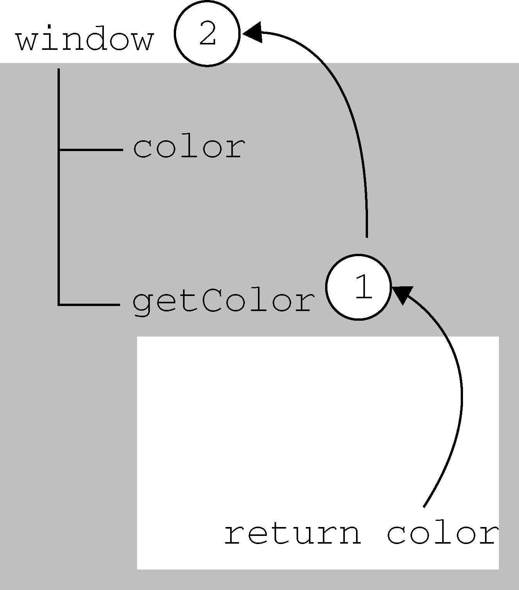

## 前言
> JavaScript具有自动垃圾收集机制，也就是说，执行环境会负责管理代码执行过程中使用的内存。

**[原理]找出那些不再继续使用的变量，然后释放其占用的内存。为此，垃圾收集器会按照固定的时间间隔（或代码执行中预定的收集时间），周期性地执行这一操作。**

在学习垃圾回收机制之前让我们先来学习下执行环境及作用域

## 执行环境
> 执行环境定义了变量或函数有权访问的其他数据，决定了它们各自的行为。每个执行环境都有一个与之关联的变量对象（variable object），环境中定义的所有变量和函数都保存在这个对象中。虽然我们编写的代码无法访问这个对象，但解析器在处理数据时会在后台使用它。

【类型】  
全局和局部（函数）

【全局执行环境】
[1]最外围的一个执行环境  
[2]根据宿主环境不同表示执行环境的对象也不一样。在Web浏览器中，全局执行环境被认为是window对象  
[3]全局变量和函数都是作为window对象的属性和方法创建的  
[4] 某个执行环境中的所有代码执行完毕后，该环境被销毁，保存在其中的所有变量和函数定义也随之销毁（全局执行环境直到应用程序退 出——例如关闭网页或浏览器——时才会被销毁）

【环境栈】  
每个函数都有自己的执行环境。当执行流进入一个函数时，函数的环境就会被推入一个环境栈中。而在函数执行之后，栈将其环境弹出，把控制权返回给之前的执行环境。ECMAScript程序中的执行流正是由这个方便的机制控制着。

## 作用域链(scope chain)
> 作用域链的用途，是保证对执行环境有权访问的所有变量和函数的有序访问。

1、作用域链的前端，始终都是当前执行的代码所在环境的变量对象。

2、全局执行环境的变量对象始终都是作用域链中的最后一个对象。

3、标识符解析是沿着作用域链一级一级地搜索标识符的过程。搜索过程始终从作用域链的前端开始，然后逐级地向后回溯，直至找到标识符为止（如果找不到标识符，通常会导致错误发生）。

4、内部环境可以通过作用域链访问所有的外部环境，但外部环境不能访问内部环境中的任何变量和函数。（但是[闭包](深入学习javaScript闭包闭包的原理，闭包的作用，闭包与内存管理.md)可以解决这个问题）

**[注意]函数参数也被当作变量来对待，因此其访问规则与执行环境中的其他变量相同**

【活动对象（activation object）】  
作用域链的前端，始终都是当前执行的代码所在环境的变量对象。如果这个环境是函数，则将其活动对象（activation object）作为变量对象。活动对象在最开始时只包含一个变量，即arguments对象（这个对象在全局环境中是不存在的）。


## 延长作用域链
1、try-catch语句的catch块  
2、with语句

这两个语句都会在作用域链的前端添加一个变量对象。对with语句来说，会将指定的对象添加到作用域链中。对catch语句来说，会创建一个新的变量对象，其中包含的是被抛出的错误对象的声明。

```
function buildUrl() {
    var qs = "?debug=true";

    with(location){
        var url = href + qs;
    }

    return url;
}
```

在此，with语句接收的是location对象，因此其变量对象中就包含了location对象的所有属性和方法，而这个变量对象被添加到了作用域链的前端。buildUrl()函数中定义了一个变量qs。当在with语句中引用变量href时（实际引用的是location.href），可以在当前执行环境的变量对象中找到。当引用变量qs时，引用的则是在buildUrl()中定义的那个变量，而该变量位于函数环境的变量对象中。至于with语句内部，则定义了一个名为url的变量，因而url就成了函数执行环境的一部分，所以可以作为函数的值被返回。

**[注意]在IE8及之前版本的JavaScript实现中，存在一个与标准不一致的地方，即在catch语句中捕获的错误对象会被添加到执行环境的变量对象，而不是catch语句的变量对象中。换句话说，即使是在catch块的外部也可以访问到错误对象。IE9修复了这个问题。**

## 没有块级作用域

```
if (true) {
    var color = "blue";
}

alert(color);    //"blue"
```
这里是在一个if语句中定义了变量color。如果是在C、C++或Java中，color会在if语句执行完毕后被销毁。但在JavaScript中，if语句中的变量声明会将变量添加到当前的执行环境（在这里是全局环境）中。

```
for (var i=0; i < 10; i++){
    doSomething(i);
}

alert(i);      //10
```
对于有块级作用域的语言来说，for语句初始化变量的表达式所定义的变量，只会存在于循环的环境之中。而对于JavaScript来说，由for语句创建的变量i即使在for循环执行结束后，也依旧会存在于循环外部的执行环境中。

【声明变量】  
使用var声明的变量会自动被添加到最接近的环境中。在函数内部，最接近的环境就是函数的局部环境；在with语句中，最接近的环境是函数环境。如果初始化变量时没有使用var声明，该变量会自动被添加到全局环境。

```
function add(num1, num2) {
    sum = num1 + num2;
    return sum;
}

var result = add(10, 20);    //30
alert(sum);                  //30
```

这个例子中的变量sum在被初始化赋值时没有使用var关键字。于是，当调用完add()之后，添加到全局环境中的变量sum将继续存在；即使函数已经执行完毕，后面的代码依旧可以访问它。

【查询标识符】  
当在某个环境中为了读取或写入而引用一个标识符时，必须通过搜索来确定该标识符实际代表什么。搜索过程从作用域链的前端开始，向上逐级查询与给定名字匹配的标识符。如果在局部环境中找到了该标识符，搜索过程停止，变量就绪。如果在局部环境中没有找到该变量名，则继续沿作用域链向上搜索。搜索过程将一直追溯到全局环境的变量对象。如果在全局环境中也没有找到这个标识符，则意味着该变量尚未声明。

```
var color = "blue";

function getColor(){
    return color;
}

alert(getColor());  //"blue"
```


**[注意]变量查询也不是没有代价的。很明显，访问局部变量要比访问全局变量更快，因为不用向上搜索作用域链。JavaScript引擎在优化标识符查询方面做得不错，因此这个差别在将来恐怕就可以忽略不计了。**

## 垃圾收集
JavaScript具有自动垃圾收集机制，也就是说，执行环境会负责管理代码执行过程中使用的内存。

局部变量只在函数执行的过程中存在。而在这个过程中，会为局部变量在栈（或堆）内存上分配相应的空间，以便存储它们的值。然后在函数中使用这些变量，直至函数执行结束。此时，局部变量就没有存在的必要了，因此可以释放它们的内存以供将来使用。

垃圾收集器必须跟踪哪个变量有用哪个变量没用，对于不再有用的变量打上标记，以备将来收回其占用的内存。用于标识无用变量的策略可能会因实现而异，但具体到浏览器中的实现，则通常有两个策略。


## 标记清除
> JavaScript中最常用的垃圾收集方式是标记清除（mark-and-sweep）。当变量进入环境（例如，在函数中声明一个变量）时，就将这个变量标记为“进入环境”。从逻辑上讲，永远不能释放进入环境的变量所占用的内存，因为只要执行流进入相应的环境，就可能会用到它们。而当变量离开环境时，则将其标记为“离开环境”。最后，垃圾收集器完成内存清除工作，销毁那些带标记的值并回收它们所占用的内存空间。

[注意]实际的实现过程远比这个复杂，这里只是简述一个工作流程，让我们能更清晰的理解这个过程

**[注意]到2008年为止，IE、Firefox、Opera、Chrome和Safari的JavaScript实现使用的都是标记清除式的垃圾收集策略（或类似的策略），只不过垃圾收集的时间间隔互有不同**

## 引用计数
> 另一种不太常见的垃圾收集策略叫做引用计数（reference counting）。引用计数的含义是跟踪记录每个值被引用的次数。当声明了一个变量并将一个引用类型值赋给该变量时，则这个值的引用次数就是1。如果同一个值又被赋给另一个变量，则该值的引用次数加1。相反，如果包含对这个值引用的变量又取得了另外一个值，则这个值的引用次数减1。当这个值的引用次数变成0时，则说明没有办法再访问这个值了，因而就可以将其占用的内存空间回收回来。这样，当垃圾收集器下次再运行时，它就会释放那些引用次数为零的值所占用的内存。

[注意]由于未能很好解决循环引用的问题，很快引用计数的方式被淘汰了。

但是为什么还要提及它呢。因为IE(<=IE8)中有一部分对象并不是原生JavaScript对象。例如，其BOM和DOM中的对象就是使用C++以COM（Component Object Model，组件对象模型）对象的形式实现的，而COM对象的垃圾收集机制采用的就是引用计数策略。因此，即使IE的JavaScript引擎是使用标记清除策略来实现的，但JavaScript访问的COM对象依然是基于引用计数策略的。

```
var element = document.getElementById("some_element");
var myObject = new Object();
myObject.element = element;
element.someObject = myObject;
```

这个例子在一个DOM元素（element）与一个原生JavaScript对象（myObject）之间创建了循环引用。其中，变量myObject有一个名为element的属性指向element对象；而变量element也有一个属性名叫someObject回指myObject。由于存在这个循环引用，即使将例子中的DOM从页面中移除，它也永远不会被回收。

所以碰到这种情况，我们只能手动来解除这种关系
```
myObject.element = null;
element.someObject = null;
```
将变量设置为null意味着切断变量与它此前引用的值之间的连接。当垃圾收集器下次运行时，就会删除这些值并回收它们占用的内存。

## 性能问题

**IE6垃圾回收触发条件:256个变量、4096个对象（或数组）字面量和数组元素（slot）或者64KB的字符串。达到上述任何一个临界值，垃圾收集器就会运行。**

如果一个脚本中包含那么多变量，那么该脚本很可能会在其生命周期中一直保有那么多的变量。而这样一来，垃圾收集器就不得不频繁地运行。结果，由此引发的严重性能问题促使IE7重写了其垃圾收集例程。

IE7垃圾回收机制：触发垃圾收集的变量分配、字面量和（或）数组元素的临界值被调整为动态修正。IE7中的各项临界值在初始时与IE6相等。如果垃圾收集例程回收的内存分配量低于15%，则变量、字面量和（或）数组元素的临界值就会加倍。如果例程回收了85%的内存分配量，则将各种临界值重置回默认值。这一看似简单的调整，极大地提升了IE在运行包含大量JavaScript的页面时的性能。

在IE中，调用window.CollectGarbage()方法会立即执行垃圾收集。在Opera 7及更高版本中，调用window.opera.collect()也会启动垃圾收集例程。

## 小结
通过本文，我们学习了JavaScript执行环境，作用域链，垃圾回收机制的两种方式：标记清楚，应用计数。以及最后了解了下IE中的垃圾回收的性能问题。
