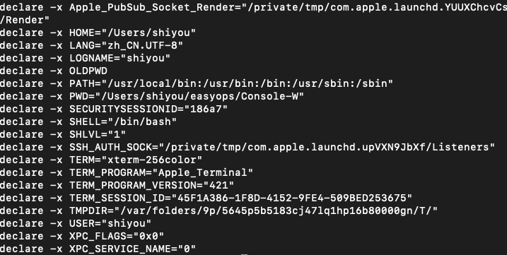
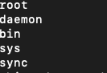
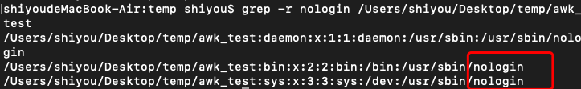

## 基础操作
#### export
显示所有环境变量



#### whereis
使用系统自动构建的数据库来搜索可执行文件，源文件和手册页面。

```
whereis java
```


#### which
它在环境变量PATH指定的目录中搜索可执行文件。此命令将打印可执行文件的完整路径。

```
which php
```


#### clear
清除窗口

--------------------------------------------------------------------------------

## 文件操作
<h4 id=111>ls</h4>

列出文件  
常用选项  
-l 列出文件详情  
-a 列出所有文件，包含隐藏文件

<h4 id=112>touch</h4>

创建文件

```
touch filename
```

<h4 id=113>cat</h4>

列出指定文件的内容

```
cat filename
```

<h4 id=114>more</h4>

显示文件的第一部分（用空格移动并键入q以退出）

```
more filename
```

<h4 id=115> head </h4>

输出文件的前10行

```
head filename
```

<h4 id=116>tail</h4>

输出最后10行文件。

```
tail filename
```

<h4 id=117>mv</h4>

将文件从一个位置移动到另外一个位置
```
mv f1 f2 // f1 文件的原路径， f2是目标路径
```

<h4 id=118>cp</h4>

将文件从一个位置移动到另外一个位置

```
cp f1 f2 // f1 文件的原路径， f2是目标路径
```

<h4 id=119>rm</h4>

删除文件

```
rm filename 删除文件
rm -f dirname 删除目录
```

<h4 id=1110>diff</h4>

比较文件

```
diff f1 f2
```

<h4 id=1111>chmod</h4>

更改文件的读取，写入和执行权限

```
chmod -options filename
```

<h4 id=1112>gzip</h4>

压缩文件

```
gzip filename => fi.gz
```

<h4 id=1113>gunzip</h4>

解压缩gzip压缩的文件

```
gunzip filename
```

<h4 id=1114>gzcat</h4>

查看gzip压缩文件，而不需要gunzip

<h4 id=1115>lpr</h4>

打印文件

<h4 id=1116>lpq</h4>

查看打印机队列

<h4 id=1117>lprm</h4>

从打印队列移除某些内容

```
lprm jobnumbers
```

--------------------------------------------------------------------------------------------

<h2 id=12>文本操作</h2>

<h4 id=121>awk</h4>

awk是处理文本文件最有用的命令。它一行一行的在整个文件上运行，默认情况下，它使用空格分隔字段。awk命令最常用的语法是

常用命令
```
awk '/search_pattern/ { action_to_take_if_pattern_matches; }' file_to_parse
```

实例：  
新建一个文件内容是  
```
root:x:0:0:root:/root:/usr/bin/zsh
daemon:x:1:1:daemon:/usr/sbin:/usr/sbin/nologin
bin:x:2:2:bin:/bin:/usr/sbin/nologin
sys:x:3:3:sys:/dev:/usr/sbin/nologin
sync:x:4:65534:sync:/bin:/bin/sync
```
文件路径：/Users/shiyou/Desktop/temp/awk_test

执行命令
```
awk -F':' '{ print $1 }' /Users/shiyou/Desktop/temp/awk_test
```

输出了：  


解释：  
-F 指定在我们要基于哪个分隔字段。在我们代码里面是使用冒号 ':'  
{print $1} 是指打印出第一个匹配字段

<h4 id=122>grep</h4>

查找文件内的文本。您可以使用grep搜索与一个或多个正则表达式匹配的文本行，并仅输出匹配的行。

```
grep pattern filename
```

例如文件还是上面创建的文件，我们执行以下命令
```
grep -r nologin /Users/shiyou/Desktop/temp/awk_test
```
-i 选项强制grep忽略单词大小写  
-r 可以用于搜索指定目录下的所有文件

输出：  


<h4 id=123>wc</h4>

一个文件有多少行，多少单词和多少字符
```
wc filename
```

<h4 id=124>sort</h4>

排序文本文件的行

```
sort filename
```

<h4 id=125>uniq</h4>

省略重复的行

```
uniq filename
sort example.txt | uniq // 先排序再去重复
```

<h4 id=126>echo</h4>

显示一行文字

```
echo output
echo -ne "Hello\nWorld\n" // 输出换行
```

<h4 id=127>tr</h4>

把所有小写字母变成大写

```
cat example.txt | tr 'a-z' 'A-Z' 
```

<h4 id=128>nl</h4>

显示文件的行数

```
nl -s". " filename
```

---------------------------------------------------------------------------------
<h2 id=13>目录操作</h2>

<h4 id=131>mkdir</h4>

生成一个新目录

```
mkdir dirname
```

<h4 id=132>cd</h4>

一个目录跳转到另外一个目录

```
cd dirname
```

<h4 id=133>pwd</h4>

告诉你你目前所在的目录


---------------------------------------------------------------------------------------------

<h2 id=14>SSH&系统信息&网络操作</h2>

<h4 id=141>ssh</h4>

ssh 是一个用来登录到远程机器并执行命令的程序

```
ssh user@host //登录到的机器地址
ssh -p port user@host // 连接到特定端口的选项
```

<h4 id=142>whoami</h4>

返回当前登录用户名

<h4 id=143>quota</h4>

显示磁盘配额

<h4 id=144>date</h4>

显示当前日期和时间

<h4 id=145>cal</h4>

显示月份的日历

<h4 id=146>uptime</h4>

显示当前的正常运行时间

<h4 id=147>w</h4>

显示谁在线

<h4 id=148>finger</h4>

显示有关用户的信息
```
finger username
```

<h4 id=149>uname</h4>

显示内核信息

<h4 id=1410>man</h4>

显示指定命令的手册

```
man command
```

<h4 id=1411>df</h4>

显示磁盘使用情况

<h4 id=1412>du</h4>

显示文件名中文件和目录的磁盘使用情况（du -s只给出一个总数）。

```
du filename
```

<h4 id=1413>last</h4>

列出最后登录的指定用户

```
last username
```

<h4 id=1414>ps</h4>

列出您的进程

```
ps -u yourusername
```

<h4 id=1415>kill</h4>

使用您所提供的ID杀死进程

```
kill PID
```

<h4 id=1416>killall</h4>

用名称杀死所有进程

```
killall processname
```

<h4 id=1417>top</h4>

显示当前活动的进程

<h4 id=1418>bg</h4>

列出停止的或后台工作的Job; 恢复在后台停止的Job。

<h4 id=1419>fg</h4>

前台化最近的Job

<h4 id=1420>ping</h4>

Pings主机并输出结果

<h4 id=1421>whois</h4>

获取域的whois信息。

```
whois www.baidu.com
```

<h4 id=1422>dig</h4>

获取域的DNS信息

```
dig www.baidu.com
```

<h4 id=1423>wget</h4>

下载文件

<h4 id=1424>scp</h4>

在本地主机和远程主机之间或两台远程主机之间传输文件。

从本地主机复制到远程主机
```
scp source_file user@host:directory/target_file
```

从远程主机复制到本地主机
```
scp user@host:directory/source_file target_file
scp -r user@host:directory/source_folder farget_folder
```

<h4 id=1425>curl</h4>

发送一个http请求

```
curl www.baidu.com 发送一个http请求
curl -v www.baidu.com 详细信息
```

<h4 id=1426>passwd</h4>

允许当前登录的用户更改其密码。

----------------------------------------------------------------

## 参考文献
- [bash-guide](https://github.com/Idnan/bash-guide)
