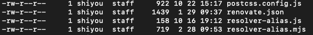

## 用户组
> 在linux中的每个用户必须属于一个组，不能独立于组外。在Linux中每个文件有所有者、所在组、其它组的概念。

【所有者】  
一般为文件的创建者，谁创建了该文件，就天然的成为该文件的所有者，用”ls ‐ahl”命令可以看到文件的所有者，也可以使用”chown 用户名 文件名”来修改文件的所有者。

【所在组】  
当某个用户创建了一个文件后，这个文件的所在组就是该用户所在的组，用”ls ‐ahl”命令可以看到文件的所有组，也可以使用”chgrp 组名 文件名”来修改文件所在的组。

【其它组】  
除开文件的所有者和所在组的用户外，系统的其它用户都是文件的其它组。

## 文件权限
在某个有文件的目录执行如下命令
```
ls -l
```


-rw-r--r--  展示了不同用户对这个文件的权限信息

第一位有三种取值：文件（-）、目录（d），链接（l），这个例子是-代表是一个文件。

其余9位每3位一组，分别对应所有者，所在组，其他组；读（r）、写（w）、执行（x）

第一组rw-：文件所有者的权限是读、写

第二组r–：与文件所有者同一组的用户拥有读权限

第三组r–：不与文件所有者同组的其他用户拥有读权限

也可用数字表示为：r=4，w=2，x=1 因此rwx=4+2+1=7

-rw-r--r-- 数字表示就是 644

## 修改文件的权限

```
chmod 777 mysql.log // 把mysql.log权限修改为777
```

## 小结
本文简单的了解下Linux系统下用户 用户组 权限的一些规则。
