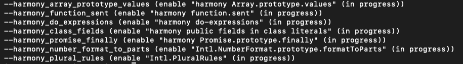

## 前言
一直想好好学习node.js都是半途而废的状态，这次沉下心来，想好好的学习下node.js。打算写一个系列的文章大概10几篇文章，会一直以实际案例作为贯穿的学习。

## 什么是node
Node.js是一个JavaScript运行平台，其显著特征是它的异步和事件驱动机制，以及小巧精悍的标准库。Node目前有两个活跃版本：长期支持版（LTS）和当前版，由Node.js基金会进行管理并提供支持。这个行业联盟遵循开放式治理模型，如果想了解更多与Node管理相关的信息，可以查阅其官网上的文档。

自2009年Node.js问世以来，JavaScript渐渐变成了能开发所有软件的语言，其地位也越来越重要，不再是只能勉强在浏览器上用一下的鸡肋语言了。这里有ECMAScript 2015的功劳，因为它解决了之前那些ECMAScript标准中遗留下来的几个关键问题。Node所用的Google V8引擎就是基于ECMAScript 2015开发的。ECMAScript 2015是ECMAScript标准的第6个版本，所以有时也被称为ES6，一般简写为ES2015。Node、React和Electron等技术创新成果的功劳也不可小觑，是它们让JavaScript无处不在：从服务器到浏览器，到原生的移动端应用程序。甚至像微软这样的大公司都对JavaScript敞开了怀抱，也为Node的成功起到推波助澜的作用。

## Node与V8
> node.js是运行在chrome v8引擎上的。V8负责JavaScript代码的解释和执行。

## 使用特性组
Node包含了V8提供的ES2015特性。这些特性分为shipping、staged和in progress三组。shipping组的特性是默认开启的，staged和in progress组的特性则需要用命令行参数开启。如果你想用staged特性，可以在运行Node时加上参数--harmony，V8团队将所有接近完成的特性都放在了这一组。然而，in progress特性稳定性较差，需要具体的特性参数来开启。Node的文档建议通过grep "in progress"来查询当前可用的in progress特性：
```
node --v8-options | grep "in progress"
```
  
在不同的Node版本中执行这条命令后得到的结果也是不同的。Node自己也有个版本计划，定义了它要提供哪些API。

## Node的发布计划
Node的发行版分为长期支持版（LTS）、当前版和每日构建版三组。LTS版有18个月的支持服务，期满后还有12个月的维护性支持服务。版本号是按照语义版本（SemVer）编制的。SemVer给每个版本定义了一个主要、次要和补丁版本号。比如6.9.1的主要版本号是6，次要版本号是9，补丁版本号是1。只要看到主版本号发生变化，那就意味着有些API可能不兼容了，也就是说如果要用这个版本的Node，那么你的项目需要重新测试一下。另外，按Node的发布规则，主版本号增长意味着新的当前版也已经切下来了。每日构建版的构建是自动进行的，每隔24小时一次，包含这24小时内的最新修改，但一般只用来测试Node的最新特性。

用哪个版本取决于你的项目和组织。有些人可能喜欢更新不那么频繁的LTS，对于那些难以管理频繁更新的大公司来说，这个版本可能更好。但如果你想跟上性能和功能的改进，当前版更合适。

## Node特性以及应用场景
> Node和JavaScript的优势之一是它们的单线程编程模型。Node保留了JavaScript在浏览器中所用的模型。它们都拥有“事件机制” 使其 I/O 密集 的情况下拥有非常好的表现。

我们先来了解几个概念：

【I/O 操作】
> 文件操作、网络操作、数据库

I/O 操作非常耗时，这样会阻塞程序的进行，导致效率非常低下的。那么Node.js 是如何处理的？
> Node用三种技术来解决这个问题：事件、异步API、非阻塞I/O。在Node程序员看来，非阻塞I/O是个底层术语。它的意思是说，你的程序可以在做其他事情时发起一个请求来获取网络资源，然后当网络操作完成时，将会运行一个回调函数来处理这个操作的结果。

【为什么使用node】
- web中应用效果良好，使得前端职责范围变大
- 在处理高并发、I/O密集场景性能优势明显

【使用场景】
- web server
- 本地代码构建：gulp、webpack 之类的
- 实用工具的开发：爬虫之类

## 总结
Node是用来搭建JavaScript应用程序的平台，有基于事件和非阻塞的特性。

V8被用作JavaScript运行时。

被称为核心模块的Node标准库很精巧，为JavaScript添加了磁盘I/O。

Node自带了一个调试器和一个依赖管理器（npm）。

Node可以用于搭建Web应用程序、命令行工具，甚至桌面程序。
