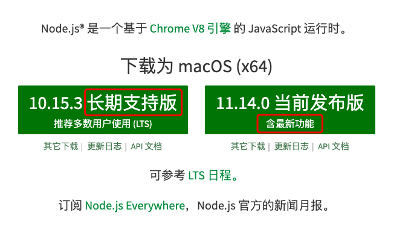
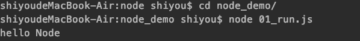
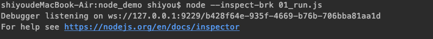
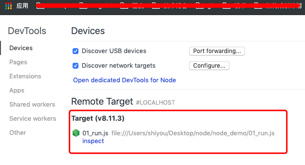
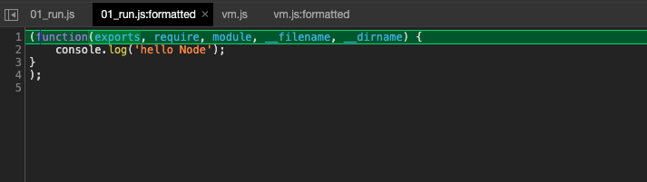

## 前言
上一节让我们对Node.js有一个初步的了解，那么现在可以开始正式学习下Node.js的开发了，但是任何一门语言要设计到开发，就必须先学习开发环境以及调试。本文将主要讲解这些内容。

本文涉及到的代码全部可在github地址找到>>>[node 代码](https://github.com/shiyou00/node)

## 安装
点击查看>>>[node 中文官网地址](https://nodejs.org/zh-cn/)

【版本选择】


看图发现包含两种版本：长期支持的稳定版本 以及 当前发布版(包含很多最新的特性)

安装的过程就省略了...

## 开发环境
那么我们如果想要开发一个node程序，需要什么先了解哪些概念呢？

【1】CommonJS  
代码规范，如果AMD，CMD一样的代码组织规范（模块管理系统）

【2】global  
代码运行在浏览器时，我们可以使用浏览器提供的全局对象：window以及DOM,BOM。但是node.js是运行在chrome V8引擎上的。给我们提供了 “global” 全局对象使用

【3】process  
代表当前执行的进程，这个是挂载在global下面的。在一些高级点的功能需要使用到

下面我们写第一个node.js文件

文件名：01_run.js
```
console.log('hello Node');
```

那么我们如何执行文件呢。此时打开命令行工具，执行命令
```
node 01_run.js 
```

可以看到输出结果：



## 调试工具
实际开发中我们会使用node提供的一款调试工具 "inspect" ，这里先简单的了解下使用，后面会详细学习该工具

1、命令行工具执行
```
node --inspect-brk 01_run.js
```



2、使用chrome浏览器,地址栏输入
```
chrome://inspect
```




3、点击上图中红色框框里面的 inspect


上图就是实际上在node执行代码时，node底层帮我们把代码进行的封装。  
我们把封装的代码提取出来分析下：
```
(function(exports, require, module, __filename, __dirname) {
        console.log('hello Node');
    }
);
>>> node把我们的代码分装在一个函数中并且添加了5个参数，我们先只看前3个参数：exports ，require，module
>>> 其实这个就是CommonJS模块的话规范了。
```

## 小结
通过本文我们初步学习了
- node的版本分为 长期稳定版本(LTS) 以及 当前新特性版本(current)
- node的全局变量是global
- 编写了第一个node代码，简单了解了下inspect调试工具

接下来我们将主要学习 CommonJS规范。
