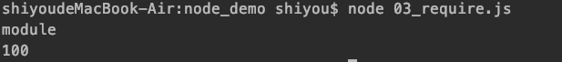

## 前言
想开始编写Node.js代码，那么我们就必须先熟悉它的模块化规范CommonJS，本文将详细讲解CommonJS规范

本文代码 >>> [github 地址](https://github.com/shiyou00/node/tree/master/node_demo)

## CommonJS
Node 应用由模块组成，采用 CommonJS 模块规范。

每个文件就是一个模块，有自己的作用域。在一个文件里面定义的变量、函数、类，都是私有的，对其他文件不可见。

【特点】
- 所有代码都运行在模块作用域，不会污染全局作用域。
- 模块可以多次加载，但是只会在第一次加载时运行一次，然后运行结果就被缓存了，以后再加载，就直接读取缓存结果。要想让模块再次运行，必须清除缓存。
- 模块加载的顺序，按照其在代码中出现的顺序。

新建文件example.js
```
// example.js
var x = 5;
var addX = function (value) {
  return value + x;
};
```
上面代码中，变量x和函数addX，是当前文件example.js私有的，其他文件不可见。

如果想在多个文件分享变量，必须定义为global对象的属性。
```
global.warning = true;
```
上面代码的warning变量，可以被所有文件读取。当然，这样写法是不推荐的。


## module.exports
CommonJS规范规定，每个模块内部，module变量代表当前模块。  
这个变量是一个对象，它的exports属性（即module.exports）是对外的接口。  
加载某个模块，其实是加载该模块的module.exports属性。

新建文件02_module.js
```
console.log('module');

const NUM = 100;

function test (){
    console.log(NUM);
}

// 输出常量
module.exports.num = NUM;
// 输出函数
module.exports.testFn = test;
```

## exports 与 module.exports
> 它们之间是一层引用关系，exports 引用了 module.exports对象

06_exports.js
```
console.log(exports,module.exports); // {} , {}
exports.num = '100';
console.log(exports,module.exports); // { num: '100' } { num: '100' }
```
看上面的代码的输出可以证明exports 引用了 module.exports。那么之前我们采用module.exports输出的内容，其实可以简写为exports输出

【错误的做法】
```
exports = {
    a:1,
    b:2
};
```
上面代码会切断 exports 对 module.exports的引用关系。导致输出的文件，在其它文件是无法使用的

**[注意]建议还是使用module.exports规范些，不会产生额外的错误！**


## require
> require方法用于加载模块。

新建文件 03_require.js
```
const m1 = require('./02_module');

m1.testFn();
```

执行命令：
```
node 03_require.js
```

运行结果：



【路径】  
[1] / 表示绝对路径，./ 表示相对于当前文件的路径  
[2] 不写路径则认为是 build-in模块或者各级 node_modules内的第三方模块
```
const m1 = require('./02_module.js'); // 这样就会在同级目录中寻找02_module.js文件
const m = require('02_module.js'); // 这样只会去 node_modules去寻找相应的文件
```


【加载文件】  
[1]支持js、json、node 拓展名，不写依次尝试加载
```
const m1 = require('./02_module'); // 这样会在同级目录中寻找 是否有02_module.js 的文件如果有则加载，如果没有则去寻找是否有02_module.json 或者 02_module.node 文件
```

【特性】  
[1]module 被加载的时候执行，加载后缓存

创建文件 04_catch.js
```
>>> 当我们连续两次引入同一个文件其实只会执行一次

const m1 = require('./02_module');
const m2 = require('./02_module');
// 同时引入两次 02_module文件
```
我们执行命令 ：node 04_catch.js，输出结果：  


[2]一旦出现某个模块被循环加载，就只输出已执行的部分，还未执行的部分不会输出
```
// 1、创建文件：05_modA.js
module.exports.test = 'A';

const modB = require('./05_modB');
console.log('modA: ', modB.test);

module.exports.test = 'AA';

// 2、创建文件：05_modB.js
module.exports.test = 'B';

const modA = require('./05_modA');
console.log('modB: ', modA.test);

module.exports.test = 'BB';

// 3、创建文件：05_main.js
const modA = require('./05_modA');
const modB = require('./05_modB');
```

我们可以看到 modA中引入modB，modB中也引入了modA，它们形成了循环引用。那么此时执行 node 05_main.js 会输出什么呢？  


其实就是遵循上诉原理：一旦出现某个模块被循环加载，就只输出已执行的部分，还未执行的部分不会输出。大家可以动起手来敲敲代码很好理解的。

**[注意]平时写代码的时候切记要避免循环引用**
