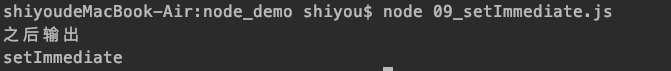
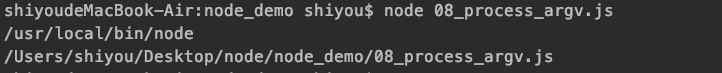
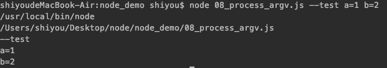
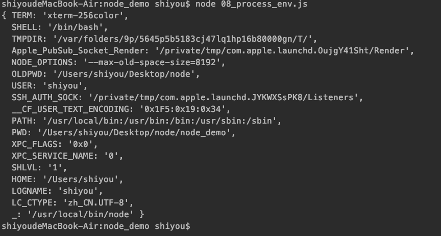
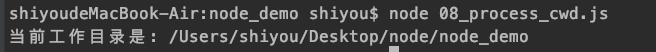
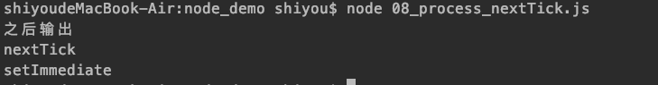
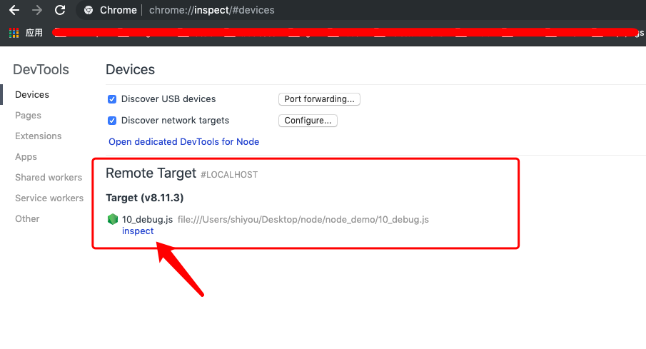

## 前言
在之前的课程我们学习了Node的模块化规则，接下来我们将学习下 Node的几个新特性：global ，process进程，debug调试

## global
> 跟在浏览器中的window一样都是全局变量，我们先来熟悉些常用的全局变量

- Buffer(二进制数据处理)、process、console
- timer(setImmediate)


看一段简单的代码：
```
>>> 07_global.js
const NUM = 1000;
global.NUM = 2000; // 这里输出到全局
module.exports.num = NUM;

>>> 07_global_01.js
const mod = require('./07_global');
console.log(NUM); // 这里可以打印处全局的常量NUM
```

【setImmediate】
> callback <Function> 在当前回合的 Node.js 事件循环结束时调用的函数。

09_setImmediate.js
```
setImmediate(()=>{
    console.log('setImmediate');
});

console.log('之后输出');
```
结果：  
  
我们可以看到，输入setImmediate写在了前面，但是还是先执行了后面的输出。具体牵涉到了Node的event Loop，会在后面进行详细讲解


## process 进程
> process 对象是一个全局变量，它提供有关当前 Node.js 进程的信息并对其进行控制。 作为一个全局变量，它始终可供 Node.js 应用程序使用，无需使用 require()。

【argv】  
process.argv 属性返回一个数组，其中包含当启动 Node.js 进程时传入的命令行参数。

第二个元素将是正在执行的 JavaScript 文件的路径。
其余元素将是任何其他命令行参数。

```
const {argv} = process;
argv.forEach(item => {
    console.log(item);
});
```
我们启动node打印出输出内容：  
  
第一行输出的是启动的命令  
第二行输出的是启动的文件路径

【添加参数】
```
执行命令：node 08_process_argv.js --test a=1 b=2
```
输出：

可以看到，我们可以看到，命令中的参数全部都打印出来了。


【env】
> 属性返回包含用户环境的对象

08_process_env.js
```
const { env } = process;
console.log(env);
```


【cwd】
> process.cwd() 方法返回 Node.js 进程的当前工作目录。

08_process_cwd.js
```
console.log(`当前工作目录是: ${process.cwd()}`);
```



【nextTick】
> process.nextTick() 方法将 callback 添加到下一个时间点的队列。 一旦当轮的事件循环全部完成，则调用下一个时间点的队列中的所有回调。

这个方法同setImmdiate相似。

08_process_nextTick.js
```
setImmediate(()=>{
    console.log('setImmediate');
});

console.log('之后输出');

process.nextTick(()=>{
    console.log('nextTick');
});
```
看下打印结果：  
  
同步的先执行，其次是nextTick，然后是setImmediate

[注意]关于nextTick 与 setImmediate 之间的关系，会在之后进行详细讲解的，目前只需要简单的了解下即可

## debug 调试

【inspector】  
其实前面已经稍微提到了如何使用，这里再重复一遍

0、创建文件：10_debug.js
```
function t1(){
    const a = parseInt( Math.random() * 10 );
    const b = parseInt( Math.random() * 10 );

    const c = t2(a,b);
}

function t2(a,b){
    if(a>b){
        a += a * 2;
    }else{
        b -= a;
    }

    return a + b;
}

t1();
```

1、命令行工具执行
```
node --inspect-brk 10_debug.js
```

2、使用chrome浏览器,地址栏输入
```
chrome://inspect
```




3、点击上面的红框处的inpect的进入调试界面


该调试界面跟我们平时调试浏览器上的代码一模一样，非常方便，功能也是非常强大，这里就不展开讲解了。
