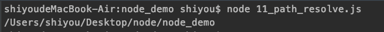

## 前言
前面已经学习了很多跟Node相关的知识，譬如开发环境、CommonJs，那么从现在开始要正式学习node的基本模块了，开始node编程之旅了。

## path
> path 模块提供用于处理文件路径和目录路径的实用工具。 它可以使用以下方式访问：

```
const path = require('path');
```


【path.normalize(path)】
> path.normalize() 方法规范化给定的 path，解析 '..' 和 '.' 片段。

11_path_normalize.js
```
const { normalize } = require('path');
// 输入两个不规范的路径
console.log( normalize('usr/local//bin') );
console.log( normalize('usr/local/../bin') );
```
输出结果：


【path.join([...paths])】
> path.join() 方法使用平台特定的分隔符作为定界符将所有给定的 path 片段连接在一起，然后规范化生成的路径。

11_path_join.js
```
const { join } = require('path');
console.log(join('/usr','local','bin/')); // 传入3个路径，且中间的路径不规则
```
输出：


【path.resolve([...paths])】
> path.resolve() 方法将路径或路径片段的序列解析为绝对路径。如果没有传入 path 片段，则 path.resolve() 将返回当前工作目录的绝对路径。

11_path_resolve.js
```
const { resolve } = require('path');
console.log(resolve('./')); // 看下当前的路径的绝对路径
```

输出：


【basename、extname、dirname】  
basename: 返回 path 的最后一部分，类似于 Unix 的 basename 命令。 尾部的目录分隔符将被忽略

extname: 返回 path 的扩展名，从最后一次出现 .（句点）字符到 path 最后一部分的字符串结束。

dirname: 返回 path 的目录名，类似于 Unix 的 dirname 命令。 尾部的目录分隔符将被忽略
```
const { basename, dirname, extname } = require('path');
const filePath = '/usr/local/bin/e.text';
console.log(basename(filePath));
console.log(dirname(filePath));
console.log(extname(filePath));
```
输出：


【parse、format】  
parse: 方法返回一个对象，其属性表示 path 的重要元素。 尾部的目录分隔符将被忽略

format: 从对象返回路径字符串。 与 path.parse() 相反

```
const { parse, format} = require('path');

const filePath = '/usr/local/node_modules/n/package.json';

console.log(parse(filePath));
console.log(format(parse(filePath)));
```

输出：


【sep、delimiter、win32、posix】  
sep：提供平台特定的路径片段分隔符：Windows 上是 \。POSIX 上是 /。

delimiter：提供平台特定的路径定界符：; 用于 Windows ，: 用于 POSIX

win32：属性提供对特定于 Windows 的 path 方法的实现的访问

posix： 属性提供对 path 方法的 POSIX 特定实现的访问。

```
const { sep, delimiter, win32, posix } = require('path');

console.log('sep: ', sep);
console.log('win sep: ', win32.sep);

console.log('PATH', process.env.PATH);

console.log('delimiter: ', delimiter);
console.log('win delimiter: ', win32.delimiter);
```
输出：


最后对之前接触过的路径做一个总结：
- __dirname , __filename 总是返回文件的绝对路径
- process.cwd() 总是返回执行node命令所在文件夹

## 小结
通过本文我们学习了path模块的一些用法，文章只是列举了一些常用的方法，具体可以去node的官方文档查看更多方法。
