## 前言
给SVG元素应用填充和描边，除了使用纯色外，还可以使用渐变。本文将详细介绍SVG渐变

## 线性渐变
　　有两种类型的渐变：线性渐变和径向渐变。必须给渐变内容指定一个id属性，否则文档内的其他元素不能引用它。为了让渐变能被重复使用，渐变内容需要定义在`<defs>`标签内部，而不是定义在形状上面

　　线性渐变沿着直线改变颜色，要插入一个线性渐变，需要在SVG文件的defs元素内部，创建一个`<linearGradient>` 节点
```
<svg height="70" version="1.1" xmlns="http://www.w3.org/2000/svg">
  <defs>
      <linearGradient id="Gradient1">
        <stop offset="0%" stop-color="#05a"/>
        <stop offset="100%" stop-color="#0a5"/>
      </linearGradient>
  </defs>
  <rect id="rect1" x="10" y="10" rx="15" ry="15" width="50" height="50" fill="url(#Gradient1)"/>
</svg>
```


`<stop>`元素一共有3个属性，包括offset，stop-color，stop-opacity
```
offset用来设置色标位置
stop-color用来设置色标颜色
stop-opacity用来设置色标的透明
```

例子：
```
<svg height="70" version="1.1" xmlns="http://www.w3.org/2000/svg">
  <defs>
      <linearGradient id="Gradient1">
        <stop offset="0%" stop-color="#05a"/>
        <stop offset="50%" stop-color="#50a" stop-opacity="0.5"/>
        <stop offset="100%" stop-color="#0a5"/>
      </linearGradient>
  </defs>
  <rect id="rect1" x="10" y="10" rx="15" ry="15" width="50" height="50" fill="url(#Gradient1)"/>
</svg>
```


【x1、x2、y1、y2】

　　线性渐变包括x1、x2、y1、y2这四个属性，用来控制渐变的大小和方向。取值为0-100%，或者0-1的小数。默认地，x1=y1=y2=0、x2=1

　　如果变成垂直方向的渐变，则需要设置为x1=x2=y1=0、y2=1

```
<svg height="70" version="1.1" xmlns="http://www.w3.org/2000/svg">
  <defs>
      <linearGradient id="Gradient1" x1=0 x2=0 y1=0 y2=1>
        <stop offset="0%" stop-color="#05a"/>
        <stop offset="100%" stop-color="#0a5"/>
      </linearGradient>
  </defs>
  <rect id="rect1" x="10" y="10" rx="15" ry="15" width="50" height="50" fill="url(#Gradient1)"/>
</svg>
```


如果将y2或x2设置为50%，则50%-100%这一部分区域填充为最后一个色标的纯色
```
<svg height="70" version="1.1" xmlns="http://www.w3.org/2000/svg">
  <defs>
      <linearGradient id="Gradient1" x1=0 x2=50% y1=0 y2=50%>
        <stop offset="0%" stop-color="#05a"/>
        <stop offset="100%" stop-color="#0a5"/>
      </linearGradient>
  </defs>
  <rect id="rect1" x="10" y="10" rx="15" ry="15" width="50" height="50" fill="url(#Gradient1)"/>
</svg>
```


当然了，可以有多个色标
```
<svg height="70" version="1.1" xmlns="http://www.w3.org/2000/svg">
  <defs>
      <linearGradient id="Gradient1" x1=0 x2=1 y1=0 y2=1>
        <stop offset="0%" stop-color="#05a"/>
        <stop offset="20%" stop-color="#50a"/>
        <stop offset="40%" stop-color="#5a0"/>
        <stop offset="60%" stop-color="#a05"/>
        <stop offset="80%" stop-color="#a50"/>
        <stop offset="100%" stop-color="#0a5"/>
      </linearGradient>
  </defs>
  <rect id="rect1" x="10" y="10" rx="15" ry="15" width="50" height="50" fill="url(#Gradient1)"/>
</svg>
```
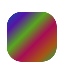

渐变除了可以作为填充，也可以作为描边
```
<svg height="70" version="1.1" xmlns="http://www.w3.org/2000/svg">
  <defs>
      <linearGradient id="Gradient1" x1=0 x2=1 y1=0 y2=1>
        <stop offset="0%" stop-color="#05a"/>
        <stop offset="20%" stop-color="#50a"/>
        <stop offset="40%" stop-color="#5a0"/>
        <stop offset="60%" stop-color="#a05"/>
        <stop offset="80%" stop-color="#a50"/>
        <stop offset="100%" stop-color="#0a5"/>
      </linearGradient>
  </defs>
  <rect id="rect1" x="10" y="10" rx="15" ry="15" width="50" height="50" fill="transparent" stroke-width="10" stroke="url(#Gradient1)"/>
</svg>
```


【`xlink:href`】

　　`xlink:href`属性用于在一个渐变中引用另一个渐变，被引用的渐变的属性是可继承的，也可以被重写

　　下面的例子中，Gradient2引用了Gradient1的渐变，并重写了渐变的方向
```
<svg height="70" version="1.1" xmlns="http://www.w3.org/2000/svg">
  <defs>
      <linearGradient id="Gradient1" x1=0 x2=1 y1=0 y2=1>
        <stop offset="0%" stop-color="#05a"/>
        <stop offset="50%" stop-color="#50a"/>
        <stop offset="100%" stop-color="#0a5"/>
      </linearGradient>
      <linearGradient id="Gradient2" xlink:href="#Gradient1" x1=0 x2=0 y1=0 y2=1>
      </linearGradient>
  </defs>
  <rect id="rect1" x="10" y="10" rx="15" ry="15" width="50" height="50" fill="url(#Gradient2)"/>
</svg>
```


【gradientUnits】

　　gradientUnits有两个的值，userSpaceOnUse和objectBoundingBox，这用于决定渐变是否随着引用它的元素进行缩放。也就是说它决定了x1、y1、x2、y2的缩放

　　userSpaceOnUse: x1、y1、x2、y2表示当前用户坐标系统的坐标。也就是说渐变中的值都是绝对值

　　objectBoundingBox: x1, y1, x2, y2表示应用渐变的元素创建的边界坐标系统。也就是说渐变随着应用的元素进行了缩放

　　如果不设置，默认取值是objectBoundingBox
```
<svg height="70" version="1.1" xmlns="http://www.w3.org/2000/svg">
  <defs>
      <linearGradient id="Gradient1" gradientUnits="objectBoundingBox">
        <stop offset="0%" stop-color="#05a"/>
        <stop offset="50%" stop-color="#50a"/>
        <stop offset="100%" stop-color="#0a5"/>
      </linearGradient>
  </defs>
  <rect id="rect1" x="10" y="10" rx="15" ry="15" width="50" height="50" fill="url(#Gradient1)"/>
</svg>
```


如果设置为userSpaceOnUse，则x1、x2、y1、y2需要设置为用户坐标系的坐标绝对值
```
<svg height="70" version="1.1" xmlns="http://www.w3.org/2000/svg">
  <defs>
      <linearGradient id="Gradient1" gradientUnits="userSpaceOnUse" x1="10" x2="60" y1="0" y2="0">
        <stop offset="0%" stop-color="#05a"/>
        <stop offset="50%" stop-color="#50a"/>
        <stop offset="100%" stop-color="#0a5"/>
      </linearGradient>
  </defs>
  <rect id="rect1" x="10" y="10" rx="15" ry="15" width="50" height="50" fill="url(#Gradient1)"/>
</svg>
```


【spreadMethod】

　　spreadMethod可以接受三个值，pad，reflect，repeat，它定义了渐变如何开始和结束，当cx和cy的值是在0%到100%里面的时候
```
pad:（默认值）使用开始和结束位置的颜色结点来填充剩余的部分
reflect: 反射渐变图案，从开始->结束，再从结束->开始，然后开始->结束，往复直到空间都填满
repeat: 从start-to-end重复渐变图案，直到空间填满
```

pad为默认值
```
<svg height="70" version="1.1" xmlns="http://www.w3.org/2000/svg" >
  <defs>
      <linearGradient id="Gradient1" spreadMethod=pad x1=0.4 x2=0.6>
        <stop offset="0%" stop-color="#05a"/>
        <stop offset="100%" stop-color="#0a5"/>
      </linearGradient>
  </defs>
  <rect id="rect1" x="10" y="10" rx="15" ry="15" width="50" height="50" fill="url(#Gradient1)"/>
</svg>
```


下面是reflect的效果
```
<svg height="70" version="1.1" xmlns="http://www.w3.org/2000/svg" >
  <defs>
      <linearGradient id="Gradient1" spreadMethod=reflect x1=0.4 x2=0.6>
        <stop offset="0%" stop-color="#05a"/>
        <stop offset="100%" stop-color="#0a5"/>
      </linearGradient>
  </defs>
  <rect id="rect1" x="10" y="10" rx="15" ry="15" width="50" height="50" fill="url(#Gradient1)"/>
</svg>
```
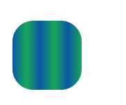

下面是repeat的效果
```
<svg height="70" version="1.1" xmlns="http://www.w3.org/2000/svg" >
  <defs>
      <linearGradient id="Gradient1" spreadMethod=repeat x1=0.4 x2=0.6>
        <stop offset="0%" stop-color="#05a"/>
        <stop offset="100%" stop-color="#0a5"/>
      </linearGradient>
  </defs>
  <rect id="rect1" x="10" y="10" rx="15" ry="15" width="50" height="50" fill="url(#Gradient1)"/>
</svg>
```
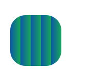


## 径向渐变
　　径向渐变与线性渐变相似，只是它是从一个点开始发散绘制渐变。创建径向渐变需要在文档的defs中添加一个`<radialGradient>`元素

```
<svg height="70" version="1.1" xmlns="http://www.w3.org/2000/svg">
  <defs>
      <radialGradient id="Gradient1">
        <stop offset="0%" stop-color="#05a"/>
        <stop offset="50%" stop-color="#50a" stop-opacity="0.5"/>
        <stop offset="100%" stop-color="#0a5"/>
      </radialGradient>
  </defs>
  <rect id="rect1" x="10" y="10" rx="15" ry="15" width="50" height="50" fill="url(#Gradient1)"/>
</svg>
```
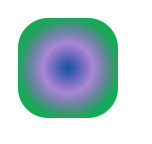

【cx、cy、r、fx、fy】

　　与线性渐变的x1、y1、x2、y2属性不同，径向渐变使用cx、cy、r、fx、fy这五个属性来设置渐变
```
r 设置圆的半径
cx、cy 定义渐变的中心点坐标
fx、fy  定义渐变的焦点坐标
```
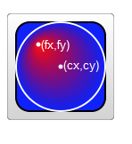

如果不设置，r默认0.5，即元素宽度或高度的一半；cx、cy默认为0.5；fx、fy默认为0.5
```
<svg height="70" version="1.1" xmlns="http://www.w3.org/2000/svg">
  <defs>
      <radialGradient id="Gradient1"  r=0.5 cx=0.5 cy=0.5 fx=0.5 fy=0.5>
        <stop offset="0%" stop-color="#05a"/>
        <stop offset="50%" stop-color="#50a" stop-opacity="0.5"/>
        <stop offset="100%" stop-color="#0a5"/>
      </radialGradient>
  </defs>
  <rect id="rect1" x="10" y="10" rx="15" ry="15" width="50" height="50" fill="url(#Gradient1)"/>
</svg>
```
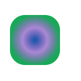

巧妙地设置焦点坐标，可以实现聚光灯的效果
```
<svg height="70" version="1.1" xmlns="http://www.w3.org/2000/svg">
  <defs>
      <radialGradient id="Gradient1"  r=0.5 cx=0.5 cy=0.5 fx=0.8 fy=0.8>
        <stop offset="0%" stop-color="#05a"/>
        <stop offset="50%" stop-color="#50a" stop-opacity="0.5"/>
        <stop offset="100%" stop-color="#0a5"/>
      </radialGradient>
  </defs>
  <rect id="rect1" x="10" y="10" rx="15" ry="15" width="50" height="50" fill="url(#Gradient1)"/>
</svg>
```
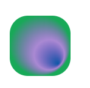

【`xlink:href`】

　　`xlink:href`属性用于在一个渐变中引用另一个渐变，被引用的渐变的属性是可继承的，也可以被重写

　　下面的例子中，Gradient2引用了Gradient1的渐变，并重写了渐变的方向
```
<svg height="70" version="1.1" xmlns="http://www.w3.org/2000/svg">
  <defs>
      <radialGradient id="Gradient1">
        <stop offset="0%" stop-color="#05a"/>
        <stop offset="50%" stop-color="#50a" stop-opacity="0.5"/>
        <stop offset="100%" stop-color="#0a5"/>
      </radialGradient>
      <radialGradient id="Gradient2" xlink:href="#Gradient1" fx=0.6>
  </defs>
  <rect id="rect1" x="10" y="10" rx="15" ry="15" width="50" height="50" fill="url(#Gradient2)"/>
</svg>
```
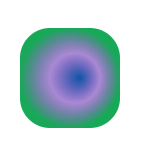

【gradientUnits】

　　gradientUnits有两个的值，userSpaceOnUse和objectBoundingBox，这用于决定渐变是否随着引用它的元素进行缩放。也就是说它决定了cx、cy、fx、fy、r的缩放

　　userSpaceOnUse: cx、cy、fx、fy、r表示当前用户坐标系统的坐标。也就是说渐变中的值都是绝对值

　　objectBoundingBox: cx、cy、fx、fy、r表示应用渐变的元素创建的边界坐标系统。也就是说渐变随着应用的元素进行了缩放

　　如果不设置，默认取值是objectBoundingBox
```
<svg height="70" version="1.1" xmlns="http://www.w3.org/2000/svg">
  <defs>
      <radialGradient id="Gradient1" gradientUnits="objectBoundingBox">
        <stop offset="0%" stop-color="#05a"/>
        <stop offset="50%" stop-color="#50a" stop-opacity="0.5"/>
        <stop offset="100%" stop-color="#0a5"/>
      </radialGradient>
  </defs>
  <rect id="rect1" x="10" y="10" rx="15" ry="15" width="50" height="50" fill="url(#Gradient1)"/>
</svg>
```
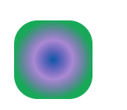

如果设置为userSpaceOnUse，则cx、cy、fx、fy、r需要设置为用户坐标系的坐标绝对值
```
<svg height="70" version="1.1" xmlns="http://www.w3.org/2000/svg">
  <defs>
      <radialGradient id="Gradient1" gradientUnits="userSpaceOnUse" cx=35 cy=35 fx=35 fy=35 r=25>
        <stop offset="0%" stop-color="#05a"/>
        <stop offset="50%" stop-color="#50a" stop-opacity="0.5"/>
        <stop offset="100%" stop-color="#0a5"/>
      </radialGradient>
  </defs>
  <rect id="rect1" x="10" y="10" rx="15" ry="15" width="50" height="50" fill="url(#Gradient1)"/>
</svg>
```
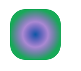

【spreadMethod】

　　和线性渐变一样。它可以接受三个值，pad，reflect，repeat，它定义了渐变如何开始和结束，当cx和cy的值是在0%到100%里面的时候

```
pad:（默认值）使用开始和结束位置的颜色结点来填充剩余的部分
reflect: 反射渐变图案，从开始->结束，再从结束->开始，然后开始->结束，往复直到空间都填满
repeat: 从start-to-end重复渐变图案，直到空间填满
```

pad为默认值
```
	<svg height="70" version="1.1" xmlns="http://www.w3.org/2000/svg">
        <defs>
            <radialGradient id="Gradient21" r=0.2 spreadMethod=pad>
                <stop offset="0%" stop-color="#05a"/>
                <stop offset="50%" stop-color="#50a" stop-opacity="0.5"/>
                <stop offset="100%" stop-color="#0a5"/>
            </radialGradient>
        </defs>
        <rect id="rect1" x="10" y="10" rx="15" ry="15" width="50" height="50" fill="url(#Gradient21)"/>
    </svg>
```

reflect的效果
```
<svg height="70" version="1.1" xmlns="http://www.w3.org/2000/svg">
  <defs>
      <radialGradient id="Gradient1" r=0.2 spreadMethod=reflect>
        <stop offset="0%" stop-color="#05a"/>
        <stop offset="50%" stop-color="#50a" stop-opacity="0.5"/>
        <stop offset="100%" stop-color="#0a5"/>
      </radialGradient>
  </defs>
  <rect id="rect1" x="10" y="10" rx="15" ry="15" width="50" height="50" fill="url(#Gradient1)"/>
</svg>
```
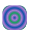

下面是repeat的效果
```
<svg height="70" version="1.1" xmlns="http://www.w3.org/2000/svg">
  <defs>
      <radialGradient id="Gradient1" r=0.2 spreadMethod=repeat>
        <stop offset="0%" stop-color="#05a"/>
        <stop offset="50%" stop-color="#50a" stop-opacity="0.5"/>
        <stop offset="100%" stop-color="#0a5"/>
      </radialGradient>
  </defs>
  <rect id="rect1" x="10" y="10" rx="15" ry="15" width="50" height="50" fill="url(#Gradient1)"/>
</svg>
```
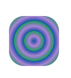

