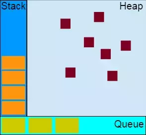
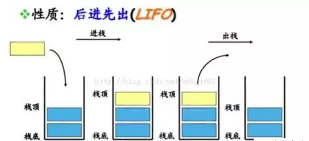
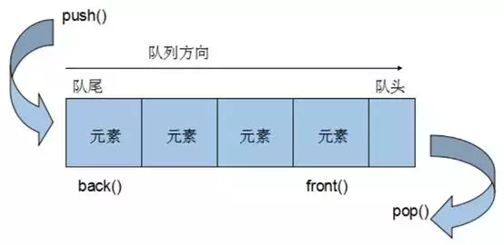
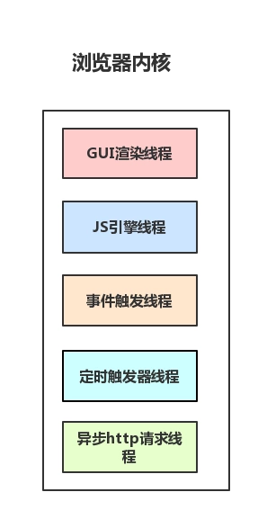
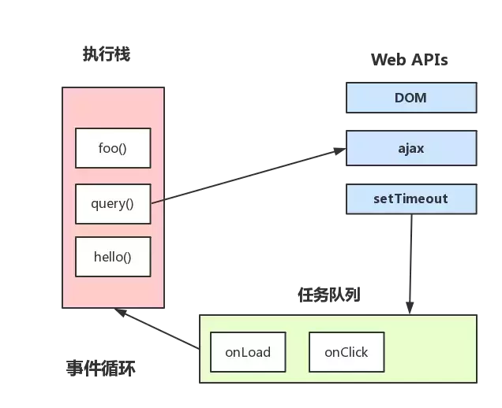

## 前言
Event Loop即事件循环，是指浏览器或Node的一种解决javaScript单线程运行时不会阻塞的一种机制，也就是我们经常使用异步的原理。

## 先熟悉基本概念


【堆Heap】
堆是一种数据结构，是利用完全二叉树维护的一组数据，堆分为两种，一种为最大堆，一种为最小堆，将根节点最大的堆叫做最大堆或大根堆，根节点最小的堆叫做最小堆或小根堆。

堆是线性数据结构，相当于一维数组，有唯一后继。

【栈Stack】  
栈在计算机科学中是限定仅在表尾进行插入或删除操作的线性表。 栈是一种数据结构，它按照后进先出的原则存储数据，先进入的数据被压入栈底，最后的数据在栈顶，需要读数据的时候从栈顶开始弹出数据。

栈是只能在某一端插入和删除的特殊线性表。



【队列Queue】  
特殊之处在于它只允许在表的前端（front）进行删除操作，而在表的后端（rear）进行插入操作，和栈一样，队列是一种操作受限制的线性表。

进行插入操作的端称为队尾，进行删除操作的端称为队头。 队列中没有元素时，称为空队列。



【进程】  
进程是系统分配的独立资源，是 CPU 资源分配的基本单位，进程是由一个或者多个线程组成的。

【线程】  
线程是进程的执行流，是CPU调度和分派的基本单位，同个进程之中的多个线程之间是共享该进程的资源的。

把这些概念拿到浏览器中来说，当你打开一个 Tab 页时，其实就是创建了一个进程，一个进程中可以有多个线程，比如渲染线程、JS 引擎线程、HTTP 请求线程等等。当你发起一个请求时，其实就是创建了一个线程，当请求结束后，该线程可能就会被销毁。

## 浏览器内核
> 浏览器是多进程的，浏览器每一个 tab 标签都代表一个独立的进程（也不一定，因为多个空白 tab 标签会合并成一个进程），浏览器内核（浏览器渲染进程）属于浏览器多进程中的一种。

浏览器内核有多种线程在工作。

【GUI 渲染线程】  
负责渲染页面，解析 HTML，CSS 构成 DOM 树等，当页面重绘或者由于某种操作引起回流都会调起该线程。

和 JS 引擎线程是互斥的，当 JS 引擎线程在工作的时候，GUI 渲染线程会被挂起，GUI 更新被放入在 JS 任务队列中，等待 JS 引擎线程空闲的时候继续执行。

【JS 引擎线程】  
单线程工作，负责解析运行 JavaScript 脚本。

和 GUI 渲染线程互斥，JS 运行耗时过长就会导致页面阻塞。

【事件触发线程】  
当事件符合触发条件被触发时，该线程会把对应的事件回调函数添加到任务队列的队尾，等待 JS 引擎处理。

【定时器触发线程】  
浏览器定时计数器并不是由 JS 引擎计数的，阻塞会导致计时不准确。

开启定时器触发线程来计时并触发计时，计时完成后会被添加到任务队列中，等待 JS 引擎处理。

【http 请求线程】  
http 请求的时候会开启一条请求线程。

请求完成有结果了之后，将请求的回调函数添加到任务队列中，等待 JS 引擎处理。




基础知识我们基本了解了些必要的，下面我们开始介绍Event Loop

## js中的任务分类
> 任务被分为两种，一种宏任务（MacroTask）也叫Task，一种叫微任务（MicroTask）  也叫jobs

【MacroTask（宏任务）】  
类型：script全部代码、setTimeout、setInterval、setImmediate、I/O、UI Rendering

【MicroTask（微任务）】  
类型：Process.nextTick（Node独有）、Promise 、MutationObserver

## Event Loop
> 目前讨论的两种情况：浏览器的Event Loop 以及Node中的Event Loop

## 浏览器中的Event Loop
> Javascript 有一个 main thread 主线程和 call-stack 调用栈(执行栈)，所有的任务都会被放到调用栈等待主线程执行。

【JS调用栈】  
JS调用栈采用的是后进先出的规则，当函数执行的时候，会被添加到栈的顶部，当执行栈执行完成后，就会从栈顶移出，直到栈内被清空。

【同步任务和异步任务】  
Javascript单线程任务被分为同步任务和异步任务，同步任务会在调用栈中按照顺序等待主线程依次执行，异步任务会在异步任务有了结果后，将注册的回调函数放入任务队列中等待主线程空闲的时候（调用栈被清空），被读取到栈内等待主线程的执行。



## 浏览器进行事件循环工作方式

1、选择当前要执行的任务队列，选择任务队列中最先进入的任务，如果任务队列为空即null，则执行跳转到微任务（MicroTask）的执行步骤。

2、将事件循环中的任务设置为已选择任务。

3、执行任务。

4、将事件循环中当前运行任务设置为null。

5、将已经运行完成的任务从任务队列中删除。

6、microtasks步骤：进入microtask检查点。

7、更新界面渲染。

8、返回第一步。

【执行进入microtask检查点时，浏览器会执行以下步骤：】

设置microtask检查点标志为true。

当事件循环microtask执行不为空时：选择一个最先进入的microtask队列的microtask，将事件循环的microtask设置为已选择的microtask，运行microtask，将已经执行完成的microtask为null，移出microtask中的microtask。

清理IndexDB事务

设置进入microtask检查点的标志为false。

【重点】  
总结以上规则为一条通俗好理解的：

1、顺序执行先执行同步方法，碰到MacroTask直接执行，并且把回调函数放入MacroTask执行队列中（下次事件循环执行）；碰到microtask直接执行。把回调函数放入microtask执行队列中（本次事件循环执行）

2、当同步任务执行完毕后，去执行微任务microtask。（microtask队列清空）

3、由此进入下一轮事件循环：执行宏任务 MacroTask （setTimeout，setInterval，callback）

[总结]所有的异步都是为了按照一定的规则转换为同步方式执行。

查看一个示例
```
console.log('script start'); 

setTimeout(function() {
  console.log('setTimeout');
}, 0);

Promise.resolve().then(function() {
  console.log('promise1');
}).then(function() {
  console.log('promise2');
});

console.log('script end');
```
1、一开始task队列中只有script，则script中所有函数放入函数执行栈执行，代码按顺序执行。

2、接着遇到了setTimeout,它的作用是0ms后将回调函数放入task队列中，也就是说这个函数将在下一个事件循环中执行（注意这时候setTimeout执行完毕就返回了）。

3、接着遇到了Promise，按照前面所述Promise属于microtask，所以第一个.then()会放入microtask队列。

4、当所有script代码执行完毕后，此时函数执行栈为空。

5、开始检查microtask队列，此时队列不为空,执行.then()的回调函数输出'promise1'，由于.then()返回的依然是promise,所以第二个.then()会放入microtask队列继续执行,输出'promise2'。此时microtask队列为空了

6、进入下一个事件循环，检查task队列发现了setTimeout的回调函数，立即执行回调函数输出'setTimeout'，代码执行完毕。


## 小结
基本上能理解这个例子的话，对于浏览器的事件循环应该已经可以理解的差不多了。由于本篇文章涉及的知识点比较多，不易篇幅太长，至于node的事件循环方式则跟浏览器的实现方式不太一样。所以后面会在总结一篇文章
