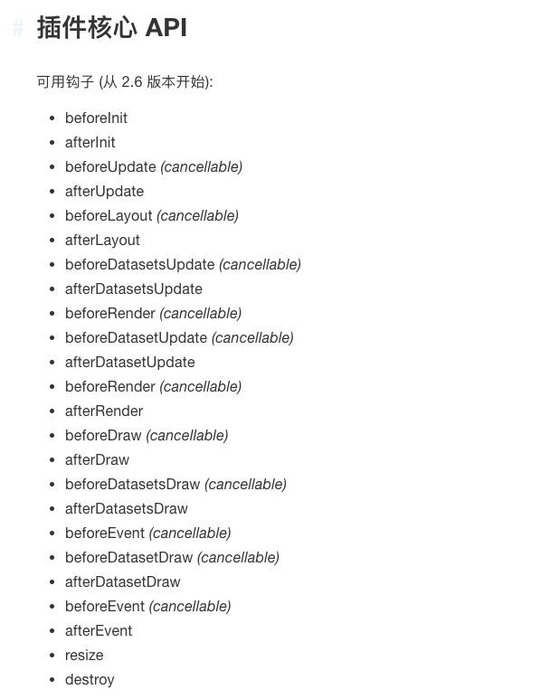

## 前言
项目需要使用chart.js插件，由于项目是使用angular开发，那么我第一步就是先把chart.js改造成angular组件来使用。

本项目代码都可以在github上下载：[项目git地址](https://github.com/shiyou00/chart)

## angular改造
1、搭建angular项目步骤省略了，可以自行查询ng官方文档

2、创建一个chart-js的组件
```
ng g c chart-js
```

chart-js.component.html
```
<div style="display: block; height: 100%">
  <canvas #canvas></canvas>
</div>
```

chart-js.component.ts
```
import {
  Component,
  OnInit,
  ViewChild,
  ElementRef,
  AfterViewInit,
  Input,
  OnChanges,
  SimpleChanges,
  OnDestroy
} from "@angular/core";
import "chart.js";

declare var window: any;
@Component({
  selector: 'chart-js',
  templateUrl: './chart-js.component.html',
  styleUrls: ['./chart-js.component.css']
})
export class ChartJsComponent implements OnInit, AfterViewInit, OnChanges, OnDestroy {

  @ViewChild("canvas") canvas: ElementRef;

  @Input() config;

  private chart;

  constructor() { }

  ngOnInit() {
  }
  // 子组件加载完成后，渲染图标
  ngAfterViewInit() {
    this.render();
  }
  // 渲染图表
  render() {
    this.chart = new window.Chart(
      this.canvas.nativeElement.getContext("2d"),
      this.config
    );
    this.chart.height = "100%";
  }
  // 判断Input参数config 是否变化，如果变化，触发更新绘图
  ngOnChanges({ config }: SimpleChanges) {
    if (config && !config.isFirstChange()) {
      this.destroyChart();
      this.render();
    }
  }
  // 销毁chart  
  ngOnDestroy() {
    this.destroyChart();
  }
  // 销毁chart主体
  destroyChart() {
    if (this.chart) {
      this.chart.destroy();
      this.chart = undefined;
    }
  }
}
```

好了angular组件就这样改造完成了，接下来我们看下如何调用把
```
// html
<div style="width:50%;margin:0 auto;">
  <chart-js [config]="config"></chart-js>
</div>

// ts
// 一份简单的配置，后续会详细解释配置的含义
this.config = {
      type: 'bar',
      data: {
        labels: ["Red", "Blue", "Yellow", "Green", "Purple", "Orange"],
        datasets: [{
          label: '# of Votes',
          data: [12, 19, 3, 5, 2, 3],
          backgroundColor: [
            'rgba(255, 99, 132, 0.2)',
            'rgba(54, 162, 235, 0.2)',
            'rgba(255, 206, 86, 0.2)',
            'rgba(75, 192, 192, 0.2)',
            'rgba(153, 102, 255, 0.2)',
            'rgba(255, 159, 64, 0.2)'
          ],
          borderColor: [
            'rgba(255,99,132,1)',
            'rgba(54, 162, 235, 1)',
            'rgba(255, 206, 86, 1)',
            'rgba(75, 192, 192, 1)',
            'rgba(153, 102, 255, 1)',
            'rgba(255, 159, 64, 1)'
          ],
          borderWidth: 1
        }]
      },
      options: {
        scales: {
          yAxes: [{
            ticks: {
              beginAtZero:true
            }
          }]
        },
        onHover(event, elements) {
          console.log(event,elements);
        },
      }
    }
```

看下效果吧：


## 配置详解
具体配置可以参考下面链接，非常全面
[Chart.js中文文档](https://chartjs-doc.abingoal.com/)


## 配置一个复合图表
经常可以看到一个数据表中包含几种方式的展示具体看图：


既有柱状图也有折线图。像这样的该如何进行配置呢？

只需要在dataset里面新增一种数据类型并制定相应的type即可，具体如下
```
        datasets: [
          {
            label: '# of Votes',
            data: [12, 19, 3, 5, 2, 3],
            backgroundColor: [
              'rgba(255, 99, 132, 0.2)',
              'rgba(54, 162, 235, 0.2)',
              'rgba(255, 206, 86, 0.2)',
              'rgba(75, 192, 192, 0.2)',
              'rgba(153, 102, 255, 0.2)',
              'rgba(255, 159, 64, 0.2)'
            ],
            borderColor: [
              'rgba(255,99,132,1)',
              'rgba(54, 162, 235, 1)',
              'rgba(255, 206, 86, 1)',
              'rgba(75, 192, 192, 1)',
              'rgba(153, 102, 255, 1)',
              'rgba(255, 159, 64, 1)'
            ],
            borderWidth: 1
          },
          {
            type: "line", // 将此数据集类型变为折线图
            label: "Line Dataset",
            data: [3, 5, 7, 16]
          }
        ]
```
[查看完整配置代码](https://github.com/shiyou00/chart/blob/master/ng-chart/src/app/app.component.ts)


## chart.js 插件编写
插件扩展分为全局插件和内联插件

【内联插件】

> 插件也可以直接在图表插件配置（即内联插件）中定义

```
var chart = new Chart(ctx, {
    plugins: [
        {
            beforeInit: function(chart, options) {
                //..
            }
        }
    ]
});
```

【全局插件】

> 插件可以在全局范围内注册，应用于所有图表（即全局插件）

```
Chart.pluginService.register({
    // plugin implementation
});
```


【编写一个插件】  
回顾下上面我们画的图表  


如果这个时候产品跟我们说，想在这个图表上添加一个背景色，且背景色可以设置。

我们赶紧翻到柱状/条形图(Bar)的配置这里查看，发现并没有这个配置项，只能对各个柱状/条形图填充色。并不能对整个背景填充颜色

怎么办？编写插件吧。

查看下文档发现插件提供了一些钩子函数给我们：



那么我们开始正式编写插件
```
        beforeDraw: function(chartInstance) {
            // chartInstance === 画布实例
            
            // 首先我们去获取配置表，看是否配置了chartAreaBackground，如果没有配置则不执行
            if (!chartInstance.options.chartAreaBackground) return;
            var ctx = chartInstance.chart.ctx; // 获取画布上下文
            var chartArea = chartInstance.chartArea; // 画布区域
            var left = chartArea.left;
            var right = chartArea.right;
            var yOptions = chartInstance.scales["y-axis-0"];
            var yAxesTop = yOptions.paddingTop;
            var yAxesBottom = yOptions.paddingBottom;
            var top = chartArea.top + yAxesTop;
            var bottom = chartArea.bottom - yAxesBottom;
            var width = right - left; // 获取到画布宽度
            var height = bottom - top; // 获取画布的高度
            ctx.fillStyle = chartInstance.options.chartAreaBackground; // 获取背景色
            ctx.fillRect(left, top, width, height); // 举行填充
          }
```

如果对区域的位置不清楚的可以看下面的标注：


插件编写好了。如何使用呢？  
插件里面通过判断chartInstance.options.chartAreaBackground 这个是否配置。那么很明显，我们对这个进行配置就可以了
```
options:{
    chartAreaBackground:'#f5f5f5'
}
```

再来看下效果：


灰色背景色已经出现了。说明内联插件我们已经配置成功了。

【把上面的插件改造成全局插件】

新建文件 chart-plugin.ts
```
import * as Chart from "chart.js";

const drawBgColorFactory = function (Chart) {
  const drawBgColor = {
    beforeDraw: function(chartInstance) {
      // chartInstance === 画布实例
      console.log(chartInstance);
      // 首先我们去获取配置表，看是否配置了chartAreaBackground，如果没有配置则不执行
      if (!chartInstance.options.chartAreaBackground) return;
      var ctx = chartInstance.chart.ctx; // 获取画布上下文
      var chartArea = chartInstance.chartArea; // 画布区域
      var left = chartArea.left;
      var right = chartArea.right;
      var yOptions = chartInstance.scales["y-axis-0"];
      var yAxesTop = yOptions.paddingTop;
      var yAxesBottom = yOptions.paddingBottom;
      var top = chartArea.top + yAxesTop;
      var bottom = chartArea.bottom - yAxesBottom;
      var width = right - left; // 获取到画布宽度
      var height = bottom - top; // 获取画布的高度
      ctx.fillStyle = chartInstance.options.chartAreaBackground; // 获取背景色
      ctx.fillRect(left, top, width, height); // 举行填充
    }
  };

  Chart.pluginService.register(drawBgColor);
};


drawBgColorFactory(Chart);
```

这样我们就在全局注册成功了

## 小结
那么至此全局插件，局部插件我们都已经实现了，如果想要实现更加复杂的插件，则需要在项目中更加深入的去学习chart.js插件
