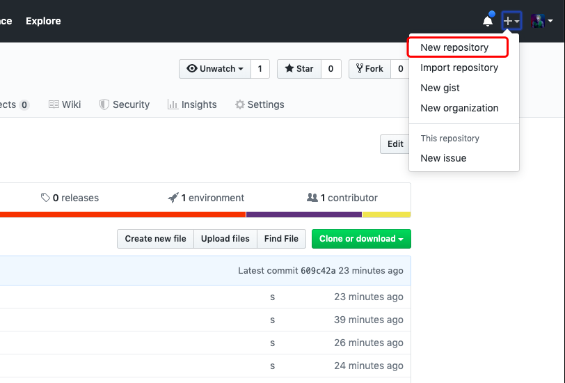
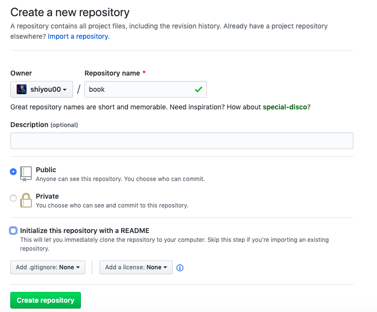
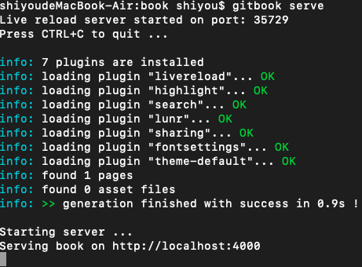
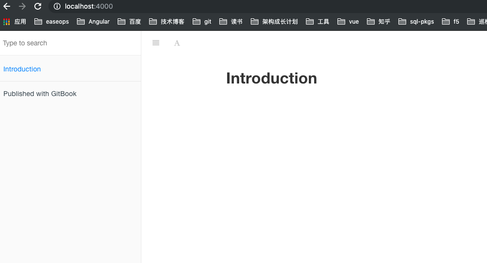
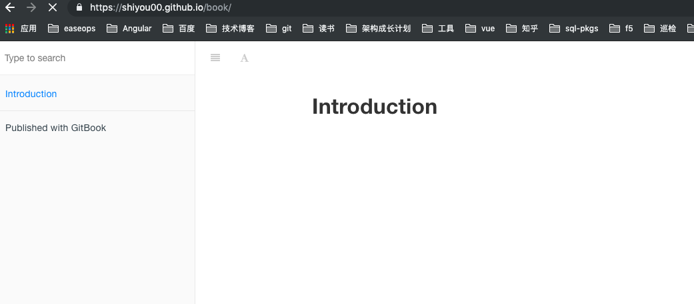

## 前言
本文主要介绍如何使用 gitbook 并且发布到github pages中

## 安装
> 安装前需要自行安装node.js

```
sudo npm install gitbook -g
```

## 使用
1、创建一个git仓库




2、拉取git仓库
```
git clone https://github.com/shiyou00/book.git
cd book/
```

3、初始化gitbook
```
gitbook init 初始化
gitbook serve 启动服务
```


4、打开界面
`http://localhost:4000`


目录结构
```
$ tree book/
book/
├── README.md
└── SUMMARY.md
0 directories, 2 files
```
可以看到一个初始化的书籍已经出现了

## 发布到 github pages
1、推送代码到git仓库
```
git add .
git commit -m "add pages"
git push
```

2、安装工具
```
sudo npm install -g gh-pages
```

3、执行`gitbook build` 把书籍打包到_book目录下

4、执行命令`gh-pages -d _book`

至此就发布成立可以打开相应的链接：
`Your site is published at https://shiyou00.github.io/book/`



好了已经成功部署到github pages中托管了，以后可以直接线上访问了，非常方便。

