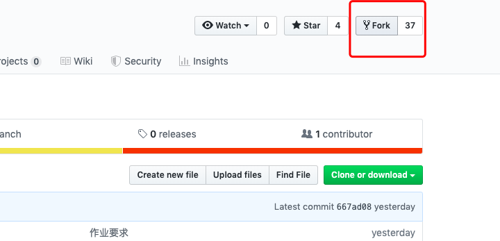
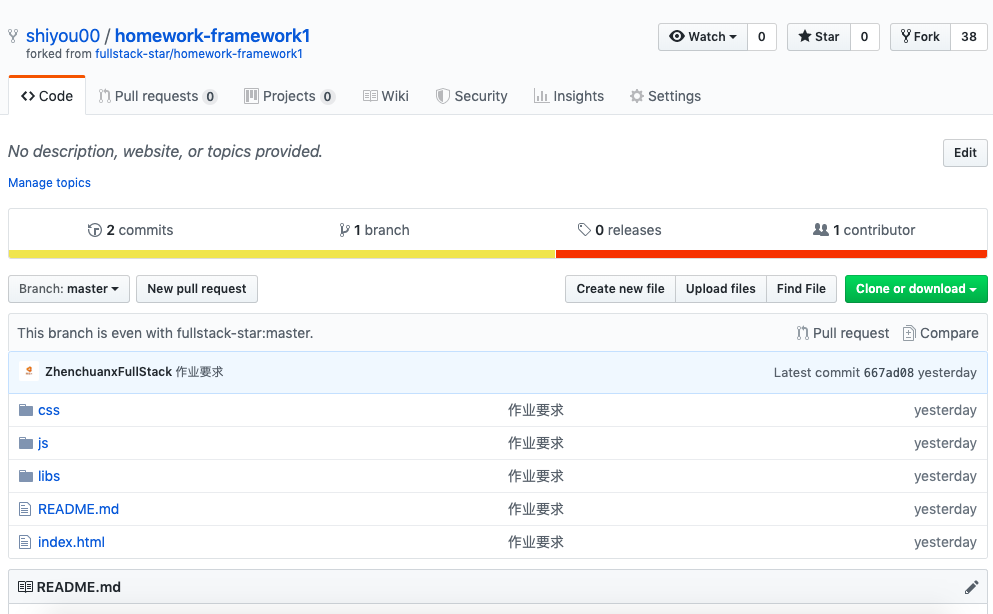
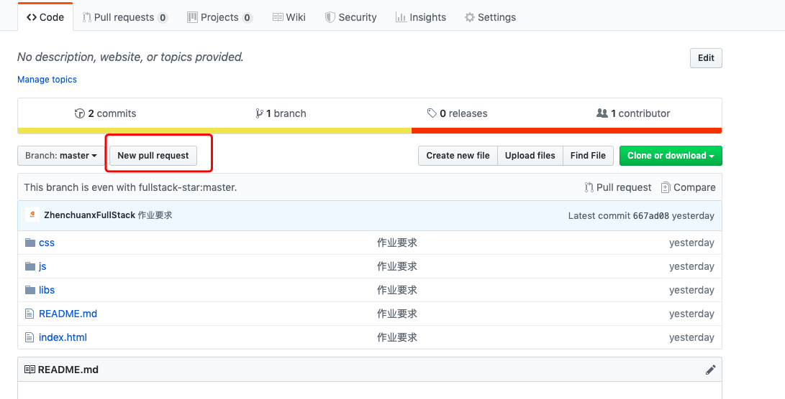
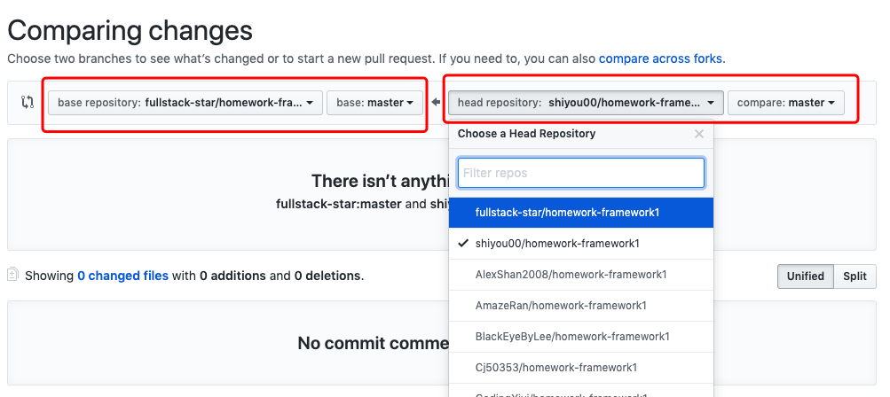
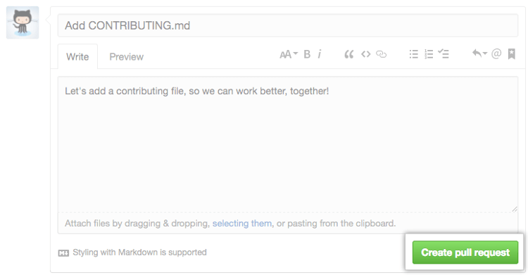

## 前言
Github 的一大特色就是 Pull Request 功能（简写为 PR）。

对于多人合作的项目，该功能简直必不可少。


## Pull Request 是什么？
> "Pull Request 是一种通知机制。你修改了他人的代码，将你的修改通知原来的作者，希望他合并你的修改，这就是 Pull Request。"

Pull Request 本质上是一种软件的合作方式，是将涉及不同功能的代码，纳入主干的一种流程。这个过程中，还可以进行讨论、审核和修改代码。


## Pull Request 的流程

第一步，你需要把别人的代码，克隆到你自己的仓库，Github 的术语叫做 fork。





git clone 刚刚fork下来的代码进行编写修改

第二步，在你仓库的修改后的分支上，按下"New pull request"按钮。




这时，会进入一个新页面，有Base 和 Head 两个选项 
- Base 是你希望提交变更的目标
- Head 是目前包含你的变更的那个分支或仓库




第三步，填写说明，帮助别人理解你的提交，然后按下"create pull request"按钮即可。



PR 创建后，管理者就要决定是否接受该 PR。对于非代码变更（比如文档），单单使用 Web 界面就足够了。但是，对于代码变更，Web 界面可能不够用，需要命令行验证是否可以运行。

## git am
`git am`命令用于将一个 patch 文件，合并进入当前代码。

Github 对每个 PR 会自动生成一个 patch 文件。我们下载该文件，合并进本地代码，就可以在本地查看效果了。
```
$ curl -L http://github.com/cbeust/testng/pull/17.patch | git am
```

上面代码中，curl的-L参数表示，如果有302跳转，curl会自动跟进。后面网址里面的`/cbeust/testng`是目标仓库，`pull/17`表示该仓库收到的第17个 PR。

如果 PR 只包含一个 commit，那么也可以直接下载这个 commit 的 patch 文件。
```
$ curl https://github.com/sclasen/jcommander/commit/bd770141029f49bcfa2e0d6e6e6282b531e69179.patch | git am
```

上面代码中，网址里面的`/sclasen/jcommander`是代码变更所在的那个仓库。

## 创建远程仓库
另一种方法是为 PR 创建一个远程分支，追踪提交者的仓库。

```
# 创建远程仓库，指向 PR 提交者的仓库
$ git remote add nullin git://github.com/nullin/testng.git

# 从该远程仓库拉取代码
$ git fetch nullin

# 将该仓库的某个分支合并到当前分支
$ git merge kneath/error-page

# 推送到自己的仓库
$ git push origin master
```


## cherry-pick

有时，PR 里面包含好几个 commit，但是你只想合并其中的一个或几个。

这时可以使用cherry-pick命令，挑出你感兴趣的 commit。

```
# 建立远程分支，追踪提交者的仓库
$ git remote add nullin git://github.com/nullin/testng.git

# 从该远程仓库拉取代码
$ git fetch nullin

# 只将感兴趣的 commit 加入当前代码
$ git cherry-pick commit1
$ git cherry-pick commit2

# 推送到自己的仓库
$ git push origin master
```

