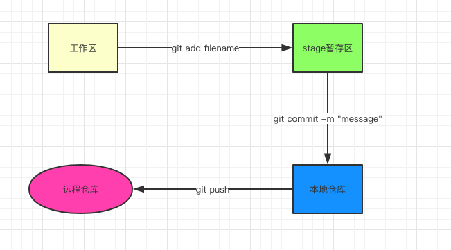

## 什么是git
> 代码管理工具，分布式管理，每个人电脑都是一个完整的版本库。并且有中央服务器(gitHub,gitLab)提供代码交换修改



## git基础概念
- 工作区：自己的项目(有一个隐藏目录 ".git" 的文件)
- stage暂存区(git add .之后就进入暂存区)
- 本地仓库(包含了本地的各种分支)
- 远程仓库(默认：origin)
- 分支：默认每个仓库都有一个master分支，也是我们的工作的一条线，git仓库则是由无数个分支组成
- 在git中HEAD表示当前版本指针

## 常用git指令
- git add name(单个) || git add .（全部） : 工作区 ==> 暂存区 
- git commit -m "message" : 暂存区 ==> 本地分支
- git push origin branchName : 本地分支 ==> 远程分支
- git pull : 拉取关联了本地分支的远程分支的最新内容
- git status : 用于显示工作目录和暂存区的状态
- git rm file : 删除一个文件
- git clone 项目地址 : 克隆一个项目
- git remote 查看远程仓库信息
- get remote -v 显示可以拉取和推送的origin的地址。如果没有推送权限，就看不到push地址

## 查看git操作信息
git log 查看log
```
git log 显示log详细信息
git log --pretty=oneline(更加简洁清晰的显示)
git reflog 记录了所有命令变更状态
git log --graph --pretty=oneline --abbrev-commit 查看分支合并图
```

## 分支

基础操作
```
git checkout -b 本地分支名 origin 远程分支名 ：创建分支
git branch -a : 查看本地分支和远程分支
git branch -r : 查看远程分支
git branch : 查看本地分支
git branch -d 分支名 : 删除本地分支
git push origin --delete 远程分支名
```

合并分支操作
```
假设develop为最新分支，我们需要更新当前分支为最新的develop
1. git fetch origin develop:develop 更新develop为最新
2. git merge develop 把最新的develop更新到当前分支中
3. 如果有冲突就解决冲突后重新commit push等操作
```

## 缓存区操作
假设我们现在编写了很多代码，但是又不愿意commit，但是这个时候又需要切换到其它分支进行操作，那么此时就可以用上stash了
```
1、把我们写的内容保存起来，执行命令git stash
2、然后切换到其它分支去工作，工作完成后切换到当前分支来
3、执行 git stash list 查看缓冲区有哪些内容
4、恢复之前的工作内容：git stash apply(恢复最后一条stash里面的工作内容，并且stash中还保存着)
5、或者使用 git stash pop 恢复最后一条stash的工作内容，且stash中不再保存了
6、也可以执行 git stash apply stash@{0} 来恢复指定的stash工作内容

最后再介绍一条：git stash drop stash@{0} 来移除指定的stash里面已经没有用的内容。 
```

## rebase操作流程
假设develop为最新分支，我们所在的分支名为cur分支，现在我们想要把develop的最新内容更新到cur分支上。
```
条件：我们现在所处的分支是cur分支
1. 拉取最新develop：git fetch origin develop:develop
2. git rebase develop
3. 如果有冲突的话，处理好冲突
4. git add . 
5. git rebase --continue 
6. git push -f （这里必须要强制推送）
```

## cherry-pick操作
假设我们现有release/1.0分支，我们所在的分支为cur分支，按照git flow 的分支管理方式，我们需要把cur分支合并到develop分支上的同时，我们还需要cherry-pick一份到release/1.0
```
1、git log 找到我们即将要cp的 commitID 假设(4b16df9cdf46159ceac7a5489b3da8eb5486034b)
2、切换到release/1.0分支上（git checkout release/1.0）
3、执行命令: git cherry-pick 4b16df9cdf46159ceac7a5489b3da8eb5486034b
4、查看是否有冲突，如果有冲突就解决冲突（假设有冲突）如果没有冲突的话就直接git push结束
5、解决完冲突后，git add .
6、git cherry-pick --continue
7、git push 操作
```

## 后悔药

暂存区后悔
```
git reset HEAD <filename> 这个是把暂存区的修改返回到工作区
git checkout --filename 丢弃工作区，回到上一次commit的状态
```

本地仓库后悔
```
git reset --hard origin/分支名 : 放弃所有修改，同步远程仓库
git reset --hard HEAD^ : 回退到上一次commit的状态
git reset --hard commitId : 回退到任意commitId
```


## 常见问题
1、当我们在gitLab上面创建了一个新分支，为什么使用命令行是看不到的？
> 需要先git fetch 更新一下

## 小结
本文让我们初步了解了git是什么，且理解了git的四个核心的概念：工作区，暂存区，本地仓库，远程仓库。其实我们对于git的操作无非就是分支，把分支在这4个区中不断的变更位置，做错了就回退位置，做完了就合并到其它分支上去的一个过程。
