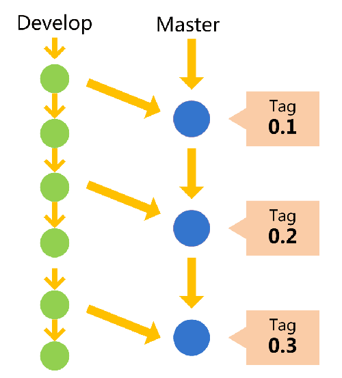

## 什么是 git-flow？
> Git Flow是一套使用Git进行源代码管理时的一套行为规范

## 主分支Master
> 首先，代码库应该有一个、且仅有一个主分支。所有提供给用户使用的正式版本，都在这个主分支上发布。Git主分支的名字，默认叫做Master。它是自动建立的，版本库初始化以后，默认就是在主分支在进行开发。

## 开发分支Develop
> 主分支只用来分布重大版本，日常开发应该在另一条分支上完成。我们把开发用的分支，叫做Develop



这个分支可以用来生成代码的最新隔夜版本（nightly）。如果想正式对外发布，就在Master分支上，对Develop分支进行"合并"（merge）。


## 临时性分支
前面讲到版本库的两条主要分支：Master和Develop。前者用于正式发布，后者用于日常开发。其实，常设分支只需要这两条就够了，不需要其他了。

但是，除了常设分支以外，还有一些临时性分支，用于应对一些特定目的的版本开发。临时性分支主要有三种：

```
* 功能（feature）分支

* 预发布（release）分支

* 修补bug（fixbug）分支
```
这三种分支都属于临时性需要，使用完以后，应该删除，使得代码库的常设分支始终只有Master和Develop。

【功能分支】  
它是为了开发某种特定功能，从Develop分支上面分出来的。开发完成后，要再并入Develop。

功能分支的名字，可以采用feature-*的形式命名。

创建一个功能分支：
```
git checkout -b feature-x develop
```

开发完成后，将功能分支合并到develop分支:
```
git checkout develop

git merge --no-ff feature-x
```

删除feature分支：
```
git branch -d feature-x
```

【预发布分支】  
它是指发布正式版本之前（即合并到Master分支之前），我们可能需要有一个预发布的版本进行测试。

预发布分支是从Develop分支上面分出来的，预发布结束以后，必须合并进Develop和Master分支。它的命名，可以采用release-*的形式。

【修补bug分支】  
最后一种是修补bug分支。软件正式发布以后，难免会出现bug。这时就需要创建一个分支，进行bug修补。

修补bug分支是从Master分支上面分出来的。修补结束以后，再合并进Master和Develop分支。它的命名，可以采用fixbug-*的形式。


以上就是分支管理的一些策略。

## 特性开关
以下则是实际项目中有用的一个点：就是当我们在开发一个大型项目的时候，并且是多人进行协作。假设开发者A在开发大型项目中的一个特性。这个特性大概要开发一个月的时间，才能完全开发结束。那么我们不可能把开发到一半的内容展示到测试网站上吧。这个时候我们可以引入“特性开关”。就是创建一个配置文件对这个特性增加一个开关。当我们正在开发中的时候，只在本地配置该开关打开，我们就可以把开发的代码都合并develop分支上去。其他人是看不见的。当我们全部开发测试完成后。就可以在测试服务器上打开相应的开关。那么测试就可以进行测试了。该特性就对外公布了。

特性开关在多人协作开发的过程中是非常有用的。一般中大型团队都在使用。


## 参考文献
- [git分支管理](http://www.ruanyifeng.com/blog/2012/07/git.html)
