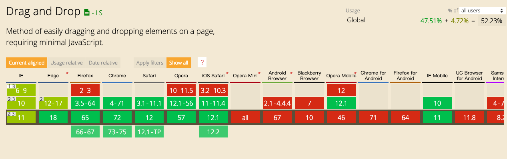

<h2 id=01>drag简介</h2>
> HMTL5提供的支持原生拖拽的实现

<h2 id=02>兼容性如何？</h2>


桌面端的支持比较好，移动端的支持还是比较差

<h2 id=03>拖拽流程</h2>
1. 设置可拖拽目标.设置属性draggable="true"实现元素的可拖拽(文本、图片和链接是默认可以拖放的，它们的draggable属性自动被设置成了true。)
2. 监听dragstart，通过DataTransfer设置拖拽数据
3. 为拖拽操作设置反馈图标(可选)
4. 设置允许的拖放效果，如copy,move,link
5. 设置拖放目标，默认情况下浏览器阻止所有的拖放操作，所以需要监听dragenter或者dragover取消浏览器默认行为使元素可拖放.
6. 监听drop事件执行所需操作

<h2 id=04>drag事件</h2>
dragstart：在元素开始被拖动时候触发

drag：在元素被拖动时反复触发（可以在此处节流）

dragend：在拖动操作完成时触发

dragenter：当被拖动元素进入目的地元素所占据的屏幕空间时触发

dragover：当被拖动元素在目的地元素内时触发

dragleave：当被拖动元素没有放下就离开目的地元素时触发

<h2 id=05>DataTransfer对象</h2>
> 在进行拖放操作时，DataTransfer 对象用来保存，通过拖放动作，拖动到浏览器的数据。它可以保存一项或多项数据、一种或者多种数据类型。

e.dataTransfer.files
> 包含一个在数据传输上所有可用的本地文件列表。如果拖动操作不涉及拖动文件，此属性是一个空列表。

e.dataTransfer.types
> 保存一个被存储数据的类型列表作为第一项，顺序与被添加数据的顺序一致。

[DataTransfer-MDN](https://developer.mozilla.org/zh-CN/docs/Web/API/DataTransfer)

<h2 id=06>从操作系统拖拽图片到指定区域进行预览</h2>
> 从操作系统拖拽文件到浏览器中.不会触发dragstart,dragend,只需取消拖放区域的默认行为,设置反馈,并在拖放发生时取消浏览器默认行为,通过e.dataTransfer.files获取文件信息进行操作

```
<div id="demo2">
  <h3>从文件夹中拖拽图片到下面的区域进行预览</h3>
  <ul class="preview"></ul>
  <style>
  #demo2 {
    margin: 20px;
  }
  #demo2 .preview {
    height: 300px;
    background: #ddd;
  }
  #demo2 li {
    float: left;
    margin-left: 40px;
  }
  #demo2 img {
    max-height: 150px;
    width: auto;
  }
  </style>

  <script>
  (function (w) {
    var doc = w.document;

    var dnd = {
      init: function () {
        var me = this;
        var preview = doc.querySelector('#demo2 .preview');

        preview.addEventListener('dragover', function (e) {
          e.preventDefault();
        }, false);

        preview.addEventListener('drop', function (e) {
          // 操作系统拖放文件到浏览器需要取消默认行为
          e.preventDefault();
            
          [].forEach.call(e.dataTransfer.files, function (file) {
            if (file && file.type.match('image.*')) {
              var reader = new FileReader();

              reader.onload = function (e) {
                var img = doc.createElement('img');
                img.src = e.target.result;
                var li = doc.createElement('li');
                li.appendChild(img);
                preview.appendChild(li);
              };

              reader.readAsDataURL(file);
            }
          });
        }, false);
      }

    };

    dnd.init();
  }(window));
  </script>
</div> <!-- demo2 -->
```

<h2 id=07>drag实例</h2> 
```
<div class="dropzone">
  <div id="draggable" draggable="true" ondragstart="event.dataTransfer.setData('text/plain',null)">
    This div is draggable
  </div>
</div>
<div class="dropzone"></div>
<div class="dropzone"></div>
<div class="dropzone"></div>

<style>
  #draggable {
    width: 200px;
    height: 20px;
    text-align: center;
    background: white;
  }

  .dropzone {
    width: 200px;
    height: 20px;
    background: blueviolet;
    margin-bottom: 10px;
    padding: 10px;
  }
</style>

<script>
  var dragged;

  /* 拖动目标元素时触发drag事件 */
  document.addEventListener("drag", function( event ) {

  }, false);

  document.addEventListener("dragstart", function( event ) {
      // 保存拖动元素的引用(ref.)
      dragged = event.target;
      // 使其半透明
      event.target.style.opacity = .5;
  }, false);

  document.addEventListener("dragend", function( event ) {
      // 重置透明度
      event.target.style.opacity = "";
  }, false);

  /* 放置目标元素时触发事件 */
  document.addEventListener("dragover", function( event ) {
      // 阻止默认动作以启用drop
      event.preventDefault();
  }, false);

  document.addEventListener("dragenter", function( event ) {
      // 当可拖动的元素进入可放置的目标时高亮目标节点
      if ( event.target.className == "dropzone" ) {
          event.target.style.background = "purple";
      }

  }, false);

  document.addEventListener("dragleave", function( event ) {
      // 当拖动元素离开可放置目标节点，重置其背景
      if ( event.target.className == "dropzone" ) {
          event.target.style.background = "";
      }

  }, false);

  document.addEventListener("drop", function( event ) {
      // 阻止默认动作（如打开一些元素的链接）
      event.preventDefault();
      // 将拖动的元素到所选择的放置目标节点中
      if ( event.target.className == "dropzone" ) {
          event.target.style.background = "";
          dragged.parentNode.removeChild( dragged );
          event.target.appendChild( dragged );
      }
    
  }, false);
</script>
```

<h2 id=08>小结</h2>
通过本章的学习，我们更深入的了解到如何使用drag进行拖放，并且通过dataTransfer获取拖放的相应数据。由于该对象的浏览器兼容还存在问题，所以在使用时务必查询的can i use，确保符合项目需求。否则可以选择 mouse事件进行拖拽处理
