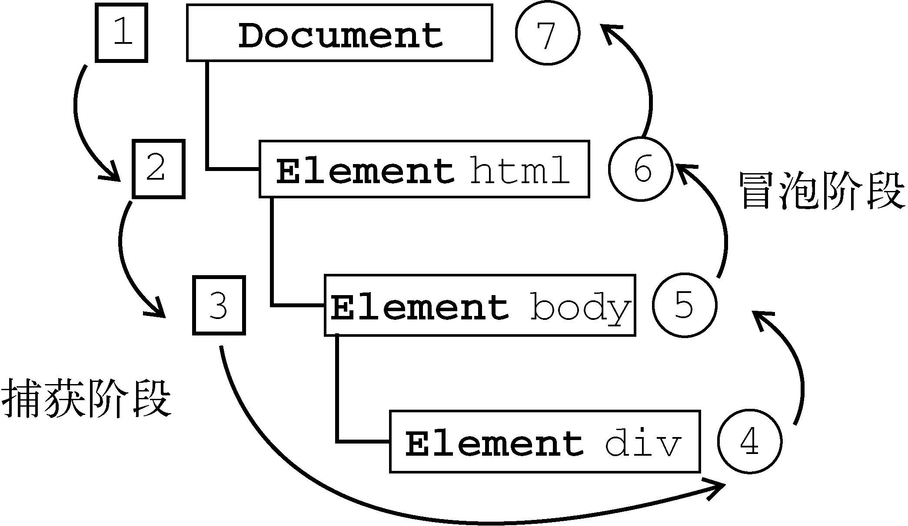

## 前言
JavaScript与HTML之间的交互是通过事件实现的。事件，就是文档或浏览器窗口中发生的一些特定的交互瞬间。可以使用侦听器（或处理程序）来预订事件，以便事件发生时执行相应的代码。这种在传统软件工程中被称为观察员模式的模型，支持页面的行为（JavaScript代码）与页面的外观（HTML和CSS代码）之间的松散耦合。

## 事件处理程序
> 事件就是用户或浏览器自身执行的某种动作。诸如 click、load 和 mouseover，都是事件的名字。 而响应某个事件的函数就叫做事件处理程序(或事件侦听器)。

【HTML 事件处理程序】
```
<input type="button" value="Click Me" onclick="alert('Clicked')" >
<input type="button" value="Click Me" onclick="alert(this.value)">
```
[注]html中定义的事件有权访问全局作用域中的任何代码，例如外部引入的JS文件

[注]this值等于事件的目标元素

【DOM0级事件处理程序】
```
var btn = document.getElementById("myBtn");
btn.onclick = function(){
    alert("Clicked");
};
```
使用DOM0级方法指定的事件处理程序被认为是元素的方法。因此，这时候的事件处理程序是在元素的作用域中运行;
```
var btn = document.getElementById("myBtn");
btn.onclick = function(){
    alert(this.id);    //"myBtn"
};
```
this指向当前元素

【删除DOM0级元素】
```
btn.onclick = null;     //删除事件处理程序
```

【DOM2级事件处理程序】
> “DOM2级事件”定义了两个方法，用于处理指定和删除事件处理程序的操作：addEventListener()和removeEventListener()。接受3个参数：要处理的事件名、作为事件处理程序的函数和一个布尔值。最后这个布尔值参数如果是true，表示在捕获阶段调用事件处理程序；如果是false，表示在冒泡阶段调用事件处理程序。

```
var btn = document.getElementById("myBtn");
btn.addEventListener("click", function(){
    alert(this.id);
}, false);
```
使用DOM2级方法添加事件处理程序的主要好处是可以添加多个事件处理程序。来看下面的例子。
```
var btn = document.getElementById("myBtn");
btn.addEventListener("click", function(){
    alert(this.id);
}, false);
btn.addEventListener("click", function(){
    alert("Hello world!");
}, false);
```

【DOM2级事件移除方式】
```
var btn = document.getElementById("myBtn");
btn.addEventListener("click", function(){
    alert(this.id);
}, false);


btn.removeEventListener("click", function(){ 
    alert(this.id);
}, false);
```
// 这样做是没有用的。。。
```
var btn = document.getElementById("myBtn");
var handler = function(){
    alert(this.id);
};
btn.addEventListener("click", handler, false);

//这里省略了其他代码

btn.removeEventListener("click", handler, false); //有效！
```
[兼容]IE9、Firefox、Safari、Chrome和Opera支持DOM2级事件处理程序

【IE事件处理程序】
> IE实现了与DOM中类似的两个方法：attachEvent()和detachEvent()。这两个方法接受相同的两个参数：事件处理程序名称与事件处理程序函数。由于IE8及更早版本只支持事件冒泡，所以通过attachEvent()添加的事件处理程序都会被添加到冒泡阶段。

```
var btn = document.getElementById("myBtn");
btn.attachEvent("onclick", function(){
    alert("Clicked");
});
```
[注意]attachEvent()的第一个参数是"onclick"，而非DOM的addEventListener()方法中的"click"。

在IE中使用attachEvent()与使用DOM0级方法的主要区别在于事件处理程序的作用域。在使用DOM0级方法的情况下，事件处理程序会在其所属元素的作用域内运行；在使用attachEvent()方法的情况下，事件处理程序会在全局作用域中运行，因此this等于window。来看下面的例子。

```
var btn = document.getElementById("myBtn");
btn.attachEvent("onclick", function(){
    alert(this === window);    //true
});
```
[注意]牢记attachEvent绑定事件中的this === window 对于编写跨浏览器应用非常有帮助


【attachEvent绑定多个事件触发顺序是反的】
```
var btn = document.getElementById("myBtn");
btn.attachEvent("onclick", function(){
    alert("Clicked");
});
btn.attachEvent("onclick", function(){
    alert("Hello world!");
});
```
结果是先弹出"Hello world!",然后才是"Clicked"

【移除IE事件】
```
var btn = document.getElementById("myBtn");
var handler = function(){
    alert("Clicked");
};
btn.attachEvent("onclick", handler);

//这里省略了其他代码

btn.detachEvent("onclick", handler);
```
[兼容] 支持IE事件处理程序的浏览器有IE和Opera。

## 跨浏览器兼容的事件处理
```
var EventUtil = {
    addHandler: function(element, type, handler){
        if (element.addEventListener){
            element.addEventListener(type, handler, false);
        } else if (element.attachEvent){
            element.attachEvent("on" + type, handler);
        } else {
            element["on" + type] = handler;
        }
    },
    removeHandler: function(element, type, handler){
        if (element.removeEventListener){
            element.removeEventListener(type, handler, false);
        } else if (element.detachEvent){
            element.detachEvent("on" + type, handler);
        } else {
            element["on" + type] = null;
        }
    }
};
```
addHandler()和removeHandler()没有考虑到所有的浏览器问题，例如在IE中的作用域问题。不过，使用它们添加和移除事件处理程序还是足够了。此外还要注意，DOM0级对每个事件只支持一个事件处理程序。好在，只支持DOM0级的浏览器已经没有那么多了，因此这对你而言应该不是什么问题。


## 事件流
如果你单击了某个按钮，他们都认为单击事件不仅仅发生在按钮上。换句话说，在单击按钮的同时，你也单击了按钮的容器元素，甚至也单击了整个页面。

事件流描述的是从页面中接收事件的顺序。但有意思的是，IE和Netscape开发团队居然提出了差不多是完全相反的事件流的概念。IE的事件流是事件冒泡流，而Netscape Communicator的事件流是事件捕获流。

## 事件冒泡
> IE的事件流叫做事件冒泡（event bubbling），即事件开始时由最具体的元素（文档中嵌套层次最深的那个节点）接收，然后逐级向上传播到较为不具体的节点（文档）。

click事件首先在`<div>`元素上发生，而这个元素就是我们单击的元素。然后，click事件沿DOM树向上传播，在每一级节点上都会发生，直至传播到document对象。图片展示了事件冒泡的过程


[注意]所有现代浏览器都支持事件冒泡，但在具体实现上还是有一些差别。IE5.5及更早版本中的事件冒泡会跳过<html>元素（从<body>直接跳到document）。IE9、Firefox、Chrome和Safari则将事件一直冒泡到window对象。

## 事件捕获
> 事件捕获的思想是不太具体的节点应该更早接收到事件，而最具体的节点应该最后接收到事件。事件捕获的用意在于在事件到达预定目标之前捕获它。

在事件捕获过程中，document对象首先接收到click事件，然后事件沿DOM树依次向下，一直传播到事件的实际目标，即\<div>元素。图片展示了事件捕获的过程。


[兼容]由于老版本的浏览器不支持(IE8-)，因此很少有人使用事件捕获。

## DOM事件流
> “DOM2级事件”规定的事件流包括三个阶段：事件捕获阶段、处于目标阶段和事件冒泡阶段。首先发生的是事件捕获，为截获事件提供了机会。然后是实际的目标接收到事件。最后一个阶段是冒泡阶段，可以在这个阶段对事件做出响应。


在DOM事件流中，实际的目标（`<div>`元素）在捕获阶段不会接收到事件。这意味着在捕获阶段，事件从document到`<html>`再到`<body>`后就停止了。下一个阶段是“处于目标”阶段，于是事件在`<div>`上发生，并在事件处理（后面将会讨论这个概念）中被看成冒泡阶段的一部分。然后，冒泡阶段发生，事件又传播回文档。

多数支持DOM事件流的浏览器都实现了一种特定的行为；即使“DOM2级事件”规范明确要求捕获阶段不会涉及事件目标，但IE9、Safari、Chrome、Firefox和Opera 9.5及更高版本都会在捕获阶段触发事件对象上的事件。结果，就是有两个机会在目标对象上面操作事件。

[兼容]IE9、Opera、Firefox、Chrome和Safari都支持DOM事件流；IE8及更早版本不支持DOM事件流。

## 事件的 Event 对象
> 在触发DOM上的某个事件时，会产生一个事件对象event，这个对象中包含着所有与事件有关的信息。包括导致事件的元素、事件的类型以及其他与特定事件相关的信息。例如，鼠标操作导致的事件对象中，会包含鼠标位置的信息，而键盘操作导致的事件对象中，会包含与按下的键有关的信息。所有浏览器都支持event对象，但支持方式不同。

兼容DOM的浏览器会将一个event对象传入到事件处理程序中。无论指定事件处理程序时使用什么方法（DOM0级或DOM2级），都会传入event对象。
```
var btn = document.getElementById("myBtn");
btn.onclick = function(event){
    alert(event.type);     //"click"
};
btn.addEventListener("click", function(event){
    alert(event.type);     //"click"
}, false);
```
event对象表

| 属性/方法        | 类　　型	           | 读/写  |  说　　明  |
| ----------- |---------------|------|-----|
|   bubbles    |  Boolean |  只读  |  表明事件是否冒泡  |
|   cancelable    |  Boolean | 只读  |  表明是否可以取消事件的默认行为  |
|   currentTarget    | Element  | 只读  |  其事件处理程序当前正在处理事件的那个元素  |
|   defaultPrevented    |  Boolean |  只读	 |  为true表示已经调用了preventDefault()（DOM3级事件中新增）  |
|   detail    | Integer  | 只读	  |  与事件相关的细节信息  |
|   eventPhase    | Integer  |  只读	 |  调用事件处理程序的阶段：1表示捕获阶段，2表示“处于目标”，3表示冒泡阶段  |
|   preventDefault()    |  Function | 只读	  |  取消事件的默认行为。如果cancelable是true，则可以使用这个方法  |
|   stopImmediatePropagation()    | Function  | 只读	  | 取消事件的进一步捕获或冒泡，同时阻止任何事件处理程序被调用（DOM3级事件中新增）   |
|   stopPropagation()	    | Function  | 只读	  |  取消事件的进一步捕获或冒泡。如果bubbles为true，则可以使用这个方法  |
|   target    |  Element | 只读	  | 事件的目标   |
|   trusted    |  Boolean | 只读	  |  为true表示事件是浏览器生成的。为false表示事件是由开发人员通过JavaScript创建的（DOM3级事件中新增）  |
|   type    | String  | 只读	  |  被触发的事件的类型  |
|   view    | AbstractView  | 只读	  |  与事件关联的抽象视图。等同于发生事件的window对象  |


在事件处理程序内部，对象this始终等于currentTarget的值，而target则只包含事件的实际目标。如果直接将事件处理程序指定给了目标元素，则this、currentTarget和target包含相同的值。来看下面的例子。

```
var btn = document.getElementById("myBtn");
btn.onclick = function(event){
    alert(event.currentTarget === this);    //true
    alert(event.target === this);           //true
};
```
[注]target是click事件的真正目标，例如再document.body中注册事件，但是在界面点击的是btn，target则会等于btn

【阻止浏览器的默认行为】
```
event.preventDefault();
```
[注]只有cancelable属性设置为true的事件，才可以使用preventDefault()来取消其默认行为。

【阻止事件冒泡和捕获】  
event.stopPropagation();
```
var btn = document.getElementById("myBtn");
btn.onclick = function(event){
    alert("Clicked");
    event.stopPropagation();
};

document.body.onclick = function(event){
    alert("Body clicked");
};
```
这样在body上面注册的事件则不会发生

【eventPhase事件处理程序的阶段】
```
var btn = document.getElementById("myBtn");
btn.onclick = function(event){
    alert(event.eventPhase); //2 目标阶段
};

document.body.addEventListener("click", function(event){
    alert(event.eventPhase); //1 捕获阶段
}, true);

document.body.onclick = function(event){
    alert(event.eventPhase); //3 冒泡阶段
};
```

[注]只有在事件处理程序执行期间，event对象才会存在；一旦事件处理程序执行完成，event对象就会被销毁。

### IE中的事件对象

【IE中获取事件对象】
```
DOM0级绑定：通过window获取event对象
var btn = document.getElementById("myBtn");
btn.onclick = function(){
    var event = window.event;
    alert(event.type);     //"click"
};

DOM2级事件：即可通过window获取也可通过参数传入获取

var btn = document.getElementById("myBtn");
btn.attachEvent("onclick", function(event){
    alert(event.type);     //"click"
});

HTML中指定事件程序：则是通过event对象获取
<input type="button" value="Click Me" onclick="alert(event.type)">
```
IE的event对象同样也包含与创建它的事件相关的属性和方法。其中很多属性和方法都有对应的或者相关的DOM属性和方法。与DOM的event对象一样，这些属性和方法也会因为事件类型的不同而不同，但所有事件对象都会包含下表所列的属性和方法。

| 属性/方法        | 类　　型	           | 读/写  |  说　　明  |
| ----------- |---------------|------|-----|
|   cancelBubble  |   Boolean  |  读/写    |  默认值为false，但将其设置为true就可以取消事件冒泡（与DOM中的stopPropagation()方法的作用相同）   |
|  returnValue   |  Boolean   |   读/写  |   默认值为true，但将其设置为false就可以取消事件的默认行为（与DOM中的preventDefault()方法的作用相同）  |
|   srcElement  |   Element  |   只读  |  事件的目标（与DOM中的target属性相同）   |
|   type  |   String  |  只读   |   被触发的事件的类型  |

因为事件处理程序的作用域是根据指定它的方式来确定的，所以不能认为this会始终等于事件目标。故而，最好还是使用event.srcElement比较保险
```
var btn = document.getElementById("myBtn");
btn.onclick = function(){
    alert(window.event.srcElement === this);     //true
};

btn.attachEvent("onclick", function(event){
    alert(event.srcElement === this);            //通过attachEvent绑定事件时this === window 所以不等于event.srcElement
});
```
【IE中阻止浏览器默认行为】
```
var link = document.getElementById("myLink");
link.onclick = function(){
    window.event.returnValue = false;
};
```

【IE中阻止事件冒泡】  
window.event.cancelBubble = true;
```
var btn = document.getElementById("myBtn");
btn.onclick = function(){
    alert("Clicked");
    window.event.cancelBubble = true;
};

document.body.onclick = function(){
    alert("Body clicked");
};
```

## 跨浏览器的事件对象兼容
```
var EventUtil = {
    getEvent: function(event){
        return event ? event : window.event;
    },
    getTarget: function(event){
        return event.target || event.srcElement;
    },
    preventDefault: function(event){
        if (event.preventDefault){
            event.preventDefault();
        } else {
            event.returnValue = false;
        }
    },
    stopPropagation: function(event){
        if (event.stopPropagation){
            event.stopPropagation();
        } else {
            event.cancelBubble = true;
        }
    }
};
```
## 事件的内存和性能
> 在JavaScript中，添加到页面上的事件处理程序数量将直接关系到页面的整体运行性能。导致这一问题的原因是多方面的。首先，每个函数都是对象，都会占用内存；内存中的对象越多，性能就越差。

【事件委托】
> 对“事件处理程序过多”问题的解决方案就是事件委托。事件委托利用了事件冒泡，只指定一个事件处理程序，就可以管理某一类型的所有事件。例如，click事件会一直冒泡到document层次。也就是说，我们可以为整个页面指定一个onclick事件处理程序，而不必给每个可单击的元素分别添加事件处理程序。

```
<ul id="myLinks">
    <li id="goSomewhere">Go somewhere</li>
    <li id="doSomething">Do something</li>
    <li id="sayHi">Say hi</li>
</ul>
```
为3个li都添加相应的点击事件，这样会导致性能更差，我们可以只在ul上面添加一个点击事件，利用冒泡原理来处理事件
```
var list = document.getElementById("myLinks");

EventUtil.addHandler(list, "click", function(event){
    event = EventUtil.getEvent(event);
    var target = EventUtil.getTarget(event);

    switch(target.id){
        case "doSomething":
            document.title = "I changed the document's title";
            break;

        case "goSomewhere":
            location.href = "http://www.wrox.com";
            break;

        case "sayHi":
            alert("hi");
            break;
    }
});
```
- 在页面中设置事件处理程序所需的时间更少。只添加一个事件处理程序所需的DOM引用更少，所花的时间也更少。
- 整个页面占用的内存空间更少，能够提升整体性能。

【移除事件处理程序】
> 每当将事件处理程序指定给元素时，运行中的浏览器代码与支持页面交互的JavaScript代码之间就会建立一个连接。这种连接越多，页面执行起来就越慢。在不需要的时候移除事件处理程序，也是解决这个问题的一种方案。内存中留有那些过时不用的“空事件处理程序”（dangling event handler），也是造成Web应用程序内存与性能问题的主要原因。

在两种情况下，可能会造成上述问题。第一种情况就是从文档中移除带有事件处理程序的元素时。这可能是通过纯粹的DOM操作，例如使用removeChild()和replaceChild()方法，但更多地是发生在使用innerHTML替换页面中某一部分的时候。如果带有事件处理程序的元素被innerHTML删除了，那么原来添加到元素中的事件处理程序极有可能无法被当作垃圾回收。来看下面的例子。

```
<div id="myDiv">
    <input type="button" value="Click Me" id="myBtn">
</div>
<script type="text/javascript">
    var btn = document.getElementById("myBtn");
    btn.onclick = function(){

        //先执行某些操作

        document.getElementById("myDiv").innerHTML = "Processing..."; //麻烦了！
    };
</script>
```
这里，有一个按钮被包含在\<div>元素中。为避免双击，单击这个按钮时就将按钮移除并替换成一条消息；这是网站设计中非常流行的一种做法。但问题在于，当按钮被从页面中移除时，它还带着一个事件处理程序呢。如果你知道某个元素即将被移除，那么最好手工移除事件处理程序.
```
<div id="myDiv">
    <input type="button" value="Click Me" id="myBtn">
</div>
<script type="text/javascript">
    var btn = document.getElementById("myBtn");
    btn.onclick = function(){

        //先执行某些操作

        btn.onclick = null;    //移除事件处理程序

        document.getElementById("myDiv").innerHTML = "Processing..."; 
    };
</script>

```
[注意]在事件处理程序中删除按钮也能阻止事件冒泡。目标元素在文档中是事件冒泡的前提。

## 模拟事件
> 事件经常由用户操作或通过其他浏览器功能来触发。但很少有人知道，也可以使用JavaScript在任意时刻来触发特定的事件，而此时的事件就如同浏览器创建的事件一样。也就是说，这些事件该冒泡还会冒泡，而且照样能够导致浏览器执行已经指定的处理它们的事件处理程序。在测试Web应用程序，模拟触发事件是一种极其有用的技术。DOM2级规范为此规定了模拟特定事件的方式，IE9、Opera、Firefox、Chrome和Safari都支持这种方式。IE有它自己模拟事件的方式。

【DOM中的事件模拟】  
可以在document对象上使用createEvent()方法创建event对象。这个方法接收一个参数，即表示要创建的事件类型的字符串。在DOM2级中，所有这些字符串都使用英文复数形式，而在DOM3级中都变成了单数。这个字符串可以是下列几字符串之一。

```
UIEvents：一般化的UI事件。鼠标事件和键盘事件都继承自UI事件。DOM3级中是UIEvent。

MouseEvents：一般化的鼠标事件。DOM3级中是MouseEvent。

MutationEvents：一般化的DOM变动事件。DOM3级中是MutationEvent。

HTMLEvents：一般化的HTML事件。没有对应的DOM3级事件（HTML事件被分散到其他类别中）。
```
模拟事件的最后一步就是触发事件。这一步需要使用dispatchEvent()方法，所有支持事件的DOM节点都支持这个方法。调用dispatchEvent()方法时，需要传入一个参数，即表示要触发事件的event对象。触发事件之后，该事件就跻身“官方事件”之列了，因而能够照样冒泡并引发相应事件处理程序的执行。

【模拟鼠标事件】  
创建新的鼠标事件对象并为其指定必要的信息，就可以模拟鼠标事件。创建鼠标事件对象的方法是为createEvent()传入字符串"MouseEvents"。返回的对象有一个名为initMouseEvent()方法，用于指定与该鼠标事件有关的信息。这个方法接收15个参数，分别与鼠标事件中每个典型的属性一一对应；这些参数的含义如下。
```
type（字符串）：表示要触发的事件类型，例如"click"。

bubbles（布尔值）：表示事件是否应该冒泡。为精确地模拟鼠标事件，应该把这个参数设置为true。

cancelable（布尔值）：表示事件是否可以取消。为精确地模拟鼠标事件，应该把这个参数设置为true。

view（AbstractView）：与事件关联的视图。这个参数几乎总是要设置为document.defaultView。

detail（整数）：与事件有关的详细信息。这个值一般只有事件处理程序使用，但通常都设置为0。

screenX（整数）：事件相对于屏幕的X坐标。

screenY（整数）：事件相对于屏幕的Y坐标。

clientX（整数）：事件相对于视口的X坐标。

clientY（整数）：事件想对于视口的Y坐标。

ctrlKey（布尔值）：表示是否按下了Ctrl键。默认值为false。

altKey（布尔值）：表示是否按下了Alt键。默认值为false。

shiftKey（布尔值）：表示是否按下了Shift键。默认值为false。

metaKey（布尔值）：表示是否按下了Meta键。默认值为false。

button（整数）：表示按下了哪一个鼠标键。默认值为0。

relatedTarget（对象）：表示与事件相关的对象。这个参数只在模拟mouseover或mouseout时使用。
```
显而易见，initMouseEvent()方法的这些参数是与鼠标事件的event对象所包含的属性一一对应的。其中，前4个参数对正确地激发事件至关重要，因为浏览器要用到这些参数；而剩下的所有参数只有在事件处理程序中才会用到。当把event对象传给dispatchEvent()方法时，这个对象的target属性会自动设置。下面，我们就通过一个例子来了解如何模拟对按钮的单击事件。

```
    var btn = document.getElementById("myBtn");

    //创建事件对象
    var event = document.createEvent("MouseEvents");

    //初始化事件对象
    event.initMouseEvent("click", true, true, document.defaultView, 0, 0, 0, 0, 0,
        false, false, false, false, 0, null);

    btn.onclick = function(event){
        console.log(`${event.target.id}被点击了`);
    };

    //触发事件
    btn.dispatchEvent(event);
```
当然还可以模拟键盘事件等等...这里就不赘述了，如果有相应的需求可以查阅相关资料

【IE中的事件模拟】  
在IE8及之前版本中模拟事件与在DOM中模拟事件的思路相似：先创建event对象，然后为其指定相应的信息，然后再使用该对象来触发事件。当然，IE在实现每个步骤时都采用了不一样的方式。

调用document.createEventObject()方法可以在IE中创建event对象。但与DOM方式不同的是，这个方法不接受参数，结果会返回一个通用的event对象。然后，你必须手工为这个对象添加所有必要的信息（没有方法来辅助完成这一步骤）。最后一步就是在目标上调用fireEvent()方法，这个方法接受两个参数：事件处理程序的名称和event对象。在调用fireEvent()方法时，会自动为event对象添加srcElement和type属性；其他属性则都是必须通过手工添加的。换句话说，模拟任何IE支持的事件都采用相同的模式。例如，下面的代码模拟了在一个按钮上触发click事件过程。

```
var btn = document.getElementById("myBtn");

//创建事件对象
var event = document.createEventObject();

//初始化事件对象
event.screenX = 100;
event.screenY = 0;
event.clientX = 0;
event.clientY = 0;
event.ctrlKey = false;
event.altKey = false;
event.shiftKey = false;
event.button = 0;

//触发事件
btn.fireEvent("onclick", event);
```

【自定义DOM事件】  
DOM3级还定义了“自定义事件”。自定义事件不是由DOM原生触发的，它的目的是让开发人员创建自己的事件。要创建新的自定义事件，可以调用createEvent("CustomEvent")。返回的对象有一个名为initCustomEvent()的方法，接收如下4个参数。
```
type（字符串）：触发的事件类型，例如"keydown"。

bubbles（布尔值）：表示事件是否应该冒泡。

cancelable（布尔值）：表示事件是否可以取消。

detail（对象）：任意值，保存在event对象的detail属性中。
```
示例
```
var div = document.getElementById("myDiv"),
    event; 

EventUtil.addHandler(div, "myevent", function(event){
    alert("DIV: " + event.detail);
});
EventUtil.addHandler(document, "myevent", function(event){
    alert("DOCUMENT: " + event.detail);
});

if (document.implementation.hasFeature("CustomEvents", "3.0")){
    event = document.createEvent("CustomEvent");
    event.initCustomEvent("myevent", true, false, "Hello world!");
    div.dispatchEvent(event);
}
```
[兼容]支持自定义DOM事件的浏览器有IE9+和Firefox 6+


## 小结
通过本文

我们学习了事件流，冒泡，目标阶段，捕获；

事件处理程序，HTML处理，DOM0，DOM2级事件处理方式；

事件对象，常用的属性，例如阻止冒泡，阻止浏览器的默认事件发生，已经事件对象的兼容性

事件的内存和性能文件，例如采用“事件委托”的方式来提升性能

最后我们学习了如何模拟HTML事件，以及模拟自定义事件的方法
