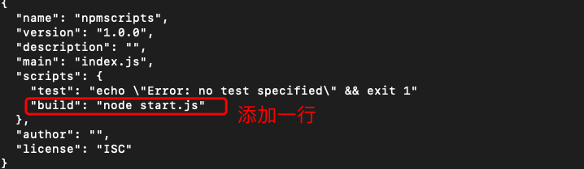
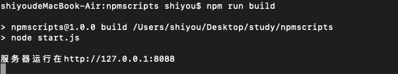
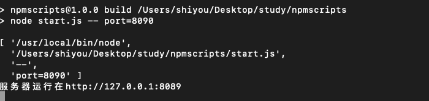
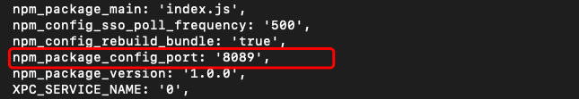
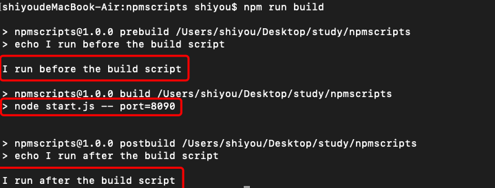
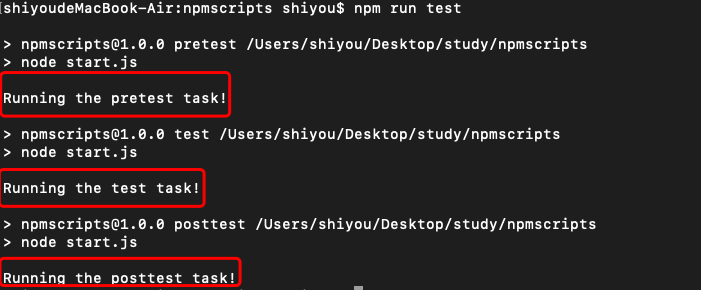
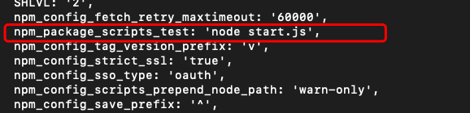

## 什么是npm脚本？
> npm 允许在package.json文件里面，使用scripts字段定义脚本命令。

初始化package.json -> npm init -> 经历一系列的问答即可
```
{
  // ...
  "scripts": {
    "build": "node start.js"
  }
}
```

此时我们执行 npm run build 就等于执行 node start.js

【npm脚本的优势】
- 项目的相关脚本都集中在一个地方
- 可以利用 npm 提供的很多辅助功能

代码示例：

执行命令
```
mkdir npmscript
cd npmscript
npm init
...一路回车
```


start.js  
一个简单的web服务器代码
```
//引入http模块
var http = require("http");
//设置主机名
var hostName = '127.0.0.1';
//设置端口
var port = 8088;
//创建服务
var server = http.createServer(function(req,res){
    res.setHeader('Content-Type','text/plain');
    res.end("hello nodejs");
});
server.listen(port,hostName,function(){
    console.log(`服务器运行在http://${hostName}:${port}`);
});
```
执行刚设置好的命令 npm run build 



## npm scripts 原理
> npm 脚本的原理非常简单。每当执行npm run，就会自动新建一个 Shell，在这个 Shell 里面执行指定的脚本命令。因此，只要是 Shell（一般是 Bash）可以运行的命令，就可以写在 npm 脚本里面。

> 比较特别的是，npm run新建的这个 Shell，会将当前目录的node_modules/.bin子目录加入PATH变量，执行结束后，再将PATH变量恢复原样。

> 这意味着，当前目录的node_modules/.bin子目录里面的所有脚本，都可以直接用脚本名调用，而不必加上路径。比如，当前项目的依赖里面有 Mocha，只要直接写mocha test就可以了。

```
"test": "mocha test"
```

而不同写成下面这样

```
"test": "./node_modules/.bin/mocha test"
```
由于 npm 脚本的唯一要求就是可以在 Shell 执行，因此它不一定是 Node 脚本，任何可执行文件都可以写在里面。

npm 脚本的退出码，也遵守 Shell 脚本规则。如果退出码不是0，npm 就认为这个脚本执行失败。


## 通配符
由于 npm 脚本就是 Shell 脚本，因此可以使用shell通配符

```
"lint": "jshint *.js" // * 表示所有
```

## 传递参数和获取参数
【方法一】  
向npm 脚本传入参数，要使用 -- 表明。
```
"scripts": {
    "build": "node start.js -- port=8090" // 通过 -- port=8090 传入参数
  }
```
在我们的start.js文件中获取
```
// 打印process.argv对象看下
console.log(process.argv);
```
看下输出什么？

可以看到数组中有port的相关信息，我们在通过数组方法就可以取出相应的值。

【方法二】  
package.json中添加config
```
"config": {
    "port": "8099"
  }
```
然后在start.js中打印 process.env.npm_package_config_port 的信息看看

同样也可以获取到相应的信息

## 执行顺序
并行执行: &
```
npm run script1.js & npm run script2.js
```

继发执行：&&
```
npm run script1.js && npm run script2.js
```

## 默认值
一般来说，npm 脚本由用户提供。但是，npm 对两个脚本提供了默认值。也就是说，这两个脚本不用定义，就可以直接使用
```
"start": "node server.js"，
"install": "node-gyp rebuild"
```
上面代码中，npm run start的默认值是node server.js，前提是项目根目录下有server.js这个脚本；npm run install的默认值是node-gyp rebuild，前提是项目根目录下有binding.gyp文件。

## 钩子
npm脚本有pre和post两个钩子。
```
{
  "name": "npmscripts",
  "version": "1.0.0",
  "description": "",
  "main": "index.js",
  "scripts": {
    "prebuild":"echo I run before the build script",
    "build": "node start.js -- port=8090",
    "postbuild":"echo I run after the build script"
  },
  "author": "",
  "license": "ISC"
}
```
start.js 建一个空文件即可

用户执行 npm run build的时候，会自动按照下面的顺序执行。
```
npm run prebuild && npm run build && npm run postbuild 
```
因此可以在pre和post钩子上完成一些准备工作和清理工作;

再执行下npm run build 可以看看结果


【默认钩子】
```
prepublish，postpublish
preinstall，postinstall
preuninstall，postuninstall
preversion，postversion
pretest，posttest
prestop，poststop
prestart，poststart
prerestart，postrestart
```

【自定义命令的钩子】
> 自定义的脚本命令也可以加上pre和post钩子。比如，myscript这个脚本命令，也有premyscript和postmyscript钩子

npm 提供一个npm_lifecycle_event变量，返回当前正在运行的脚本名称，比如pretest、test、posttest等等。所以，可以利用这个变量，在同一个脚本文件里面，为不同的npm scripts命令编写代码。

package.json
```
{
  "name": "npmscripts",
  "version": "1.0.0",
  "description": "",
  "main": "index.js",
  "scripts": {
    "pretest": "node start.js",
    "test": "node start.js",
    "posttest": "node start.js"
  },
  "author": "",
  "license": "ISC"
}

```

start.js
```
const TARGET = process.env.npm_lifecycle_event;

if (TARGET === 'test') {
  console.log(`Running the test task!`);
}

if (TARGET === 'pretest') {
  console.log(`Running the pretest task!`);
}

if (TARGET === 'posttest') {
  console.log(`Running the posttest task!`);
}
```

执行命令 npm run test 可以看看效果；


## 简写形式
四个常用的npm脚本有简写形式
```
npm start是npm run start
npm stop是npm run stop的简写
npm test是npm run test的简写
npm restart是npm run stop && npm run restart && npm run start的简写
```

## 变量
可以通过process.env 获取到package.json中定义的内容。要加上npm_package_前缀。看下代码

package.json
```
{
  "name": "npmscripts",
  "version": "1.0.0",
  "description": "",
  "main": "index.js",
  "scripts": {
    "test": "node start.js"
  },
  "author": "",
  "license": "ISC"
}
```

start.js
```
// 打印process.env对象看下
console.log(process.env);
```

看下输出的内容部分截图


具体我就不全部截图了，总之可以获取到package.json中的所有数据到

总结：通过本章的学习，让我们对npm scripts 脚本编程有一个入门的了解，再也不会感觉到陌生了。如果还有哪里不清楚的欢迎留言，我们一起探讨学习。


## 参考文献
- [npm scripts 使用指南](http://www.ruanyifeng.com/blog/2016/10/npm_scripts.html)
- [docs for npm](https://docs.npmjs.com/misc/scripts)
