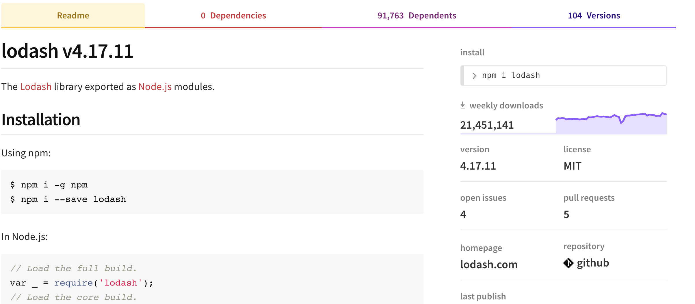
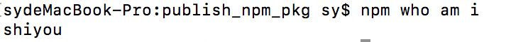
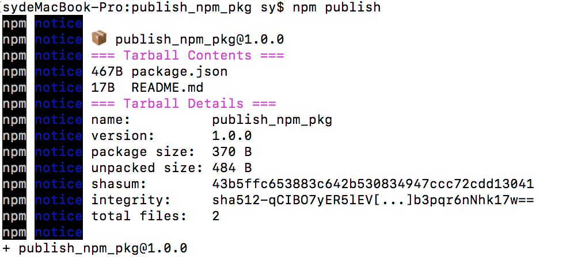

## 前言
平时我们开发都是直接使用网上的第三方包，例如`npm install --save lodash`，那么究竟我们这个包是下载的哪里的？我们能不能也自己发一个第三方类库供大家使用呢？今天这边文章我们将一探究竟！

## 第三方包
我们先来看看`lodash`这个我们常用的第三方包。
它的包管理地址：[https://www.npmjs.com/package/lodash](https://www.npmjs.com/package/lodash)



当我们执行`npm install lodash`命令时，实际上npm包管理工具会去搜索这个包。然后下载一个最新版本，下载地址一般都是发包的代码仓库，一般都是git仓库下载的。

## 如何发包
我们`npm publish`发布的时候，一定是本地文件发布到远程仓库，并且登录到http://registry.npmjs.org（即npm adduser或npmlogin）之后，才可以进行发布。

### 一、创建文件关联git
1. git建立文件仓库文件，`publish_npm_pkg`
2. `git clone https://github.com/shiyou00/publish_npm_pkg.git` 
3. `cd publish_npm_pkg`
4. `npm init `
生产package.json文件，里面要注意参数，repository:""一定要填写git仓库地址(默认会自动填上)，因为最后npmjs，会从线上仓库获取。

### 二、注册包仓库账号
为了维护包，NPM必须要使用仓库账号才允许将包发布到仓库中。注册账号的命令是`npm adduser`。这也是提问式的交互，按顺序进行即可
```
npm adduser
Username:shiyou
Email:(xxx@xxx.com)
```
如果已经注册账号：  
则我们用`npm login` 登录即可  
证明是否登录成功：  
npm who am i  


`npm config ls` 也可查看npm的配置文件内容

**最后就是直接上传了：npm publish**

上传成功了
[npm包线上地址](https://www.npmjs.com/package/publish_npm_pkg)
【注意】
1. 包名字不能重复，否则上传时候报错
2. 切记要注册登录，然后再上传
3. 仓库地址一定要填写

最后：如果你以后修改了代码，然后想要同步到 npm 上的话请修改 package.json 中的 version 然后再次 publish，更新的版本上传的版本要大于上次

### 安装自己的包
在其它工作项目中直接`npm install publish_npm_pkg`
是不是和使用lodash的体验一样了。
