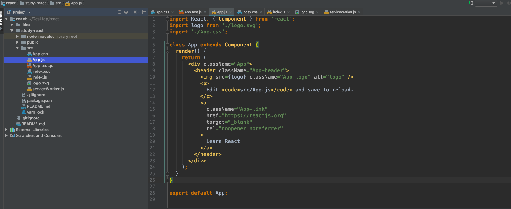

## 前言

## Create React App
```
npm install -g create-react-app
create-react-app my-app

cd my-app
npm start
```

执行命令后新建项目：study-react  
可以看下项目基本目录：  


## 工程目录介绍

【node_modules】
> 项目依赖的包文件都在这里

【package.json】
```
{
  "name": "study-react", // 项目名称
  "version": "0.1.0", // 当前版本(默认是0.1.0)
  "private": true, // 项目是否私有
  "dependencies": { // 项目依赖哪些模块
    "react": "^16.8.6",
    "react-dom": "^16.8.6",
    "react-scripts": "2.1.8"
  },
  "scripts": { // 项目的脚本命令,我们执行 npm run start 等于执行 react-scripts start
    "start": "react-scripts start",
    "build": "react-scripts build",
    "test": "react-scripts test",
    "eject": "react-scripts eject"
  },
  "eslintConfig": {
    "extends": "react-app" // 使用 JavaScript、JSON 或者 YAML 文件为整个目录（处理你的主目录）和它的子目录指定配置信息。可以配置一个独立的 .eslintrc.* 文件，或者直接在 package.json 文件里的 eslintConfig 字段指定配置，ESLint 会查找和自动读取它们。
  },
  "browserslist": [ // 这代表这个项目的浏览器兼容情况
    ">0.2%",
    "not dead",
    "not ie <= 11",
    "not op_mini all"
  ]
}
```

【public目录】  
favicon.ico：页面左上角的图标  


index.html：入口的HTML页面

manifest: PWA相关，做离线使用(这里不展开讲解)


【src目录】  
> 项目的代码存放目录

整个项目的入口文件：index.js(主要用于把入口组件挂载到HTML上)
```
import React from 'react';
import ReactDOM from 'react-dom';
import './index.css';
import App from './App'; // 自定义的组件
// 当项目部署到https协议的服务上，第一次访问需要网络，一旦加载完成后如果此时断网，还是可以访问刚刚的页面
import * as serviceWorker from './serviceWorker';

ReactDOM.render(<App />, document.getElementById('root')); // 将组件App 挂载HTML的 root元素下，这样界面就可以显示App组件的内容了

serviceWorker.unregister();
```

App.js：App组件的定义文件
```
import React, { Component } from 'react';
import logo from './logo.svg';
import './App.css';

class App extends Component {
  render() {
    // jsx 相关内容
    return (
      <div className="App">
        <header className="App-header">
          
          <p>
            Edit <code>src/App.js</code> and save to reload.
          </p>
          <a
            className="App-link"
            href="https://reactjs.org"
            target="_blank"
            rel="noopener noreferrer"
          >
            Learn React
          </a>
        </header>
      </div>
    );
  }
}

export default App; // 提供对外的引用
```

App.test.js： 组件单元测试文件

App.css：组件样式文件

## 小结
通过本文我们学习了
- 初始化react环境
- 初始化项目文件的介绍
