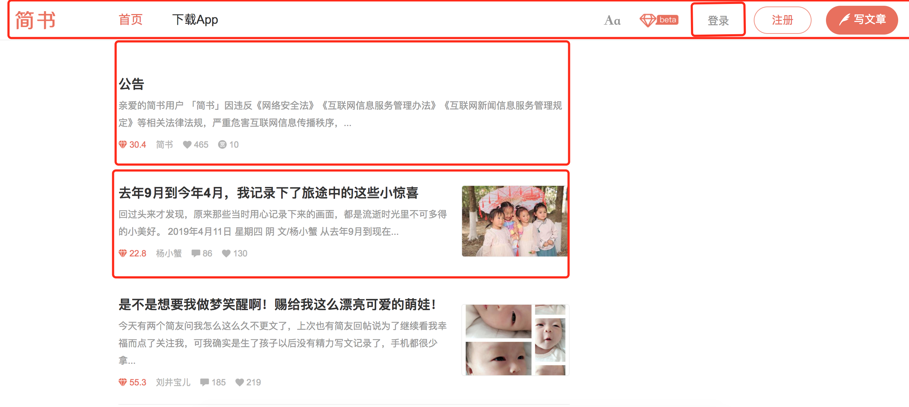

## 前言
前面我们已经学习了利用官方脚手架搭建一套可以应用在生产环境下的React开发环境。那么今天这篇文章主要先了解几个react重要的概念，以及讲解本文的重要知识JSX语法

## React重要概念

【思想】  
React 的核心思想是：封装组件，各个组件维护自己的状态和 UI，当状态变更，自动重新渲染整个组件。  
  
如果我们使用react编写的话，会把他拆分成一个一个的小组件进行编写方便管理复用性高，例如我们把登录拆分成一个组件编写，如果以后公司其它地方需要用到，那么就可以直接使用。

看一段代码感受下：
```
import React, { Component } from 'react';
import { render } from 'react-dom';

class HelloMessage extends Component {
  render() {
    return <div>Hello {this.props.name}</div>;
  }
}

// 加载组件到 DOM 元素 mountNode
render(<HelloMessage name="John" />, mountNode);
```

【组件】  
React 应用都是构建在组件之上。

上面的 HelloMessage 就是一个 React 构建的组件，最后一句 render 会把这个组件显示到页面上的某个元素 mountNode 里面，显示的内容就是 \<div>Hello John\</div>。

props 是组件包含的两个核心概念之一，另一个是 state（这个组件没用到）。可以把 props 看作是组件的配置属性，在组件内部是不变的，只是在调用这个组件的时候传入不同的属性（比如这里的 name）来定制显示这个组件。

【JSX】  
从上面的代码可以看到将 HTML 直接嵌入了 JS 代码里面，这个就是 React 提出的一种叫 JSX 的语法，这应该是最开始接触 React 最不能接受的设定之一，因为前端被“表现和逻辑层分离”这种思想“洗脑”太久了。但实际上组件的 HTML 是组成一个组件不可分割的一部分，能够将 HTML 封装起来才是组件的完全体，React 发明了 JSX 让 JS 支持嵌入 HTML 不得不说是一种非常聪明的做法，让前端实现真正意义上的组件化成为了可能。

好消息是你可以不一定使用这种语法，后面会进一步介绍 JSX，到时候你可能就会喜欢上了。现在要知道的是，要使用包含 JSX 的组件，是需要“编译”输出 JS 代码才能使用的。

【Virtual DOM】  
当组件状态 state 有更改的时候，React 会自动调用组件的 render 方法重新渲染整个组件的 UI。

当然如果真的这样大面积的操作 DOM，性能会是一个很大的问题，所以 React 实现了一个Virtual DOM，组件 DOM 结构就是映射到这个 Virtual DOM 上，React 在这个 Virtual DOM 上实现了一个 diff 算法，当要重新渲染组件的时候，会通过 diff 寻找到要变更的 DOM 节点，再把这个修改更新到浏览器实际的 DOM 节点上，所以实际上不是真的渲染整个 DOM 树。这个 Virtual DOM 是一个纯粹的 JS 数据结构，所以性能会比原生 DOM 快很多。


【Data Flow】  
“单向数据绑定”是 React 推崇的一种应用架构的方式。当应用足够复杂时才能体会到它的好处，虽然在一般应用场景下你可能不会意识到它的存在，也不会影响你开始使用 React，你只要先知道有这么个概念。


## JSX语法

看如下变量的定义：如果是字符串应该添加引号，但是却直接把DOM结构赋值给一个变量？什么操作？这就是JSX
```
const element = <h1>Hello, world!</h1>;
```

> 它被称为 JSX， 一种 JavaScript 的语法扩展。 我们推荐在 React 中使用 JSX 来描述用户界面。JSX 看起来可能比较像是模版语言，但事实上它完全是在 JavaScript 内部实现的。

【语法糖】  
本质上讲JSX只是为React.createElement(component, props, ...children) 方法提供的语法糖
```
<MyButton color="blue" shadowSize={2}>
  Click Me
</MyButton>

等同于下面
React.createElement(
  MyButton,
  {color: 'blue', shadowSize: 2},
  'Click Me'
)
```

使用上篇文章搭建好的项目，并进行瘦身，然后新建一个组件JsxCom.js 并且引入到App.js中，代码如下：

App.js
```
import React, { Component } from 'react';
import JsxCom from './JsxCom';

class App extends Component {
  render() {
    return (
      <div className="App">
        <JsxCom />
      </div>
    );
  }
}
export default App;
```

JsxCom.js
```
import React, { Component } from 'react';

class JsxCom extends Component {
  render() {
    return (
      <div className="JsxCom">
      </div>
    );
  }
}

export default JsxCom;
```

## JSX 规则
以下几点是刚开始写React时比较容易忽视的规则

【制定React元素】  
`<JsxCom />` 首字母大写的类型表示 JSX 标签引用到一个 React 组件。这些标签将会被编译为直接引用同名变量，所以如果你使用了 `<JsxCom />` JSX 表达式，则 JsxCom 必须在作用域中。

【React 必须在作用域中】  
由于 JSX 编译成React.createElement方法的调用，所以在你的 JSX 代码中，React库必须也始终在作用域中。也就是最上面必须引入React

【用户定义组件必须首字母大写】  
当元素类型以小写字母开头时，它表示一个内置的组件，如 `<div>` 或 `<span>`，将导致字符串 'div' 或 'span' 传递给 React.createElement。 以大写字母开头的类型，如 `<Foo />` 编译为 React.createElement(Foo)，并且它正对应于你在 JavaScript 文件中定义或导入的组件。

【在运行时选择类型】
```
const components = {
  photo: PhotoStory,
  video: VideoStory
};

function Story(props) {
  // 错误！JSX 标签名不能为一个表达式。
  return <components[props.storyType] story={props.story} />;
}

如下方式才是正确的：
function Story(props) {
  // 正确！JSX 标签名可以为大写开头的变量。
  const SpecificStory = components[props.storyType];
  return <SpecificStory story={props.story} />;
}
```

## JSX 语法 

【JSX的属性(Props)表达式】  
你可以传递JavaScript 表达式作为一个属性，再用大括号{}括起来。例如，在这个 JSX 中：
```
<JsxCom foo={1+2+3}>
```

【在 JSX 中使用表达式】

直接看代码
```
class JsxCom extends Component {
    user = {
        firstName: 'Harper',
        lastName: 'Perez'
    };

    formatName(user) {
        return user.firstName + ' ' + user.lastName;
    }

    render() {
      return (
        <div className="JsxCom">
          <h1>
            Hello, {this.formatName(this.user)}!
          </h1>
        </div>
      );
    }
}
```
分析：定义了一个字面量对象user，定义了一个函数formatName，输出一个字符串。最后我们在render函数中{this.formatName(this.user)} 使用该函数


【JSX中if语句和for语句的应用】
> if 语句和 for 循环在 JavaScript 中不是表达式，因此它们不能直接在 JSX 中使用，但是你可以将它们放在周围的代码中。例如：

```
function NumberDescriber(props) {
  let description;
  if (props.number % 2 == 0) {
    description = <strong>even</strong>;
  } else {
    description = <i>odd</i>;
  }
  return <div>{props.number} is an {description} number</div>;
}
```

【字符串常量】
```
<MyComponent message="hello world" />

<MyComponent message={'hello world'} />
```


【JSX 属性】
```
// 使用引号来定义以字符串为值的属性
const element = <div tabIndex="0" className="hello"></div>;

// 使用表达式
const element = ;
```
因为 JSX 的特性更接近 JavaScript 而不是 HTML , 所以 React DOM 使用 camelCase 小驼峰命名 来定义属性的名称，而不是使用 HTML 的属性名称。

例如，class 变成了 className，而 tabindex 则对应着 tabIndex。

【属性默认为“True”】  
如果你没有给属性传值，它默认为 true。
```
<MyTextBox autocomplete />
等价于
<MyTextBox autocomplete={true} />
```

【展开属性】  
如果你已经有了个 props 对象，并且想在 JSX 中传递它，你可以使用 ... 作为“展开(spread)”操作符来传递整个属性对象。下面两个组件是等效的：
```
function App1() {
  return <Greeting firstName="Ben" lastName="Hector" />;
}

function App2() {
  const props = {firstName: 'Ben', lastName: 'Hector'};
  return <Greeting {...props} />;
}
```

【JSX中的子代】  
在既包含开始标签又包含结束标签的 JSX 表达式中，这两个标签之间的内容被传递为专门的属性：props.children。

[1]字符串字面量  
你可以在开始和结束标签之间放入一个字符串，则 props.children 就是那个字符串。这对于许多内置 HTML 元素很有用。
```
<MyComponent>Hello world!</MyComponent>
```
这是有效的 JSX，并且 MyComponent 的 props.children 值将会直接是 "hello world!"

[2]嵌套React组件
```
<MyContainer>
  <MyFirstComponent />
  <MySecondComponent />
</MyContainer>
```

[3]JavaScript 表达式作为子代  
你可以将任何 {} 包裹的 JavaScript 表达式作为子代传递。例如，下面这些表达式是等价的：
```
<MyComponent>foo</MyComponent>

<MyComponent>{'foo'}</MyComponent>
```

[4]函数作为子代  
通常情况下，插入 JSX 中的 JavaScript 表达式将被认作字符串、React 元素或这些的一个列表。然而，props.children 可以像其它属性一样传递任何种类的数据，而不仅仅是 React 知道如何去渲染的数据种类。例如，如果你有一个自定义组件，你能使其取一个回调作为props.children：
```
// Calls the children callback numTimes to produce a repeated component
function Repeat(props) {
  let items = [];
  for (let i = 0; i < props.numTimes; i++) {
    items.push(props.children(i));
  }
  return <div>{items}</div>;
}

function ListOfTenThings() {
  return (
    <Repeat numTimes={10}>
      {(index) => <div key={index}>This is item {index} in the list</div>}
    </Repeat>
  );
}
```
传递给自定义组件的子代可以是任何东西，只要该组件在 React 渲染前将其转换成 React 能够理解的东西。这个用法并不常见，但当你想扩展 JSX 时可以使用。

【布尔值、Null 和 Undefined 被忽略】  
false、null、undefined 和 true 都是有效的子代，只是它们不会被渲染。下面的JSX表达式将渲染为相同的东西：
```
<div />
<div></div>
<div>{false}</div>
<div>{null}</div>
<div>{undefined}</div>
<div>{true}</div>
```
相反，如果你想让类似 false、true、null 或 undefined 出现在输出中，你必须先把它转换成字符串 :
```
<div>
  My JavaScript variable is {String(myVariable)}.
</div>
```

【JSX 防注入攻击】
```
const title = response.potentiallyMaliciousInput;
// 直接使用是安全的：
const element = <h1>{title}</h1>;
```
React DOM 在渲染之前默认会 过滤 所有传入的值。它可以确保你的应用不会被注入攻击。所有的内容在渲染之前都被转换成了字符串。这样可以有效地防止 XSS(跨站脚本) 攻击。
