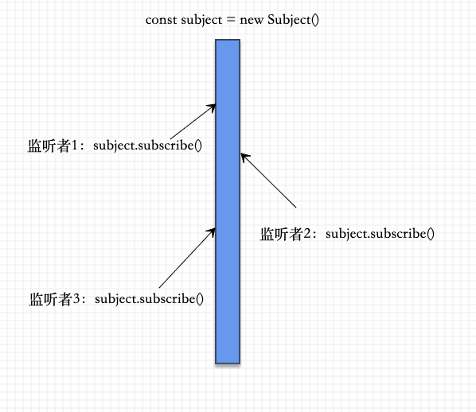

## RxJS 基本介紹
RxJS 是一个库，它通过使用 observable 序列来编写异步和基于事件的程序。它提供了一个核心类型 Observable，附属类型 (Observer、 Schedulers、 Subjects) 和受 [Array#extras] 启发的操作符 (map、filter、reduce、every, 等等)，这些数组操作符可以把异步事件作为集合来处理。

> 可以把 RxJS 当做是用来处理事件的 Lodash 。

ReactiveX 结合了 观察者模式、迭代器模式 和 使用集合的函数式编程，以满足以一种理想方式来管理事件序列所需要的一切。

在 RxJS 中用来解决异步事件管理的的基本概念是：
- Observable (可观察对象)
- Observer (观察者)
- Subscription (订阅)
- Operators (操作符)
- Subject (主体)
- Schedulers (调度器)

下面分别来概述下核心概念，让大家对rxjs的主体部分有个了解

## Observable
它是rxjs最核心的概念，理解了它基本上就理解了60%的rxjs了。

标签1：`可观察对象`
标签2：`惰性运算`
> 当我们创建一个Observable可观察对象，只有当我们对它进行订阅了之后，它才会执行；不订阅不执行！

【创建第一个Observable】  
```
const observable = Observable.create(function (observer) {
  observer.next(1);
});
```

【订阅刚刚创建的可观察对象】  
```
const subscriber = observable.subscribe({
  next: x => console.log('值：' + x),
  error: err => console.error('报错：' + err),
  complete: () => console.log('结束')
});
```
只有订阅过后它才会去执行。

这时我们可以看下控制台：

输出了上面`observer.next(1)`推送过来的1;

`observable生产者` 把消息推送给 `subscriber消费者`

上面创建的是一个同步执行的`Observable`，接下来我们来创建一个异步的`Observable`
```
asyncObservable() {
    const observable = Observable.create(function (observer) {
      setTimeout(() => {
        observer.next(1); // 这里就好比我们跟后台请求的数据，在angular中一般存放在service中
      }, 3000 );
    });
    console.log('before subscribe');
    // 这里就好比我们在组件中订阅了service的请求数据，当异步数据请求到了就会返回给组件
    observable.subscribe({
      next: x => console.log('值：' + x),
      error: err => console.error('报错：' + err),
      complete: () => console.log('结束')
    });
    console.log('after subscribe');
}
```
输出循序：  
1. before subscribe
2. after subscribe
3. 值：1

我们通过这种方式就已经替代了基础版本的 callback模式回调处理请求来的数据。

上面我们对可观察对象分别做了几个动作：创建、订阅、执行

既然有创建就一定有清除，不然就要内存溢出了

【清除一个可观察对象】
```
  clearObservable() {
    const observable = Observable.create(function (observer) {
      setTimeout(() => {
        observer.next(1);
      }, 3000 );
    });
    const subscriber = observable.subscribe({
      next: x => console.log('值：' + x),
      error: err => console.error('报错：' + err),
      complete: () => console.log('结束')
    });

    subscriber.unsubscribe(); // 这句就是清除一个可观察对象
  }
```

到这里为止，已经基本上对 `Observable` 这个可观察对象已经有一个了解了。  


## Observer
它的中文名叫`观察者`，观察者是由 `Observable` 发送的值的消费者。
  
上面已经提到了 `Observable`是生产者；`subscriber`是消费者。

`Observer` 对 `Observable` next(1) 出来的值进行了消费。

通俗来讲就是它了：
```
const observer = {
                   next: x => console.log('值：' + x),
                   error: err => console.error('报错：' + err),
                   complete: () => console.log('结束')
                 }
const subscriber = observable.subscribe(observer);
```

这样看代码是不是清晰了很多：   
observer = '值的消费者' = '对象且包含一组不类型的消费者'   
所以说对象里面的 `next: ()=>{}` , `error: ()=>{}` , `complete: ()=>{}` 这三个函数就是真正意义上的数据消费者了，它们3个就组成了数据消费对象`observer`

所以`Observer`的标签就是：
1. 观察者
2. 值的消费者


### Observer特性
> 底下有3个数据消费者，当我派出哪个函数，才会消费相应的数据，不派出则不消费

例如：
```
var observer = {
  next: x => console.log('Observer got a next value: ' + x),
  error: err => console.error('Observer got an error: ' + err),
};
```
这样我们就消费不到complete传来的数据，但是其他传来的数据都可以正常消费。


## Subscription
> Subscription 是表示可清理资源的对象，通常是 Observable 的执行。
Subscription 有一个重要的方法，即 unsubscribe，它不需要任何参数，只是用来清理由 Subscription 占用的资源。

```
var observable = Rx.Observable.interval(1000);
var subscription = observable.subscribe(x => console.log(x));
// 稍后：
// 这会取消正在进行中的 Observable 执行
// Observable 执行是通过使用观察者调用 subscribe 方法启动的
subscription.unsubscribe();
```

**记住一点，它存在的价值就是用来释放资源或去取消Observable执行。**

### Subscription的方法

【add()】  
把一个childSubscription添加到另外一个subscription中
```
var observable1 = Rx.Observable.interval(400);
var observable2 = Rx.Observable.interval(300);

var subscription = observable1.subscribe(x => console.log('first: ' + x));
var childSubscription = observable2.subscribe(x => console.log('second: ' + x));

subscription.add(childSubscription);

```

【remove()】  
用来撤销一个已添加的子 Subscription 。
```
var observable1 = Rx.Observable.interval(400);
var observable2 = Rx.Observable.interval(300);

var subscription = observable1.subscribe(x => console.log('first: ' + x));
var childSubscription = observable2.subscribe(x => console.log('second: ' + x));

subscription.add(childSubscription);
subscription.remove(childSubscription);
```

【unsubscribe()】
> 取消订阅,释放资源，一般在组件的destroy声明周期进行操作

```
subscription.unsubscribe();
```


以上基本上已经把rxjs的一些基本概念都讲解清楚了，接下来我们来学习些进阶的概念。

## Subject
Subject 是一种特殊类型的 Observable

Subject vs Observable
1. Subject允许将值多播给多个观察者,所以 Subject 是多播的
2. 而普通的 Observables 是单播的(每个已订阅的观察者都拥有 Observable 的独立执行)

Subject标签
1. 多播
2. 它就是Observable的一种(子类型)

### 单播、多播的理解

我们通过代码来理解下多播的概念： 
 
observable
```
const observable = Observable.create(function subscribe(observer) {
      try {
        observer.next(1);
        observer.next(2);
        observer.next(3);
        observer.complete();
      } catch (err) {
        observer.error(err);
      }
    });
    observable.subscribe(val => {
      console.log('第一个监听者：', val );
    });

    setTimeout(() => {
      observable.subscribe(val => {
        console.log('第二个监听者：', val );
      });
    }, 3000);
```
看下打印出来的值：  


结论：无论什么时候去监听`observable`都可以获取到该`observable`推送的所有数据。我们对这种特性就称之为**单播**

那我们在来看看subject是如何进行数据推送的：   
```
const subject = new Subject();
// 监听数据
subject.subscribe({
  next: (v) => {
    console.log(`监听者1：` + v );
  }
});

subject.subscribe({
  next: (v) => {
    console.log(`监听者2：` + v );
  }
});

setTimeout(() => {
  subject.subscribe({
    next: (v) => {
      console.log(`监听者3：` + v );
    }
  });
}, 3000 );

// 推送数据
subject.next(1);
subject.next(2);
subject.next(3);
setTimeout(() => {
  subject.next(4);
}, 4000 );
```

我们来看看数据打印的结果：  


- 监听者1和监听者2,最开始就打印出了1，2，3
- 过了4秒后，监听者1，监听者2，监听者3都打印了一个4

这说明“监听者3”是没有监听到数据1，2，3的，因为它是3秒后才开始监听的，而数据1，2，3则是在它监听之前就已经推送过的数据，所以它只监听到了4，因为4是在4秒后发送的数据。所以监听者1，2，3都可以监听到了

现在拿subject和observable进行对比，我们发现observable的单播，则是每个监听者之间都是非常独立的获取到了observable提供的数据(以往提供 + 未来提供)，而subject向外推送的数据更像一个管道的流水，你什么时候开始监听了，它就会流向你这里。每个监听者都共享同一个管道的流水。

多播:subject


单播:observable  


通过上面的图，我们应该就可以理解什么是单播，什么是多播的形式了。

### Subject的双重身份
1. Observable 生产者
2. Observer 消费者

第一点作为生产者Observable的一种多播形式，上面已经介绍了。

【作为消费者】  
> 每个 Subject 都是观察者。 - Subject 是一个有如下方法的对象： next(v)、error(e) 和 complete() 。要给 Subject 提供新值，只要调用 next(theValue)，它会将值多播给已注册监听该 Subject 的观察者们。

其实这个也是非常好理解的，上面代码中其实我们已经使用了该特性：
```
1. const subject = new Subject();
2. subject.next(1);
```
第二行代码我们可以看出，subject对象是具有next方法的，且调用了该方法就可以向管道中注入一股数据。

subject是一个观察者 == Observer观察者

我们再回顾一下Observable的代码：
```
1. const observable = Observable.create(function (observer) {
      observer.next(1);
});

2. const observer = {
    next: x => console.log('值：' + x),
    error: err => console.error('报错：' + err),
    complete: () => console.log('结束')
   }

3. const subscriber = observable.subscribe(observer);
```

第三行：observable的监听函数其实就是传入一个observer观察者。

那么我们可以传入一个subject进去吗？答案是可以的。

```
const observable = Observable.create(function (observer) {
  observer.next(1);
});

const subject = new Subject();
// 监听subject
subject.subscribe({
  next: (v) => {
    console.log( '监听者1：' + v );
  }
});
// 这里其实就是会调用subject的next方法，向subject管道里面注入一股数据1，
此时我们只需要监听subject就可以获取到数据1
observable.subscribe(subject);
```

数据也可以正常打印，说明subject在这里就是作为一个数据的消费者的功能

**这也是把Observable从单播转换为多播的一种方式**

## 小结
到这里我们基本上已经可以理解Subject 与 Observable 了，以及可以理解什么是单播，什么时候多播，已经如何把一个单播的Observable转换为一个多播的Subject。
