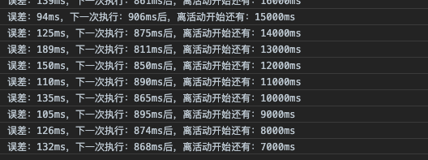

## JavaScript进程工作流简述
使用setTimeout()和setInterval()创建的定时器可以用于实现有趣且有用的功能。虽然人们对JavaScript的定时器存在普遍的误解，认为它们是线程，其实JavaScript是运行于单线程的环境中的，而定时器仅仅只是计划代码在未来的某个时间执行。执行时机是不能保证的，因为在页面的生命周期中，不同时间可能有其他代码在控制JavaScript进程。在页面下载完后的代码运行、事件处理程序、Ajax回调函数都必须使用同样的线程来执行。实际上，浏览器负责进行排序，指派某段代码在某个时间点运行的优先级。


可以把JavaScript想象成在时间线上运行的。当页面载入时，首先执行是任何包含在<script>元素中的代码，通常是页面生命周期后面要用到的一些简单的函数和变量的声明，不过有时候也包含一些初始数据的处理。在这之后，JavaScript进程将等待更多代码执行。当进程空闲的时候，下一个代码会被触发并立刻执行。例如，当点击某个按钮时，onclick事件处理程序会立刻执行，只要JavaScript进程处于空闲状态。这样一个页面的时间线类似于图22-1。


除了主JavaScript执行进程外，还有一个需要在进程下一次空闲时执行的代码队列。随着页面在其生命周期中的推移，代码会按照执行顺序添加入队列。例如，当某个按钮被按下时，它的事件处理程序代码就会被添加到队列中，并在下一个可能的时间里执行。当接收到某个Ajax响应时，回调函数的代码会被添加到队列。在JavaScript中没有任何代码是立刻执行的，但一旦进程空闲则尽快执行。

定时器对队列的工作方式是，当特定时间过去后将代码插入。注意，给队列添加代码并不意味着对它立刻执行，而只能表示它会尽快执行。设定一个150ms后执行的定时器不代表到了150ms代码就立刻执行，它表示代码会在150ms后被加入到队列中。如果在这个时间点上，队列中没有其他东西，那么这段代码就会被执行，表面上看上去好像代码就在精确指定的时间点上执行了。其他情况下，代码可能明显地等待更长时间才执行。

**关于定时器要记住的最重要的事情是，指定的时间间隔表示何时将定时器的代码添加到队列，而不是何时实际执行代码。**

## setTimeout和setInterval

【setInterval】
使用setInterval()创建的定时器确保了定时器代码规则地插入队列中。这个方式的问题在于，定时器代码可能在代码再次被添加到队列之前还没有完成执行，结果导致定时器代码连续运行好几次，而之间没有任何停顿。幸好，JavaScript引擎够聪明，能避免这个问题。当使用setInterval()时，仅当没有该定时器的任何其他代码实例时，才将定时器代码添加到队列中。这确保了定时器代码加入到队列中的最小时间间隔为指定间隔。

这种重复定时器的规则有2点问题：
- (1) 某些间隔会被跳过
- (2) 多个定时器的代码执行之间的间隔可能会比预期的小

为了避免setInterval()的重复定时器的这2个缺点，你可以用如下模式使用链式setTimeout()调用。

```
setTimeout(function(){

    //处理中

    setTimeout(arguments.callee, interval);

}, interval);
```
这个模式链式调用了setTimeout()，每次函数执行的时候都会创建一个新的定时器。第二个setTimeout()调用使用了arguments.callee来获取对当前执行的函数的引用，并为其设置另外一个定时器。这样做的好处是，在前一个定时器代码执行完之前，不会向队列插入新的定时器代码，确保不会有任何缺失的间隔。而且，它可以保证在下一次定时器代码执行之前，至少要等待指定的间隔，避免了连续的运行。

如果上面Javascript计时器原理理解了，就很好明白倒计时功能存在问题的隐患。  
先看一段测试代码：
```
let start = new Date().getTime();
let count = 0;

//定时器测试
setInterval(function(){
    count++;
    console.log( new Date().getTime() - (start + count * 1000));
},1000);

```
目测代码就知道运行结果，定时器每秒执行一次，每次输出应该是0 。

实际输出：
  

结论：由于代码执行占用时间和其他事件阻塞原因，导致有些事件执行延迟了几ms，但影响很微。

下面加一段阻塞代码看看：
```
let start = new Date().getTime();
let count = 0;

//占用线程事件
setInterval(function(){
    let j = 0;
    while(j++ < 100000000){}
}, 0);

//定时器测试
setInterval(()=>{
    count++;
    console.log( new Date().getTime() - (start + count * 1000));
},1000);
```
实际输出：  
  
结论：由于加了很占线程的阻塞事件，导致定时器事件每次执行延迟越来越严重。

由于实际项目中，执行计时器的同时，会有很多其他异步阻塞事件，会导致倒计时功能不精确。

### 解决思路
这里先分析一下从获取服务器时间到前端显示倒计时的过程：

1. 客户端http请求服务器时间；

2. 服务器响应完成；

3. 服务器通过网络传输时间数据到客户端；

4. 客户端根据活动开始时间和服务器时间差做倒计时显示；

服务器响应完成的时间其实就是服务器时间，但经过网络传输这一步，就会产生误差了，误差大小视网络环境而异，这部分时间前端也没有什么好办法计算出来，一般是几十ms以内，大的可能有几百ms。

获得服务器时间后，前端进入倒计时计算和计时器显示，这步就要考虑js代码冻结和线程阻塞造成计时器延时问题了，我的思路是通过引入计数器，判断计时器延迟执行的时间来调整，尽量让误差缩小，不同浏览器不同时间段打开页面倒计时误差可控制在1s以内。


```
//继续线程占用
setInterval(function(){
    let j = 0;
    while(j++ < 100000000){}
}, 0);

let interval = 1000,
    ms = 50000,  //从服务器和活动开始时间计算出的时间差，这里测试用50000ms
    count = 0,
    timeCounter,
    startTime = new Date().getTime();
if( ms >= 0){
    timeCounter = setTimeout(countDownStart,interval);
}

function countDownStart(){
    count++;
    let offset = new Date().getTime() - (startTime + count * interval);
    let nextTime = interval - offset;
    if (nextTime < 0) { nextTime = 0 }
    ms -= interval;
    console.log("误差：" + offset + "ms，下一次执行：" + nextTime + "ms后，离活动开始还有：" + ms + "ms");
    if(ms < 0){
        clearTimeout(timeCounter);
    }else{
        timeCounter = setTimeout(countDownStart,nextTime);
    }
}
```
  

结论：由于线程阻塞延迟问题，做了setTimeout执行时间的误差修正，保证setTimeout执行时间一致。若冻结时间特别长的，还要做特殊处理。

做100%精确的倒计时很难，但做到相对比较准确是可以的。

在倒计时功能开发中，有几点总结：

1. 要了解好js单线程工作原理；
2. 清楚了解服务器系统时间传送到前端的流程；
3. 了解前端渲染和线程阻塞造成的时间误差；

## 参考文献
- [JS实现活动精确倒计时](https://www.xuanfengge.com/js-realizes-precise-countdown.html)
- [你真的知道怎么用javascript来写一个倒计时吗 ?](https://github.com/gomeplusFED/blog/blob/master/2016-04/do-you-really-understand-how-to-write-a-countdown-by-javascript.md)
