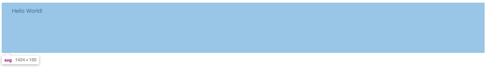
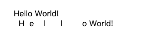
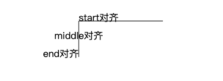
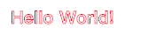
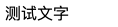
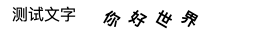
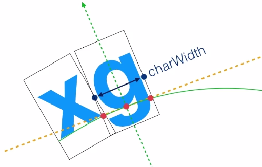
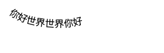

## 位置属性
在一个SVG文档中，使用`<text>`元素来设置文本，`<text>`元素有x、y、dx、dy这四个位置属性

【x和y】  
属性x和属性y性决定了文本在视口中显示的位置


可以只设置y属性，此时x属性默认为0  
[注意]如果不设置y属性，则文本将不会显示

【dx和dy】

属性dx和dy用于设置文本相对于当前位置的偏移量


如果dx或dy的值是多个值，则从第二个值开始，表示文本内字符的间距
```
<svg version="1.1" height="70" xmlns="http://www.w3.org/2000/svg">
  <text x="30" y="30">Hello World!</text>
  <text x="30" y="50" dx="10 10 20 30 40">Hello World!</text>
</svg>
```


## 对齐属性
【水平对齐】  
属性text-anchor用来设置水平对齐，取值包括：start、middle、end或inherit



【垂直对齐】  
属性dominant-baseline可以设置垂直对齐，包括以下属性

效果展示：
<iframe style="width: 100%; height: 320px;" src="https://shiyou00.github.io/lion/dist/html/svg/svg.html?case=f1" frameborder="0"></iframe>

## 样式属性
和形状元素类似，属性fill可以给文本填充颜色，属性stroke可以给文本描边，也可以引用渐变或图案

对于字体相关属性，下列每个属性可以被设置为一个SVG属性或者成为一个CSS声明：`font-family`、`font-style`、`font-weight`、`font-variant`、`font-stretch`、`font-size`、`font-size-adjust`、`kerning`、`letter-spacing`、`word-spacing`和`text-decoration`



## tspan
tspan元素用来标记大块文本的子部分，它必须是一个text元素或别的tspan元素的子元素。一个典型的用法是把句子中的一个词变成粗体

```
  <text x="10" y="50">
    <tspan font-weight="bold">测试</tspan>文字
  </text>
```


【自定义属性】  
　　tspan元素有以下的自定义属性

　　x 为容器设置一个新绝对x坐标。它覆盖了默认的当前的文本位置。这个属性可以包含一个数列，它们将一个一个地应用到tspan元素内的每一个字符上

　　dx 从当前位置，用一个水平偏移开始绘制文本。这里，可以提供一个值数列，可以应用到连续的字体，因此每次累积一个偏移

　　类似地，还有y和dy

　　rotate 把所有的字符旋转一个角度。如果是一个数列，则使每个字符旋转分别旋转到那个值，剩下的字符根据最后一个值旋转

　　textLength 这是一个很模糊的属性，给出字符串的计算长度。它意味着如果它自己的度量文字和长度不满足这个提供的值，则允许渲染引擎精细调整字型的位置
```
<svg version="1.1" height="30" xmlns="http://www.w3.org/2000/svg">
  <text x="10" y="20">
    测试文字<tspan x="100" dx="0 10 10 10" rotate="30" font-weight="bold">你好世界</tspan>
  </text>
</svg>
```



## textPath 
　　该元素利用路径文本textPath的`xlink:href`属性取得一个任意路径，把字符对齐到路径，于是字体会环绕路径、顺着路径走

　　[注意]如果给出的路径长度不够长，则超出部分不会被渲染出来

　　渲染原理如下图所示



```
<svg version="1.1" width="300" height="100" xmlns="http://www.w3.org/2000/svg">
  <path id="my_path" d="M 20,20 C 50 50, 160 50, 160 20" fill="none"/>
  <text>
    <textPath xlink:href="#my_path">你好世界世界你好</textPath>
  </text>
</svg>
```


【属性】  
使用textPath后，text元素的x和y属性的含义有所改变
```
x 路径位置
y 无效
```

效果展示：
<iframe style="width: 100%; height: 320px;" src="https://shiyou00.github.io/lion/dist/html/svg/svg.html?case=f2" frameborder="0"></iframe>

textPath只有一个startOffset属性，用来确定排列起始位置

效果展示：
<iframe style="width: 100%; height: 320px;" src="https://shiyou00.github.io/lion/dist/html/svg/svg.html?case=f3" frameborder="0"></iframe>

## 波浪文字
　　下面使用SVG，来实现波浪文字的效果。由于`<text>`标签的dx、dy属性可以控制文本间的间距。因此，可以通过定时器动态的修改他们的值，将其呈现出动态波浪文字的效果

```
<svg version="1.1" width="300" height="100" xmlns="http://www.w3.org/2000/svg">
  <text id="sinText" x="10" y="50">小火柴的蓝色理想小火柴的蓝色理想</text>
</svg>
<br>
<button id="btn1">开始运动</button>
<button id="btn2">暂停运动</button>
<script>
//n为文本的数量
var n = sinText.innerHTML.length;
//x和y分别储存dx和dy的值
var x = [],y = [];
//设置x的值
for(var i = 0; i < n; i++){
  x.push(2*Math.PI/n);
}
function arrange(t){
  //清空数组
  y = [];
  var ly = 0,cy;
  for(i = 0; i < n; i++){
    //计算当前的曲线的cy值
    cy = -20*Math.sin(0.5*i+t);
    //将y的差值保存到数组中
    y.push(cy-ly);
    //保存上一个y的值
    ly = cy;
  }
}
function render(){
  //将x、y数组中的值渲染到dx、dy中
  sinText.setAttribute('dx',x.join(' '));
  sinText.setAttribute('dy',y.join(' '));
}
(function init(){
  arrange(0);
  render();  
})();
var t = 0; 
var oTimer = null;
function frame(){
  t +=0.1;
  arrange(t);
  render();
  oTimer =  requestAnimationFrame(frame);
}
btn1.onclick = function(){
  cancelAnimationFrame(oTimer);
  oTimer =  requestAnimationFrame(frame);
}
btn2.onclick = function(){
  cancelAnimationFrame(oTimer);
}
</script>
```

