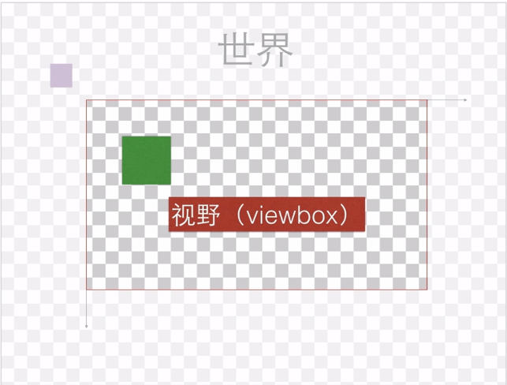
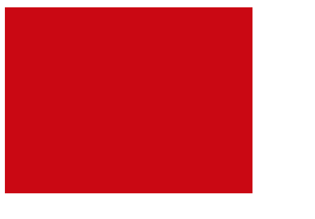
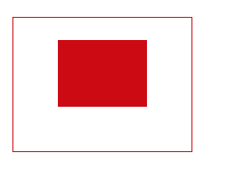

## 前言
SVG中坐标系统非常关键，但在介绍坐标系统之前，首先要了解视野。本文将详细介绍SVG视野

## 视野
下面来区分视窗、世界和视野

【视窗】

　　SVG的属性width、height来控制视窗的大小，也称为SVG容器

【世界】

　　SVG里面的代码，就是对SVG世界的定义

【视野】

　　世界是无穷大的，视野是观察世界的一个矩形区域。如下图所示



世界不可变，而视野是可以改变的。在SVG中，提供了viewBox和preserveAspectRatio属性来控制视野

## viewBox
　　viewBox属性允许指定一个给定的一组图形伸展以适应特定的容器元素

　　viewBox属性的值是一个包含4个参数的列表 min-x, min-y, width and height， 以空格或者逗号分隔开， 在用户空间中指定一个矩形区域映射到给定的元素

【位置】

　　首先来介绍下viewBox的位置属性x、y

　　将viewBox的尺寸与SVG容器尺寸设置为相同，并且在SVG中绘制占满容器尺寸的一个矩形
```
<svg version="1.1" id="drawing" width="200" height="150" style="border:1px solid #cd0000;" viewbox="0 0 200 150" xmlns="http://www.w3.org/2000/svg">
  <rect x="0" y="0" width="200" height="150" fill="#cd0000" />
</svg>
```
结果如下图所示，矩形占满容器  



[效果展示](https://demo.xiaohuochai.site/js/svg/view/v1.html)

由结果所示，当x值为正值时，视野向右移动，由于世界和视窗都不变。所以，看起来好像是图形向左移动。反之亦然

【尺寸】

　　介绍过位置属性后，下面以一个例子的形式来解释viewBox中的width和height属性
```
<svg version="1.1" id="drawing" width="200" height="150" style="border:1px solid #cd0000;" viewbox="0 0 40 30" xmlns="http://www.w3.org/2000/svg">
  <rect x="10" y="5" width="20" height="15" fill="#cd0000"/>
</svg>
```



　　如果不看viewBox，一定会觉得诧异。SVG尺寸明明有200*150像素，而小小的`<rect>`大小只有其1/10，但是显示出来的图形占据了大量的区域

　　下面的gif图，解释了这种现象的原因 


　　因此，SVG里面的图形等元素的尺寸是依据viewBox的width、height设置来布局的。最终，再把viewBox的尺寸放大到视窗的尺寸大小来显示

　　下面来解释下，视窗、世界和视野的关系

　　世界是无穷大的。viewBox的尺寸设置的越大，即视野越大，则可显示的世界的区域就越大。由于视窗大小是固定的，因此，SVG内部元素尺寸看上去就越小。反之亦然

## preserveAspectRatio
　　上面的例子，SVG的宽高比正好和viewBox的宽高比是一样的，都是4:3。显然，实际应用viewBox不可能一直跟viewport相同比例。此时，就需要preserveAspectRatio出马了，此属性也是应用在`<svg>`元素上，且作用的对象都是viewBox

　　preserveAspectRatio属性的值为空格分隔的两个值组合而成。第一个值表示，viewBox如何与SVG viewport对齐；第二个值表示，如何维持高宽比（如果有）

　　其中，第1个值又是由两部分组成的。前半部分表示x方向对齐，后半部分表示y方向对齐
```
值      含义
xMin    viewport和viewBox左边对齐
xMid    viewport和viewBox x轴中心对齐
xMax    viewport和viewBox右边对齐
YMin    viewport和viewBox上边缘对齐。注意Y是大写。
YMid    viewport和viewBox y轴中心点对齐。注意Y是大写。
YMax    viewport和viewBox下边缘对齐。注意Y是大写。
```
然后，把x和y进行组合，比如xMinYMin、xMidYMin

　　preserveAspectRatio属性第二部分的值支持下面3个
```
值      含义
meet    保持纵横比缩放viewBox适应viewport
slice   保持纵横比同时比例小的方向放大填满viewport
none    扭曲纵横比以充分适应viewport
```
　[注意]preserveAspectRatio属性第二部分的值设置为none时，第一部分的值必须为空，否则报错

　　如果不设置preserveAspectRatio属性，默认是xMidYMid、meet属性

　　下面的例子中，视窗设置为200*150，视野设置为200*100，矩形占满整个视野

[效果演示](https://demo.xiaohuochai.site/js/svg/view/v2.html)

　　由结果所示，设置为meet时，视野的宽高通过按比例缩放，都处于视窗范围内；设置为slice时，按比例缩放后发生剪切，有些内容超出视窗范围；设置为none时，视野宽高缩放到视窗的尺寸
