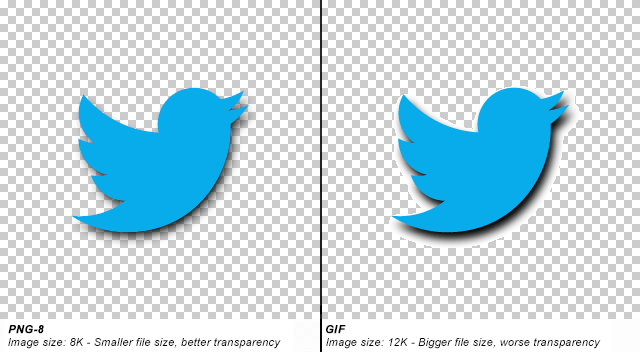
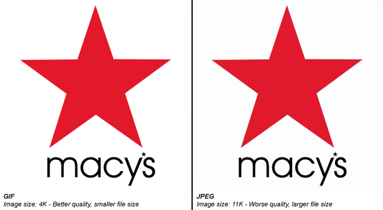
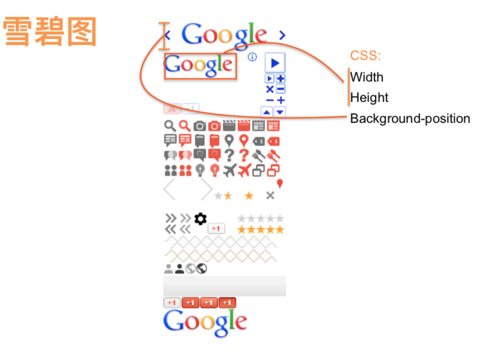

## 前言
作为前端工程师，我们对于图片的了解是否还是停留在``，反正这样就可以展示这张图片了，但其实图片对于前端展示是一个很重的话题，例如一个界面图片多了，展示非常慢，这个时候前端有什么策略可以较快界面展示吗？有，例如压缩图片，图片懒加载等策略都可以加速这个界面的展示。这只是冰山一角，所以本文将努力的详细介绍下关于图片的一些知识。


## 图片分类
图片种类有非常多种，今天这边文章只介绍前端工作中经常接触到的类型。

图形分为位图和矢量图。

位图是基于颜色的描述，是由像素点组成的图像；

而矢量图是基于数学矢量的描述，是由几何图元组成的图像，与分辨率无关。

- 矢量图
    - svg
- 位图
    - 有损位图：jpg、webp、png8、gif
    - 无损位图：png24、png32

### svg
> SVG是XML语言的一种形式，有点类似XHTML，它可以用来绘制矢量图形，可以通过定义必要的线和形状来创建一个图形，也可以修改已有的位图，或者将这两种方式结合起来创建图形，一种开放标准的矢量图形语言，可任意放大图形显示，边缘异常清晰，文字在SVG图像中保留可编辑和可搜寻的状态，没有字体的限制，生成的文件很小，下载很快，十分适合用于设计高分辨率的Web图形页面。

```
<?xml version="1.0" standalone="no"?>
<!DOCTYPE svg PUBLIC "-//W3C//DTD SVG 1.1//EN" "http://www.w3.org/Graphics/SVG/1.1/DTD/svg11.dtd">
<svg width="100%" height="100%" version="1.1" xmlns="http://www.w3.org/2000/svg">
　　<circle cx="100" cy="50" r="40" stroke="black" stroke-width="2" fill="red"/>
</svg>
```

以上代码就描述了一个svg图形，直接放入HTML就可以运行

[svg 学习教程](https://shiyou00.github.io/knowledge/SVG%E5%9F%BA%E6%9C%AC%E5%BD%A2%E7%8A%B6%E5%8F%8A%E6%A0%B7%E5%BC%8F%E8%AE%BE%E7%BD%AE.html)

### jpg
最常用的图像文件格式，由一个软件开发联合会组织制定，是一种有损压缩格式，能够将图像压缩在很小的储存空间，图像中重复或不重要的资料会被丢失，因此容易造成图像数据的损伤。 
 
尤其是使用过高的压缩比例，将使最终解压缩后恢复的图像质量明显降低，如果追求高品质图像，不宜采用过高压缩比例。但是JPEG压缩技术十分先进，它用有损压缩方式去除冗余的图像数据，在获得极高的压缩率的同时能展现十分丰富生动的图像

  

优点：  
- 摄影作品或写实作品支持高级压缩。
- 利用可变的压缩比可以控制文件大小。
- JPEG 广泛支持 Internet 标准。

缺点：
- 有损耗压缩会使原始图片数据质量下降。
- 当您编辑和重新保存 JPEG 文件时，JPEG 会混合原始图片数据的质量下降。这种下降是累积性的。
- JPEG 不适用于所含颜色很少、具有大块颜色相近的区域或亮度差异十分明显的较简单的图片。


### webp
WebP (发音"weppy")，是一种同时提供了有损压缩与无损压缩的图片文件格式，派生自图像编码格式VP8 。

WebP是Google新推出的影像技术，它可让网页图档有效进行压缩，同时又不影响图片格式兼容与实际清晰度，进而让整体网页下载速度加快。

由于目前互联网上传输的数据有65%都是图片，WebP就是出于减少数据量、加速网络传输的目的而开发的。为了改善JPEG的图片压缩技术，他们使用了一种基于VP8编码(已在2010五月开源)的图片压缩器，利用预测编码技术，同时还采用了一种基于RIFF的非常轻量级的容器。这种容器只会给每张图片增加20字节，但能让图片作者保存他们想要存储的元数据。

与JPEG相同，WebP是一种有损压缩利用预测编码技术。但谷歌表示，这种格式的主要优势在于高效率。他们发现，“在质量相同的情况下，WebP格式图像的体积要比JPEG格式图像小40%。

目前, Google放出了WebP文件解码器(libvpx)和命令行工具(webpconv)，用于JPEG等格式图片与WebP格式之间的转换，不过系统支持暂时仅限Linux。

看一下png图片与webp图片的对比：  
  


现在淘宝，jd，等大型电商网站都在使用webp格式图片。
  

[注意]webp的兼容性非常差，目前只有chrome的支持比较好，如果需要使用，请先查阅can i use 网站

### png
便携式网络图形（外语简称PNG、外语全称：Portable Network Graphics），是网上接受的最新图像文件格式。PNG能够提供长度比GIF小30%的无损压缩图像文件。

png通常用在颜色复杂并且要求特别精细或者有透明需求的图片上，如复杂的logo、图标等。由于无损还可以当做“原图”来存档使用。

【png8】  

png-8采用无损压缩(小于256色时)，是基于8位索引色的位图格式。png-8相比gif对透明的支持更好，同等质量下，尺寸也更小。非常适合作为gif的替代品。但png-8也一个明显的不足就是不支持动画。这也是png-8没办法完全替代gif的重要原因。如果没有动画需求推荐使用png-8来替代gif。

  

优点：
- 现有工具压缩算法好
- 支持alpha通道
- ie6也支持alpha通道

缺点：
- 只支持256色

【png24/png32】  
png24/32采用无损压缩，是基于直接色的位图格式。png24/32的图片质量堪比bmp，但是却有bmp不具备的尺寸优势。当然相比于jpg，gif，png8，尺寸上还是要大。正是因为其高品质，无损压缩，非常适合用于源文件或需要二次编辑的图片格式的保存。

png24/32与jpg一样能表达丰富的图片细节，但并不能替代jpg。图片存储为png24/32比存储为jpg，文件大小至少是jpg的5倍，但在图片品质上的提升却微乎其微。所以除非对品质的要求极高，否则色彩丰富的网络图片还是推荐使用jpg。

什么是png24/png32？png24就是24位png——8位_3通道（RGB红绿蓝）。png32就是32位png——8位_4通道（RGBA红绿蓝透明）

```
png24支持：rbg(xxx,xxx,xxx);
png32支持：rgba(xxx,xxx,xxx,x); 多了一个alpha通道设置
```

优点：
- 颜色丰富
- 支持alpha通道
- 无损压缩

缺点：  
- 图片太大。
- ie6不支持alpha通道(现在已经完全不用开了ie6了)

使用建议  
尺寸小的，色彩不丰富的和背景透明的切成gif或者png8的  
半透明的切成png32  

### gif
采用LZW压缩算法进行编码，是一种无损的基于索引色的图片格式。由于采用了无损压缩(小于256色)，相比古老的bmp格式，尺寸较小，而且支持透明和动画。缺点是由于gif只存储8位索引（也就是最多能表达2^8=256种颜色），色彩复杂、细节丰富的图片不适合保存为gif格式。色彩简单的logo、icon、线框图适合采用gif格式。



优点
1. 优秀的压缩算法使其在一定程度上保证图像质量的同时将体积变得很小。
2. 可插入多帧,从而实现动画效果。

缺点
- 由于采用了8位压缩,最多只能处理256种颜色（2的8次方）,故不宜应用于真彩图像。

## 图片优略势对比
| 格式        | 优点           | 缺点  | 适用场景 |
| ------------- |:-------------:|:-----:|:-----:|
|  jpg |  色彩丰富时压缩率高、边缘平滑  |  有损、不可重复压缩、不支持透明通道  |  照片  |
|  webp |  类似 jpg、压缩率更⾼(但质量不好)，支持动画、透明  |  编码时间⻓ 8 倍、浏览器兼容性不好  |  照片  |
| png32  |  无损、支持透明通道、颜色丰富、色彩有限时压缩率高、可以多次压缩  |  不支持动画、色彩丰富时压缩率低  |  平面设计图  |
| png8  |  色彩低于256种无损、色彩少时压缩率高、支持透明  |  色彩对于256种则有损  |  logo、icon、透明图  |
|  gif |  色彩低于256种无损、色彩少时压缩率高、支持动画  |  色彩对于256种则有损  |  动画  |
|  svg |  无损、可缩放、可交互  |  只适合描述“图形”  |  图标、图表  |


## 网页中如何引用图片

1、引入：  
HTML  
```

```

2、加载：  

加载过程1：浏览器 (HTTP)-> 应用服务器 (服务器本地读取)-> 返回图片 
缺点：访问量大的时候，应用服务器是没有办法负荷的。


3、渲染：  
两大原则：  
1）不能改变图片的长宽比(不让图片扭曲展示)  
2）不展示低分辨率的图片(不展示模糊的图片)  

由于图片文件大，但又是web网页中不可或缺的一种元素，在图片展示优化上也是任重而道远，下面介绍几种常用图片优化方案。

## 优化图片加载

【CDN】   
> CDN的全称是Content Delivery Network，即内容分发网络。CDN是构建在网络之上的内容分发网络，依靠部署在各地的边缘服务器，通过中心平台的负载均衡、内容分发、调度等功能模块，使用户就近获取所需内容，降低网络拥塞，提高用户访问响应速度和命中率。CDN的关键技术主要有内容存储和分发技术。
 
> CDN的基本原理是广泛采用各种缓存服务器，将这些缓存服务器分布到用户访问相对集中的地区或网络中，在用户访问网站时，利用全局负载技术将用户的访问指向距离最近的工作正常的缓存服务器上，由缓存服务器直接响应用户请求。
 
  

这样就大大较少应用服务器的负荷了，这也是目前比较主流的方式。

【浏览器的缓存策略】  
这个步骤不需要去设置，这是浏览器对于图片的缓存策略，这里展示出来加深理解    
  

【懒加载】  
> 原理：主要原理是将非首屏的图片src设为一个默认值，然后监听窗口滚动，当图片出现在视窗中时再给他赋予真实的图片地址，这样可以保证首屏的加载速度然后按需加载图片。

[lazyLoad 插件地址](https://github.com/search?q=lazyload)

【雪碧图】  
> 原理：将网站要使用的小的icon放到一张png图片中，然后通过background-position定位展示相应位置的icon。这样做的好处是只需要发起一次http请求。

  


【base64】  
> 图片的 base64 编码就是可以将一副图片数据编码成一串字符串，使用该字符串代替图像地址;

优点：
- 减少http请求
- 适合小的icon图片

缺点：
- 明显会增大HTML体积，如果图片过大的话明显影响网页的打开速度，尤其在spa项目中影响首屏加载速度。
- IE 8 以下不支持 data url

### 常用图片压缩工具
- [tinypng网站压缩](https://tinypng.com/)
- [pngquant本地压缩工具，支持Linux、Windows、macOS](https://pngquant.org/)
- [pngquant for mac](https://github.com/ashqal/PNGCompressForMac)

## 小结
通过本文的学习，现在是不是对png、jpg、gif、webp都有一定的了解了，之后在与设计沟通中可以利用以上知识给出合理意见。
