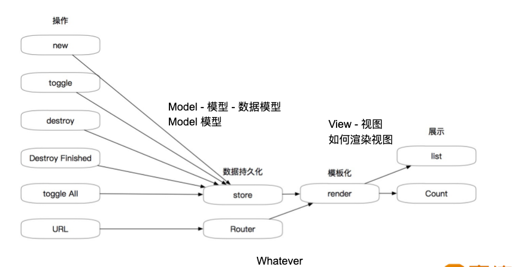
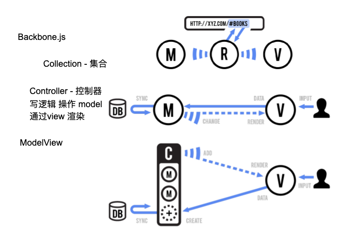
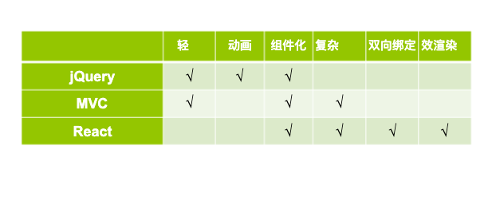

## 前言
在本周接触了一个关于“前端框架演变”的话题。今天我们就来聊聊，它到底是怎么进行演变的。

## 前端框架演变

## web1.0时代
此时前端展示数据比较简单，通常是由后台使用模板引擎直接渲染的。在这个时期都还未产生“前端工程师”，更别谈前端的发展能有多快了。这个时代作者经历的并不多，比较也已经过去了很多年了，这里就不深究。

## web2.0时代
> 前端展示趋于复杂，所以逐渐就开始前后端分离式架构。此时有一个关键词ugc: user generate content 用户生成内容，也意味着交互越来越复杂，故而逐渐产生了“前端工程师”，专门来维护这些复杂的交互界面，后台也可以专注于本该属于他们自己的业务逻辑以及业务架构中。

### 第一个时期：DIV+CSS布局解放：面向 DOM 编程
> 在面向DOM编程过程非常直观并且易操作，有一个缺点就是大量的代码冗余，例如获取元素等，于是乎就诞生了伟大的jQuery库

jquery优势：  
1. 轻量级(采用 UglifyJS 压缩后，大小保持在30kb左右)
2. 强大的选择器
3. 出色的DOM操作的封装
4. 可靠的事件处理机制
5. 对Ajax的封装完善
6. 不污染顶级变量(jQuery只建立一个名为jQuery的对象)
7. 出色的浏览器兼容性
8. 链式操作方式
9. 丰富的插件支持

### 第二个时期：Ajax 动态网页：面向数据编程
> Ajax直接拯救了JavaScript这么语言。

我们终于可以再提交一个表单的时候，不需要再刷新界面了。给了用户一个非常好的用户体验，最初在google的GMAIL中取得巨大的成功。逐渐全世界风靡。彼时的程序员的一个重要考核标准就是能不能熟练掌握`Ajax`。

### 第三个时期：浏览器兼容：面向浏览器编程
> 随着浏览器的种类繁多，以及它们都有自己的一套标准，使得研发人员在编写代码的时候要兼容多浏览器，于是乎就产生了两种编程思想

- 向下兼容思想(做设计时要考虑到兼容到低版本浏览器)
- 渐进增强思想(高版本的浏览器使用最新的技术，低版本浏览器使用老旧点的技术)

就譬如`reset.css`就是为了统一浏览器展示而存在的。

### 第四个时期：SPA 大型前端：面向模块编程
> 随着项目的复杂度越高，前端也开始仿制后端进行模块化编程，例如现在流行的前端三大框架Angular、React、Vue，都是MV*架构模式

逐渐的我们可以开发中用户体验更佳的web应用了，用户调整一个路由再也不需要等待后台的界面返回了，用户可以快速的切换各个界面间，而只需要付出极小的“带宽”

至于未来的前端技术还会如何发展，我们也需要尽更时代的发展了。

## 接下来我们通过技术层面来看看变换

### 从`jquery`操作`DOM` 到 框架的演变

【操作DOM】  
普通代码编写时，jquery直接操作DOM去做一些增删改查的工作，当项目的增大，代码也是越来越复杂，非常不好管理。于是这个时候就开始借鉴后端的模板引擎的思想，为什么要一直操作DOM去增删改查，这样显得太麻烦了，为什么不先定义好数据模型，不论什么操作，我们先更改模型里面的数据，然后在通过模板一次性去render到界面上去，这样就类似react这些框架只操作数据去改变界面了。使得代码可管理型增强了好多。

【mvc】

基于上图，于是乎就出现了一个非常知名的前端MVC分层管理框架`backbone`

M(Model)：数据模型层  
V(View)：视图层，负责展示界面的层  
C(Controller)：控制层，主要就是操作数据来渲染视图的层  

【现代框架】  
> 框架是对一个完整代码组织方法的描述

当大家意识到，每次请求一个页面都要向后台去发送一个请求，有时候似乎是比较浪费资源的，并且一些重复的已经看过的界面任然要去向后台请求，大家开始思考组件化加上前端自定义路由的重要性，这样只需要加载一次代码，通过前端自定义路由实现界面之间的跳转，不用再向后台请求界面了，速度和体验一下子增加了不少。

正因为这些问题于是乎就诞生了现代框架：Angular Vue React

【优势劣势】

每个时期的东西都有每个时期的优势，不是说我们使用了react的就可以完全抛弃jQuery。再做技术选型时还是要综合考虑我们的项目比较适合哪种技术，而不是哪种技术好我们就使用哪种技术。

## 小结
通过本文我们大概能了解到前端的一个发展历史，以及前端技术的一个演变历史。

