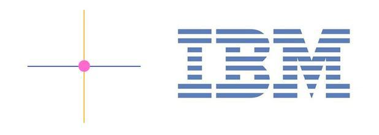
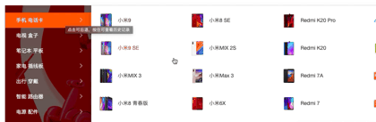

## 前言
修养是评判一个人的标准。我们做人要有修养，那么我们做事情同样的也是要有修养。那么我们做前端开发也是必须要有修养的。这也是我们常常会忽略的地方。

举个例子:
- 添加a标签的时候，你是否扩大了点击区域。
- 多菜单进行切换的时候，是否加了延时
- 所有请求后台数据，是否加了结果反馈
- 当数据请求时间过长时，是否添加了loading

以上的这些点与你的技术好坏无关，关乎的是一种“工匠精神”。甚至乎可以说是“职业素养”

今天我们就仔细讲讲如何可以提供我们的职业素养。做到领导交给我们的事情，可以做到尽善尽美。可以让我们在同行中脱颖而出！

## 尊重客观的认知规律律
> 认知是以经验规律对感觉信息进行组织得到的--格式塔学派

> 格式塔学派（德语：Gestalttheorie） ：是心理学重要流派之一，兴起于 20 世纪初的德国，又称为完形心理学；主张人脑的运作原理是整体的，『整体不同于其部件的总和』。——摘自『维基百科』

【临近性】  
> 先看看下面的图形组合，我们会倾向于认为左边的圆点以“行”来组合，而右边的圆点以“列”来组合，而仅仅是因为距离的远近就能产生这样的感官现象——我们会将靠的近的部件自动视为一组。

【相似性】  
> 我们再来观察下面的一组星星，我们会自动将第一行是做一组，第二行为另外一组，最后两行视作一组，我们会将相似相近的东西自动联系起来，这就是所谓的相似性原理

在实际页面上的应用：
  

【连续性】  
> 又得用这张用烂了的例子，但的确很经典。两条直线之间虽然有圆形阻挡，IBM的字样虽然有很多横条割开，但并不妨碍我们判定两直线相交以及辨认出字母的内容，这是因为我们的视觉有着给对象进行分组来感知事物的倾向，更倾向于感知连续的事物或联系的形式，而不是碎片化的信息。因此即使我们看到了非连续的事物，也会自动将其看成完整化。这就是格式塔理论中的连续性原理。
  

【封闭性】
> 视觉系统自动尝试将敞开的图形关闭起来，从而将其感知为完整的物体而不是分散的碎片。
注：简单理解，当图形是一个残缺图形，但主体有一种使其闭合的倾向，即主体能自行填补缺口而把其知觉为一个整体。

我们的视觉系统强烈倾向于看到物体，以至于它能将一个空白区解析成一个物体，所以我们看到上图所呈现的是一个圆而非多条线段。

  
最著名的应用便是苹果公司的logo，咬掉的缺口唤起人们的好奇、疑问，给人巨大想象空间

## 信息架构
简而言之就是对一些信息进行排列组合，呈现给用户查阅。

有几个大原则是需要我们去遵守的：

### 和谐
1. 结构清晰
2. 间距规范
3. 对齐

看下微信里面的一个子页面：  
  

结构清晰，间距规范，对齐工整，这些要素全部都符合，正式因为这些细节做的足够好，微信才会是一款优秀的app

### 统一
1. 字体
2. 颜色
3. 边距

  

同样在电商这样强展示的网站，同样都做到了字体统一，颜色统一，边距统一

### 反馈
> 一般都是用户在web界面上进行操作，网站给予用户的反馈。

1. Hover Active
  

2. Loading
3. 结果提示

就不一一举例子了，可以去各大电商网站去看，基本上各类操作的都会给用户反馈的。

### 易用
> 关于易用性交互则是一个需要把用户习惯研究到极致，才能做得非常好的一部分。下面举几个常见例子

一. menu意图判断  
  
从动态图片中可以看到，当我们鼠标快速的从下面的导航栏滑动到导航面板中，是没有对导航进行切换的。这个就是所谓易用性处理了。

大家都知道正常hover效果你滑到下面就会切换到其它导航的，但是这里对用户意图进行了判断。

二. a标签扩大点击区域

  

从动图可以看到，当鼠标没有放在文字上面的时候同样式有点击的效果，这样就把a链接的点击区域阔达了，方便用户点击。

等等的易用性操作还是有非常多的，这个需要网站研发人员的心细观察分析，想做一款好的产品绝非一蹴而就的。

## 小结
今天学习的这些东西虽然说都是偏设计的，但是这与前端研发人员是息息相关的，所有这些优化操作都是需要代码去实现的，当你上一个环节没有做的很好的时候，作为一个团队，我们是有责任去提醒或一起探讨这些问题。尽力做好每一个产品。
