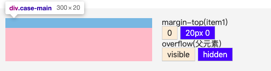

## 前言
margin是盒模型几个属性中一个非常特殊的属性。简单举几个例子：只有margin不显示当前元素背景，只有margin可以设置为负值，margin和宽高支持auto，以及margin具有非常奇怪的重叠特性。

## 重叠

margin重叠又叫margin合并，发生这种情况有两个前提  
1、只发生在block元素上(不包括float、absolute、inline-block元素)  
2、只发生在垂直方向上(不考虑writing-mode)

【相邻的兄弟元素】

margin重叠效果展示：  
item1 和 item2 是相邻的块级元素，我们可以看到垂直方向上，发生了margin重叠效果
<iframe style="width: 100%; height: 160px;" src="https://shiyou00.github.io/lion/dist/html/css-margin/margin.html?case=f1" frameborder="0"></iframe>

具体的叠加规则是什么？
> 正正取大值、正负值相加、负负最负值

【margin传递】
> 父级元素和第一个或最后一个子元素，父子级的margin重叠又叫margin传递

条件  
相对比相邻兄弟元素margin重叠来说，父子级margin重叠需要满足以下几个条件(以margin-top重叠为例)：  
a、父元素不是BFC元素

b、父元素没有padding-top值

c、父元素没有border-top值

d、父元素和第一个子元素之间没有inline元素分隔

如果是父子级的margin-bottom重叠，第d条改为父元素和最后一个子元素之间没有inline元素分隔，以及还需要满足父元素没有height、min-height、max-height限制

效果展示：  
在item1上面添加一个margin-top:20px;时父元素跟着一起下来了20px，这种现象就叫做“margin传递”。我们通过在父元素上添加一些属性就可以破坏margin传递，下面是实际案例，可以动手点点
<iframe style="width: 100%; height: 240px;" src="https://shiyou00.github.io/lion/dist/html/css-margin/margin.html?case=f2" frameborder="0"></iframe>

【空的block元素】  
先看下HTML结构
```
<div class="case-main">
    <div class="case-item"></div>
</div>
```

效果展示：  
第一步：我们选择了margin:20px 0; 此时你会发现你一点变化都没有，为什么父元素没有被撑开？  
第二步：我们再选择父元素的overflow:hidden，你会发现这时候可以看到父元素的浅蓝色背景色了，但是明明是上下margin都是20px一起应该是40px，可是父元素高度只有20px。  

<iframe style="width: 100%; height: 140px;" src="https://shiyou00.github.io/lion/dist/html/css-margin/margin.html?case=f3" frameborder="0"></iframe>  
[注意]实际布局时，极少情况下我们会如此布局。

第一步解释：  
父元素如果不是BFC的情况下，子元素margin-top margin-bottom 是不会撑开父元素的高度。

第二步解释：则是发生了margin重叠，同样地，空block元素发生margin重叠也需要满足一些条件  
a、子元素(case-item)没有border值  
b、子元素(case-item)没有padding值  
c、里面没有inline元素  
d、子元素(case-item)没有height或min-height

效果展示：
<iframe style="width: 100%; height: 300px;" src="https://shiyou00.github.io/lion/dist/html/css-margin/margin.html?case=f4" frameborder="0"></iframe>

## -webkit-margin-collapse
```
-webkit-margin-collapse: <collapse>(默认重叠) | <discard>(取消) | <separate>(分隔)
```

效果展示：
<iframe style="width: 100%; height: 200px;" src="https://shiyou00.github.io/lion/dist/html/css-margin/margin.html?case=f5" frameborder="0"></iframe>

## auto
只有width/height和margin可以设置auto。

【为什么margin:auto无法实现垂直居中】  
水平方向可以居中是因为块级元素的宽度默认是撑满父级元素的，如果给宽度设置一个固定值，而左右margin设置为auto，则可以平分剩余空间

垂直方向不可以居中是因为块级元素的高度默认是内容高度，与父级元素的高度并没有直接的关系，而上下margin设置为auto，则被重置为0

【为什么图片使用margin:auto不能水平居中】  
图片无法水平居中，类似于块级元素无法垂直居中。因为图片的宽度width默认是自身宽度，与父元素的宽度没有直接关系。左右margin设置为auto，会被重置为0

所以，图片要水平居中，需要设置为display:block元素

【实现垂直居中】  
使用margin:auto实现垂直居中，有以下两种方法

1、使用writing-mode:vertical-lr;  
writing-mode代表页面流方向，默认是水平方向。改为垂直方向后，可实现垂直居中，但水平不居中了

2、将元素变为绝对定位元素(IE7-浏览器不支持)  
将元素变为绝对定位元素后，设置top:0;bottom:0;left:0;right:0;，使绝对定位元素与定位父级的高度和宽度有了直接的联系。再设置margin:auto;，使margin-top，margin-bottom，margin-left,margin-right平分剩余空间，达到水平垂直居中的效果

效果展示：
<iframe style="width: 100%; height: 200px;" src="https://shiyou00.github.io/lion/dist/html/css-margin/margin.html?case=f6" frameborder="0"></iframe>

## 小结
通过本文我们学习了：  
margin重叠的几种情况(块级元素之间，父子之间的margin传递)  

 -webkit-margin-collapse设置是否重叠的新属性  
margin auto的一些情况，例如块级元素margin:auto;为什么无法垂直居中，图片margin:auto为什么无法水平居中  

最后通过position:absolute配合margin:auto;实现水平垂直居中显示
